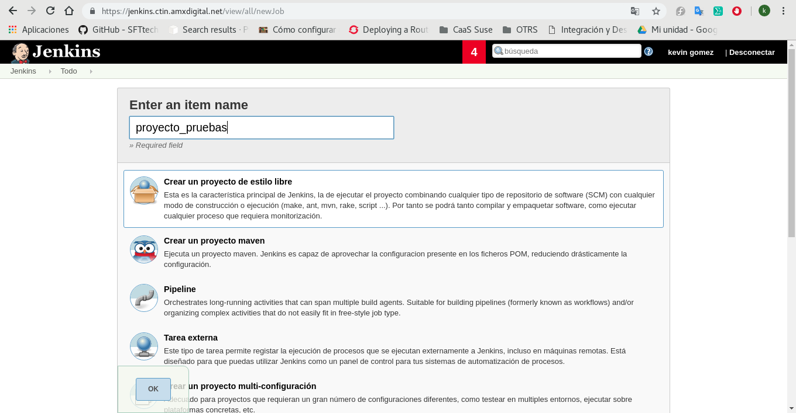
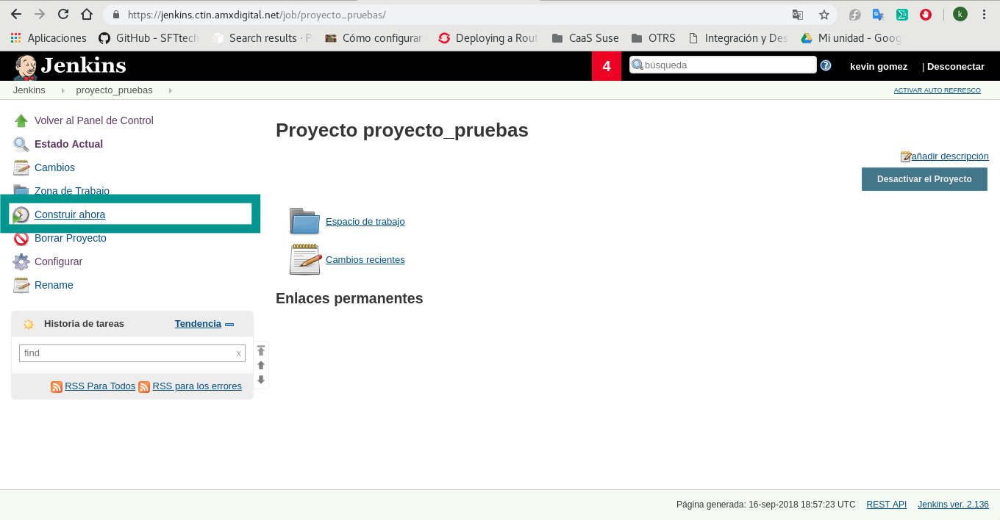

# Clonar un repositorio
## Configuración de Jenkins
Para poder clonar un repositorio, es necesario verificar que el plugin **Git Plugin** se encuentre instalado, como se muestra a continuación:

## Creación de tarea y clonado de repositorio
Primero crearemos una nueva tarea tipo estilo libre como se muestra a continuación:

Seguido de ello nos dirigimos al apartado Configurar proyecto

Situandonos en la sección **Configurar el origen del código fuente** en la que seleccionaremos *Git*

 Donde:
 * **Repository URL:** Es la URl del repositorio que deseamos clonar.
 * **Credentiales:** Son las llaves creadas, estas se indican si la forma en la que se desea clonar el proyecto es via ssh.
 * **Branch to build:** Especifica la rama desde la cual se hara el clonado.
 * **Navegador del repositorio:** Agrega enlaces en las vistas de "cambios" dentro de Jenkins a un sistema externo para examinar los detalles de esos cambios.

Una vez llenados los campos damos click en guardar.

Despues de configurar la tarea, procedemos a construirla.

Para finalmente tener una salida en consola como la siguiente:

**NOTA:** El clonado del repositorio se hace por defecto en el directorio de zona de trabajo de la tarea, para este caso dicho directorio es **/var/jenkins_home/jobs/proyecto_pruebas/workspace** situado dentro del contenedor.