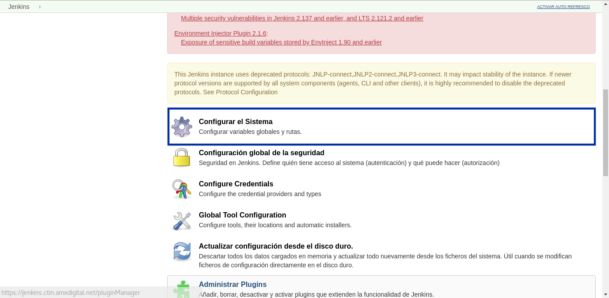
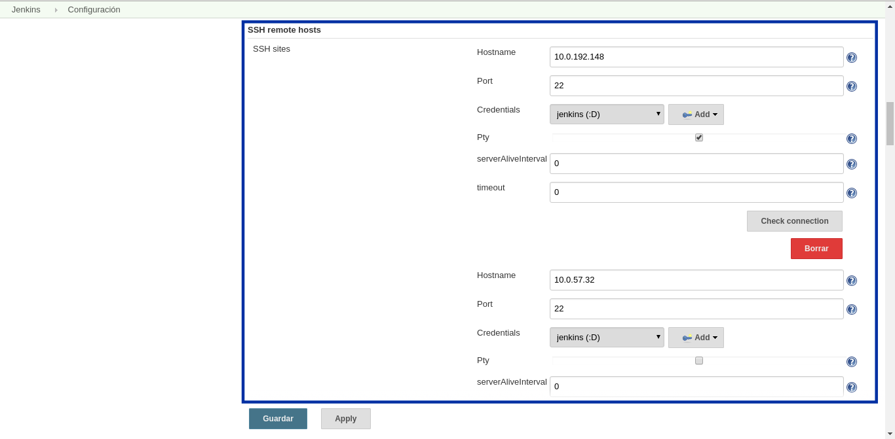
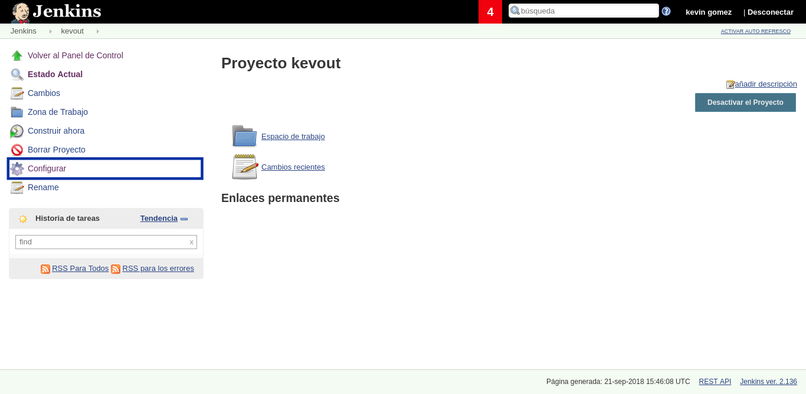
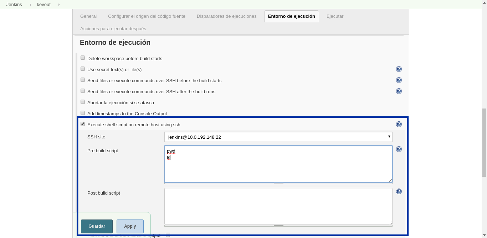
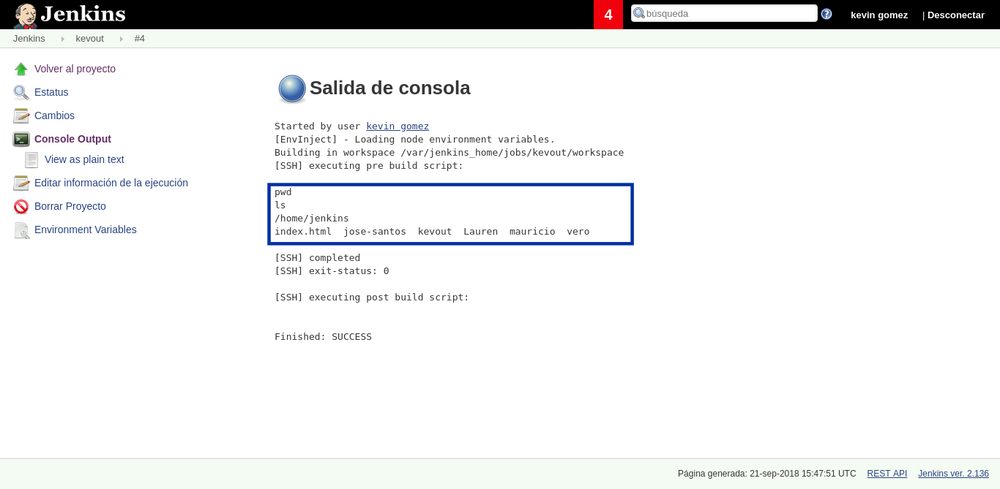

# Ejecución de comandos en servidores remotos

Jenkins permite la ejecución de comandos en los servidores remotos, usando la conexión ssh previamente configurada.

De igual forma es preciso verificar que los servidores esten dados de alta para que Jenkins pueda ejecutar los comandos de manera remota, para ello nos dirigimos a la sección **Administrar Jenkins** seleccionando la opción de **Configurar Sistema**

En la sección **SSH Hosts** damos de alta los servidores en los cuales Jenkins tiene los permisos suficientes para ejecutar comandos.

Donde:
* **Hostname:** Es el nombre de dominio o dirección IP del servidor.
* **Port:** Número del puerto por el que se realizará la conexión.

Una vez añadidos los servidores, procedemos a configurar la tarea.

Enseguida nos situamos en la sección de **Entorno de ejecución** en la cual seleccionaremos la opción de **Execute shell script on remote host using ssh**

Donde:
* **SSH site:** Indica el usuario y servidor por el cual se realizará la conexión via ssh.

* **Pre build script:** Comandos de ejecución antes de la construcción

* **Post build script:** Comandos de ejecución despues tes de la construcción

Despes de construir la tarea podemos verificar en la consola de salida, si la ejecución de los comandos se hizo  de manera correcta.

