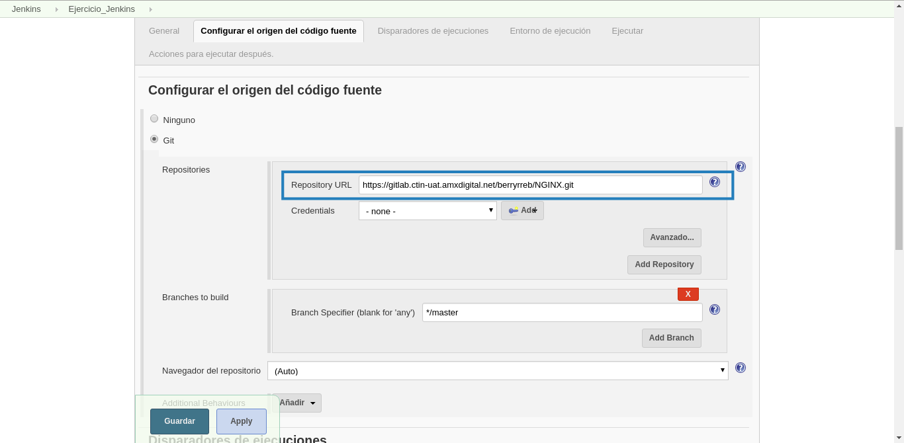

# Ejercicio Jenkins
El problema es el siguiente:

*El equipo de Claro Cobras nos pide realizar ajustes al código de su página principal utilizando la tarea jenkins. El esclavo debe traer el código del siguiente repositorio.........y modificar el archivo "index.html" para modificar el nombre de la marca de "ClaroCobras" a "Claro Cobras". Una vez que se realice la modificación del código, el esclavo debe enviar el sitio (el conjunto de HTMLs) al servidor JABLAB donde hay un vhost configurado ....... en el directorio ....... y debe verse la modificación realizada al interior del esclavo*

A continuación se muestra una propuesta de solución a dicho problema:

## Creación de la tarea.
Como primer punto procederemos a crear una tarea en blanco.
Desde el panel de control seleccionamos **Nueva Tarea**


A continuación le asignamos un nombre y seleccionamos la opción de **Crear un proyecto de estilo libre**


Damos click en **Ok** y tendremos creada nuestra primer tarea.

## Clonar un repositorio

Para poder clonar un repositorio ingresamos a nuestra tarea, y una vez dentro seleccionamos la opción de **Configurar**


A contincuación nos situamos en el apartado **Configurar el origen del código fuente** y seleccionamos *Git*

**NOTA:** Para este ejercicio clonaremos el siguiente repositorio https://gitlab.ctin-uat.amxdigital.net/berryrreb/NGINX.git

En la opción **Repository URL** colocamos la URL del repositorio que se desea clonar.



Enseguida damos click en **Guardar** y procedemos a construir la tarea


Esperamos a que la tarea termine de construirse.


Verificamos en la salida de la tarea, que el repositorio se haya clonado.


Al igual que en el espacio de trabajo de la tarea.


## Transferencia de Archivos

Para transferir un archivo, seleccionamos nuevamente la opcion de **Configurar** de dicha tarea.


Situados en el apartado **Entorno de Ejecución** seleccionamos la opción de *Send files or execute commands over SSH before the build starts*.
En la parte de **Source files** indicamos el nombre del archivo del espacio de trabajo que deseamos enviar, en nuestro caso *Index.html*


Damos click en **Guardar** y construimos el proyecto.


Una vez finalizada la construcción verificamos que el archivo se haya enviado correctamente.


## Ejecución de Comandos en un servidor remoto

Para este ejercicio copiaremos el archivo transferido al servidor remoto.

Nuevamente seleccionamos la opción de **Configurar** 


Situados en el apartado **Entorno de Ejecución** seleccionamos la opción de *Execute shell script on remote host using ssh*.

Para este ejemplo los comandos que ejecutaremos en el servidor remoto (Jablab) son:

```bash
sudo chown root:root /home/jenkins/index.html
sudo cp /home/jenkins/index.html /var/containers/nginx/etc/nginx/vhosts/
```


Damos click en **Guardar** y procedemos a construir la tarea.


A continuación verificamos que la tarea se haya ejecutado correctamente.


Finalmente visualizamos la pagina en el navegador.


http://prueba.jenkins.digital.net/

## Issues.
* Añadir en el archivo **/etc/hosts** la siguiente entrada:

```bash
201.161.97.8 prueba.jenkins.digital.net
```
* Jenkins al momento de ejecutar el comando **mv** rompe los permisos del archivo, por lo que la forma de transferir archivos entre directorios es a traves de **cp**

* Para nuestro caso es necesario cambiar el usuario y el grupo de los archivos a **root:root** ya que son el único grupo y usuario que el contendor de **nginx** conoce internamente.