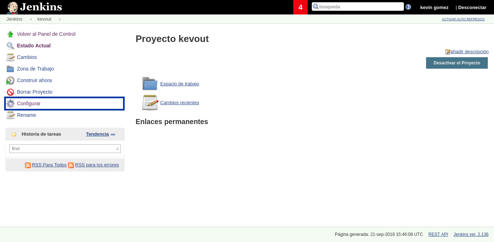

# Intercambio de Archivos en Jenkins via ssh

Para intercambiar archivos entre el servidor maestro y otros servidores via ssh es necesario generar una llave y un usuario para Jenkins

## Creación de llave

Antes de crear la llave crearemos un usario llamado **jenkins**.
Para nuestro caso, el usuario pertenecera a un grupo previamente creado llamado **operaciones**.

Los comandos para generar el usuario son los siguientes:

```bash
useradd -m -g operaciones jenkins
echo "jenkins ALL=(ALL)       NOPASSWD: ALL" >> /etc/sudoers
```
**NOTA**: Para nuestro caso, le hemos añadido permisos de superusuario.

A continuación nos logeamos como usuario **jenkins** a traves del comando:

```bash
sudo su jenkins
```
**NOTA**: Al solicitar la contraseña de logueo, solo tecleamos enter.

Una vez logueados como el usuario jenkins procedemos a generar la llave.

Para crear una llave, dede la terminal del host en el que se aloja nuestro Jenkins, ejecutamos el siguiente comando:

```bash
ssh-keygen -t rsa -b 4096
```
Sin escribir nada en ninguna de las opciones que se muestran obtendremos la creación de nuestra llave en el directorio **/home/jenkins/.ssh**

Al dejar los valores por defecto obtendremos dos archivos llamados **id_rsa** y **id_rsa.pub** en nuestro caso ambos archivos los copiaremos al directorio **/var/containers/jenkins/.ssh** con los siguientes comandos:
```bash
cp /home/jenkins/.ssh /var/containers/jenkins
```
## Dar de alta en el servidor destino
Para dar de alta la llave del usuario previamente creado, es necesario ejecutar los siguientes comando en el servidor destino

```bash
useradd -m -g operaciones jenkins
mkdir -p /home/jenkins/.ssh/
touch /home/jenkins/.ssh/authorized_keys
chmod 700 /home/jenkins/.ssh/
chmod 600 /home/jenkins/.ssh/authorized_keys
echo (En esta parte copiamos y pegamos el contenido del archivo id_rsa.pub creado en pasos enteriores) > /home/jenkins/.ssh/authorized_keys
chown jenkins /home/jenkins/ -R
chmod +w /etc/sudoers
echo jenkins ALL=\(ALL\) NOPASSWD:ALL >> /etc/sudoers
chmod -w /etc/sudoers
```
## Configuración en Jenkins
Una vez creada la llave y el usuario de *jenkins*, necesitamos configurar nuestro Jenkins productivo.

Para poder realizar el intercambio de archivos es importante verficar que el plugin **Publish Over Ssh** se encuentre instalado como se muestra a continuación.


A continuación es necesario dar de alta la llave previamente creada.

Para configurar la llave ingresamos a **Administrar jenkins > Configurar el Sistema** donde encontraremos el siguiente apartado:

Donde:
* **Passphrase:** Es el password que colocamos al momento de crear la llave.
* **Path to key:** Es la ubicación del archivo de la llave privada
* **Key:** Es el contenido de la llave privada

Una vez llenado todos los campos damos click en guardar.

**NOTA**: En nuestro caso en el apartado *Path to key* colocamos la dirección del archivo ubicado pero en el interior del contenedor.

---

Después de añadir la llave agregamos los servidores con los cuales realizará el intercambio de los archivos.

Para añadir los servidores ingresamos a **Administrar jenkins > Configurar el Sistema** donde encontraremos el siguiente apartado:

Donde:
* **Name:** Es un alias que le asociaremos al servidor.
* **Hostname:** Es el nombre de dominio o dirección IP del servidor.
* **Username:** Es el nombre de usuario con el que hará el logueo en dicho servidor.
* **Remote Directory:** Es el directorio base para esta configuración.

**NOTA:** La IP para conectar jablab es la 10.0.192.148, ya que es la VLAN por la cual se conocen nuestro servidor y el propio jablab.
Al dejar en blanco el campo *Remote Directory* indicamos que el directorio base será el directorio del usuario, en nuestro caso */home/jenkins*.

Una vez llenado los campos damos click en guardar.

## Intercambio de archivos

Despues de haber realizado las configuraciones anteriores, generamos una nueva tipo *estilo libre*, como se muestra a continuación:


Enseguida nos dirigimos al apartado configurar proyecto



Situandonos en la sección **Entorno de ejecución** donde seleccionaremos *Send files or execute commands over SSH before the build starts*


Donde:
* **Name:** Es el alias del servidor al que haremos el envio.
* **Source files:** Es el archivo que deseamos enviar.
* **Remove prefix:** Es el prefijo del archivo que deseamos remover.
* **Remote Directory:** Es el directorio remoto que se creara en el servidor destino.
* **Exec command:** Es el comando a ejecutar en el servidor remoto.

**NOTA:** Para nuestro caso, en *Name* solo colocamos el nombre del archivo, puesto que Jenkins trabaja con base a paths relativos, es decir, solo transfiere archivos ubicados en el espacio de trabajo de la tarea, siendo en este caso **/var/jenkins_home/jobs/proyecto_pruebas/workspace**, por lo que la transferencia solo se limitará a los archivos que se encuentren en dicho directorio.
Si especificamos un directorio en el apartado *Remote Directory* provocara que en el servidor destino dicho directorio sea creado, es decir, para nuestro caso, si colocamos algo como **/home/jenkins/prueba** en el directorio remoto (para nuestro caso) la ubicación real de nuestro archivo sera **/home/jenkins/home/jenkins/prueba**

Una vez configurado los campos anteriores procedemos a construir la tarea.


Al visualizar la consola de comandos de dicha tarea observaremos algo como:

Donde podremos verificar que el archivo fue enviado con éxito.

**NOTA:** En nuestro caso podemos verifcar que el archivo se envio ingresando a jablab y checando el contenido del directorio **/home/jenkins**.