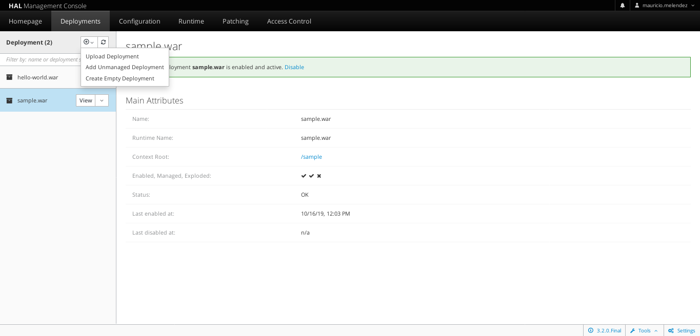
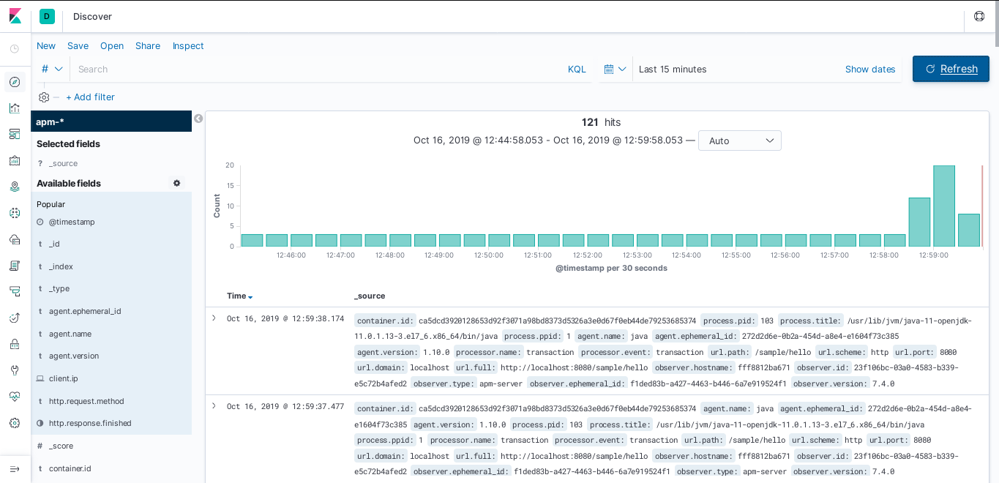
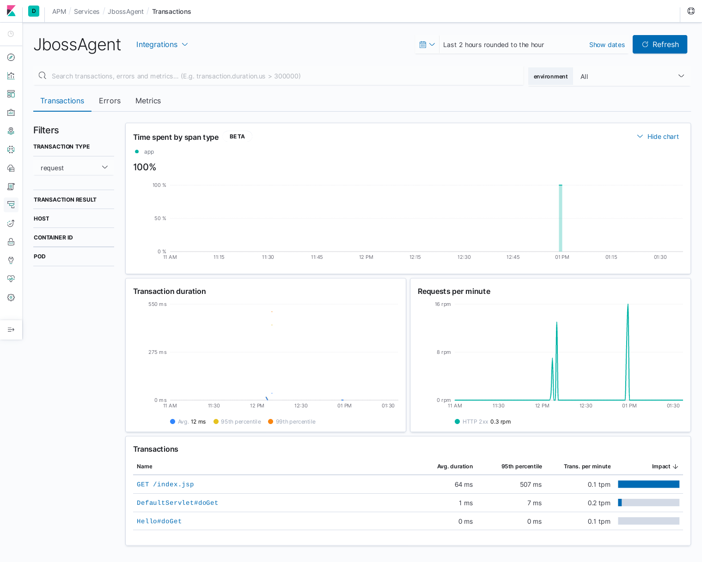

### ***La siguiente guía se realiza con imágenes oficiales, no con imágenes propias.***

# Elasticsearch, Logstash y Kibana + APM-Server

**NOTA: El despliegue que se muestra a continuación se realiza con cada uno de los componentes corriendo en un mismo servidor**

## Despliegue de Elasticsearch

### Desarrollo

Configuramos la memoria para el directorio mmapfs que usa Elasticsearch en el almacenamiento de sus indices

```bash
sysctl -w vm.max_map_count=262144
```

Creamos los directorios y el archivo de configuración utilizado en el despliegue de Elasticsearch

*Directorio para el volumen de Elasticsearch*
```bash
mkdir -p /var/containers/elk/elasticsearch/
```

*Archivo de configuración de Elasticsearch, elasticsearch.yml*
```bash
echo "IyA9PT09PT09PT09PT09PT09PT09IEVTTEFTVElDU0VBUkNIOiBlbGFzdGljc2VhcmNoLnltbCA9PT09PT09PT09PT09PT09PT09PT09ICMKY2x1c3Rlci5uYW1lOiAiZG9ja2VyLWNsdXN0ZXIiCm5ldHdvcmsuaG9zdDogMC4wLjAuMAojIG1pbmltdW1fbWFzdGVyX25vZGVzIG5lZWQgdG8gYmUgZXhwbGljaXRseSBzZXQgd2hlbiBib3VuZCBvbiBhIHB1YmxpYyBJUAojIHNldCB0byAxIHRvIGFsbG93IHNpbmdsZSBub2RlIGNsdXN0ZXJzCiMgRGV0YWlsczogaHR0cHM6Ly9naXRodWIuY29tL2VsYXN0aWMvZWxhc3RpY3NlYXJjaC9wdWxsLzE3Mjg4CmRpc2NvdmVyeS56ZW4ubWluaW11bV9tYXN0ZXJfbm9kZXM6IDE=" | base64 -w0 -d > /var/containers/elk/elasticsearch/elasticsearch.yml
```

Runit para realizar el despliegue de Elasticsearch

**NOTA: Los puertos por los que escucha Elasticsearch son 9200, 9300**

```bash
docker run --name=elasticsearch -d \
    -e "discovery.type=single-node" \
    -v /var/containers/elk/elasticsearch/elasticsearch.yml:/usr/share/elasticsearch/config/elasticsearch.yml:z \
    docker.elastic.co/elasticsearch/elasticsearch:7.4.0
```

## Despliegue de Logstash

### Prerequisito
* Instancia de Elasticsearch arriba

### Desarrollo

Creamos los directorios y el archivo de configuración utilizado en el despliegue de Logstash

*Directorio para el volumen de Logstash*
```bash
mkdir -p /var/containers/elk/logstash/pipeline/
```

*Archivo de configuración de Logstash, pipeline.conf*
```bash
echo "IyA9PT09PT09PT09PT09PT09PT09IExvZ3N0YXNoOiBwaXBlbGluZS55bWwgPT09PT09PT09PT09PT09PT09PT09PSAjCmlucHV0eyAgCiAgICBiZWF0c3sKICAgICAgICBwb3J0ID0+ICI1MDQ0IiAgfQp9Cm91dHB1dHsgIAogICAgZWxhc3RpY3NlYXJjaCB7CiAgICAgICAgaG9zdHMgPT4gWydodHRwOi8vZWxhc3RpY3NlYXJjaDo5MjAwJ10gI0lQIHkgcHVlcnRvIGRlbCBjb250ZW5lZG9yIGRlIEVsYXN0aWNzZWFyY2gKICAgICAgICBpbmRleCA9PiAibG9nc3Rhc2gtJXsrWVlZWS5NTS5kZH0iICNOb21icmUgZGVsIGluZGljZSAgCiAgICAgICAgfQp9" | base64 -w0 -d > /var/containers/elk/logstash/pipeline/pipeline.conf
```

Runit para realizar el despliegue de Logstash

**NOTA: Los puertos por los que escucha Logstash son 5044, 9600**

```bash
docker run --rm -d --name=logstash \
    --link=elasticsearch:elasticsearch \
    -v /var/containers/elk/logstash/pipeline/:/usr/share/logstash/pipeline:z \
    docker.elastic.co/logstash/logstash:7.4.0
```

## Despliegue de Kibana

### Prerequisito
* Instancia de Elasticsearch arriba

### Desarrollo

Creamos los directorios y el archivo de configuración utilizado en el despliegue de Kibana

*Directorio para el volumen de Kibana*
```bash
mkdir -p /var/containers/elk/kibana/
```

*Archivo de configuración de Kibana, kibana.yml*
```bash
echo "IyA9PT09PT09PT09PT09PT09PT09IGtpYmFuYToga2liYW5hLnltbCA9PT09PT09PT09PT09PT09PT09PT09ICMKI2tpYmFuYSBjb25maWd1cmF0aW9uIGZyb20ga2liYW5hLWRvY2tlci4Kc2VydmVyLm5hbWU6IGtpYmFuYQpzZXJ2ZXIuaG9zdDogIjAiCmVsYXN0aWNzZWFyY2gudXJsOiBodHRwOi8vZWxhc3RpY3NlYXJjaDo5MjAwICNEaXJlY2NpT24gSVAgZGVsIGNvbnRlbmVkb3IgZGUgZWxhc3RpY3NlYXJjaA==" | base64 -w0 -d > /var/containers/elk/kibana/kibana.yml
```

Runit para realizar el despliegue de Kibana

**NOTA: Los puertos por los que escucha Kibana son 5044, 9600**

```bash
docker run -d --name=kibana \
    --link=elasticsearch:elasticsearch \
    -p 5601:5601 \
    -v /var/containers/elk/kibana/kibana.yml:/usr/share/kibana/config/kibana.yml:z \
    docker.elastic.co/kibana/kibana:7.4.0
```

## Despliegue de Filebeat

### Prerequisito
* Instancia de Elasticsearch arriba
* Instancia de Logstash arriba
* Instancia de Kibana arriba

### Desarrollo

Creamos los directorios y el archivo de configuración utilizado en el despliegue de Filebeat

*Directorio para el volumen de Filebeat*
```bash
mkdir -p /var/containers/elk/filebeat/usr/share/filebeat/prospectors.d
```

*Archivo de configuración de Filebeat, filebeat.yml*
```bash
echo "IyA9PT09PT09PT09PT09PT09PT09IEZpbGViZWF0OiBmaWxlYmVhdC55bWwgPT09PT09PT09PT09PT09PT09PT09PSAjCmZpbGViZWF0LmlucHV0czoKLSB0eXBlOiBsb2cKICBlbmFibGVkOiB0cnVlCiAgcGF0aHM6CiAgICAtIC92YXIvbG9nLyoubG9nCiAgCnByb2Nlc3NvcnM6Ci0gYWRkX2Nsb3VkX21ldGFkYXRhOgoKc2V0dXAua2liYW5hOgogIGhvc3Q6ICJraWJhbmE6NTYwMSIKCm91dHB1dC5sb2dzdGFzaDogIAogIGhvc3RzOiBbJ2xvZ3N0YXNoOjUwNDQnXQo=" | base64 -w0 -d > /var/containers/elk/filebeat/usr/share/filebeat/filebeat.yml
```

Runit para realizar el despliegue de Filebeat

```bash
docker run -d --name=filebeat --user=root \
  --link=logstash:logstash \
  --link=elasticsearch:elasticsearch \
  --link=kibana:kibana \
  -v /var/containers/elk/filebeat/usr/share/filebeat/filebeat.yml:/usr/share/filebeat/filebeat.yml:ro \
  -v /var/lib/docker/containers:/var/lib/docker/containers:ro \
  -v /var/run/docker.sock:/var/run/docker.sock:ro \
  docker.elastic.co/beats/filebeat:7.4.0 filebeat -e -strict.perms=false
```

## Despliegue de APM

### Prerequisito
* Instancia de Elasticsearch arriba
* Instancia de Kibana arriba

### Desarrollo

Creamos los directorios y el archivo de configuración utilizado en el despliegue de APM

*Directorio para el volumen de APM*
```bash
mkdir -p /var/containers/elk/apm-elasticsearch/usr/share/apm-server/
```

*Archivo de configuración de APM, apm-server.yml*
```bash
echo "IyMjIyMjIyMjIyMjIyMjIyMjIyMjIyMjIyBBUE0gU2VydmVyIENvbmZpZ3VyYXRpb24gIyMjIyMjIyMjIyMjIyMjIyMjIyMjIyMjIwoKIyMjIyMjIyMjIyMjIyMjIyMjIyMjIyMjIyMjIyMjIyMgQVBNIFNlcnZlciAjIyMjIyMjIyMjIyMjIyMjIyMjIyMjIyMjIyMjIyMjIwoKYXBtLXNlcnZlcjoKICAjIERlZmluZXMgdGhlIGhvc3QgYW5kIHBvcnQgdGhlIHNlcnZlciBpcyBsaXN0ZW5pbmcgb24uIFVzZSAidW5peDovcGF0aC90by5zb2NrIiB0byBsaXN0ZW4gb24gYSB1bml4IGRvbWFpbiBzb2NrZXQuCiAgaG9zdDogIjAuMC4wLjA6ODIwMCIKCiM9PT09PT09PT09PT09PT09PT09PT09PT09PT09PT09IEtpYmFuYSA9PT09PT09PT09PT09PT09PT09PT09PT09PT09PT09PT09PT09CgpraWJhbmE6CiAgICAjIEZvciBBUE0gQWdlbnQgY29uZmlndXJhdGlvbiBpbiBLaWJhbmEsIGVuYWJsZWQgbXVzdCBiZSB0cnVlLgogIGVuYWJsZWQ6IHRydWUKCiAgICAjIFNjaGVtZSBhbmQgcG9ydCBjYW4gYmUgbGVmdCBvdXQgYW5kIHdpbGwgYmUgc2V0IHRvIHRoZSBkZWZhdWx0IChgaHR0cGAgYW5kIGA1NjAxYCkuCiAgICAjIEluIGNhc2UgeW91IHNwZWNpZnkgYW4gYWRkaXRpb25hbCBwYXRoLCB0aGUgc2NoZW1lIGlzIHJlcXVpcmVkOiBgaHR0cDovL2xvY2FsaG9zdDo1NjAxL3BhdGhgLgogICAgIyBJUHY2IGFkZHJlc3NlcyBzaG91bGQgYWx3YXlzIGJlIGRlZmluZWQgYXM6IGBodHRwczovL1syMDAxOmRiODo6MV06NTYwMWAuCiAgaG9zdDogImtpYmFuYTo1NjAxIgoKIz09PT09PT09PT09PT09PT09PT09PT09PT09PT09PT09IE91dHB1dHMgPT09PT09PT09PT09PT09PT09PT09PT09PT09PT09PT09CgojIENvbmZpZ3VyZSB0aGUgb3V0cHV0IHRvIHVzZSB3aGVuIHNlbmRpbmcgdGhlIGRhdGEgY29sbGVjdGVkIGJ5IGFwbS1zZXJ2ZXIuCgojLS0tLS0tLS0tLS0tLS0tLS0tLS0tLS0tLS0gRWxhc3RpY3NlYXJjaCBvdXRwdXQgLS0tLS0tLS0tLS0tLS0tLS0tLS0tLS0tLS0Kb3V0cHV0LmVsYXN0aWNzZWFyY2g6CiAgaG9zdHM6IFsiZWxhc3RpY3NlYXJjaDo5MjAwIl0=" | base64 -d -w0 > /var/containers/elk/apm-elasticsearch/usr/share/apm-server/apm-server.yml
```

Runit para realizar el despliegue de APM

```bash
docker run -d --name=apm-server \
    --link elasticsearch:elasticsearch \
    --link kibana:kibana \
    --user=apm-server \
    -v /var/containers/elk/apm-elasticsearch/usr/share/apm-server/apm-server.yml:/usr/share/apm-server/apm-server.yml:ro \
    docker.elastic.co/apm/apm-server:7.4.0 \
    --strict.perms=false \
    -e -E output.elasticsearch.hosts=["elasticsearch:9200"] \
    -e -E setup.kibana.host=kibana:5601
```

# Prueba de Monitoreo de JBOSS con APM Agent

Monitoreo de JBOSS mediante un agente para APM Server

Crear directorios para Jboss
```bash
mkdir -p /var/containers/jboss/jar/
```

Descargar APM Agent para Jboss
```bash
wget https://oss.sonatype.org/service/local/repositories/releases/content/co/elastic/apm/elastic-apm-agent/1.10.0/elastic-apm-agent-1.10.0.jar && mv elastic-apm-agent-1.10.0.jar /var/containers/jboss/jar/
```
Levantar contenedor de Jboss en su forma standalone
```bash
docker run -p 8080:8080 -p 9990:9990 -dt --name jboss -v /var/containers/jboss/jar:/opt/jar/ jboss/wildfly /opt/jboss/wildfly/bin/standalone.sh -bmanagement 0.0.0.0
```
Crear primer usuario para manejo de Jboss.
```bash
docker exec -it jboss /opt/jboss/wildfly/bin/add-user.sh <usuario> <contraseña> --silent
```
Hacer deploy de alguna aplicación en Jboss desde la interfaz web: *127.0.0.1:9990*

>Deployments -> + -> upload deployment -> seleccionar archivo 'sample.war' -> deploy



Si se realizó correctamente, podemos ver nuestro deployment en *127.0.0.1:8080/sample/*

Editar el archivo de configuración de standalone y agregar la configuración para el APM Agent.
```bash
docker exec -it jboss vi /opt/jboss/wildfly/bin/standalone.conf
```
Agregar el siguiente contenido: 

**NOTA: Cambiar la ip según su configuración.**
```bash
export JAVA_OPTS="$JAVA_OPTS -javaagent:/opt/jar/elastic-apm-agent-1.10.0.jar"
export JAVA_OPTS="$JAVA_OPTS -Delastic.apm.service_name=JbossAgent"
export JAVA_OPTS="$JAVA_OPTS -Delastic.apm.application_packages=http://localhost:8080/"
export JAVA_OPTS="$JAVA_OPTS -Delastic.apm.server_urls=http://<ip contenedor APM-Server>:8200"
```
En caso de que sea un Jboss levantado en Domain mode:

* Edite el archivo domain.xml que se encuentra en */opt/jboss/wildfly/domain/configuration/domain.xml* y agregue una opción JVM para el indicador -javaagent, así como las propiedades del sistema para la configuración.
* ```bash
  ...
  <server-group>
    <jvm>
      <jvm-options>
        ...
        <option value="-javaagent:/opt/jar/elastic-apm-agent-1.10.0.jar"/>
        ...
      </jvm-options>
    </jvm>
  </server-group>
  ...
  <system-properties>
    <property name="elastic.apm.service_name"         value="JbossAgent"/>
    <property name="elastic.apm.application_packages" value="http://localhost:8080/"/>
    <property name="elastic.apm.server_urls"          value="http://<ip contenedor APM-Server>:8200"/>
  </system-properties>
  ...
  ```

### Reiniciar el contenedor Jboss.
```bash
docker restart jboss
```
Verificar en Kibana el correcto monitoreo de Jboss.



*Ejemplo de monitoreo de aplicación desplegada en JBoss*

