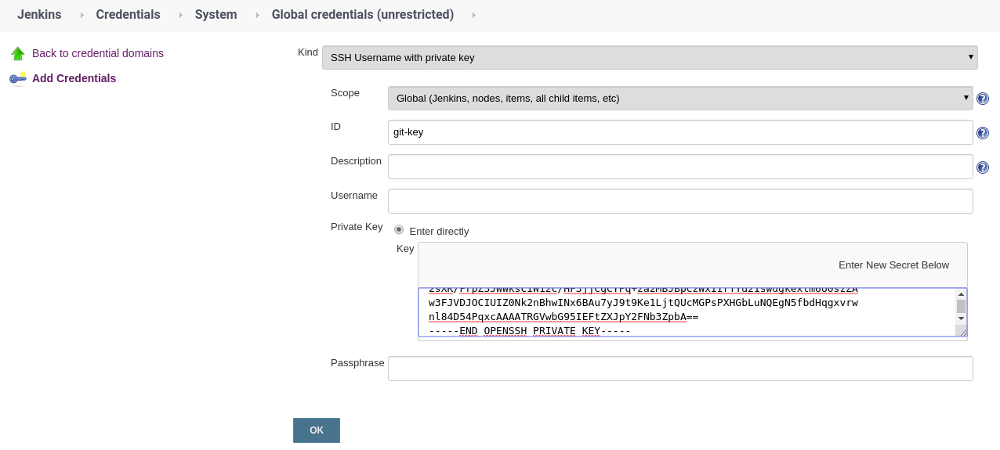

# Integracion de Jenkins con OKD

## En OKD

1. Llevamos a cabo el despliegue de la plantilla de Jenkins que viene incluida en OKD. (Esta parte la hizo Mau, a mi no me quedo cuando lo hice)

2. Para esta ocasión crearemos un proyecto el cual dedicaremos para llevar la construcción de nuestras imagenes. Este proyecto tiene un propósito similar al CCMKBUILD

*En esta ocasión lo llamaremos ccmkbuild*
```
oc new-project ccmkbuild
```

Otorgamos permisos de super administrador al service account creado por Jenkins en el nuevo proyecto que acabos de crear.

*Si se configuro por defecto el Jenkins el sa se llama jenkins*
```
oc project ccmkbuild
oc create serviceaccount jenkins
oc adm policy add-cluster-role-to-user edit system:serviceaccount:jitsi-claroconnect:jenkins
```

1. Si Jenkins tendra interacción con algún otro proyecto será necesario llevar a cabo el paso 2 en dicho proyecto.

## En Jenkins

1. Nos ubicamos en **Jenkins/Administrar Jenkins/Configurar el Sistema/Nube de Kubernetes** y modificamos el Pod que se despliega como Esclavo.

**Imagen jenkins slave:  openshift/jenkins-slave-base-centos7:v3.11*


1. En caso de utilizar llaves ssh para clonar algún repositorio, es importante crearla previamente en el apartado de credenciales de Jenkins, como se muestra a continuación



1. A continuación se muestra un pipeline de las cosas necesarias utilizadas para llevar a cabo la construcción de una imagen utilizando OKD

Para obtener el token.
*Se asume que el Service Account es jenkins y el Project donde esta Jenkins es jitsijenkins*
```
oc serviceaccounts get-token jenkins -n jitsijenkins
```

*Ejemplo Pipeline*
```
node("jenkins-slave"){
    stage("Clone Source") {
        git credentialsId: 'git-key', url: 'ssh://bitbucket.org/.....'
    }

    stage("Create BuildConfig"){
        openshift.withCluster("https://172.26.90.131:8443","<token>"){
            openshift.withProject("ccmkbuild"){
                openshift.apply([
                    "apiVersion": "v1",
                    "kind": "BuildConfig",
                    "metadata":[
                        "name": "first-build"
                    ],
                    "spec":[
                        "source":[
                            "type": "Binary"
                        ],
                        "output":[
                            "to":[
                                "kind": "DockerImage",
                                "name": "docker.io/kevopsoficial/test-webapp:v3"
                            ],
                            "pushSecret":[
                                "name": "docker-kevops"
                            ]
                        ],
                        "strategy": [
                            "type": "Docker"
                        ]
                    ]
                ])
            }
        }
    }

    stage("Build Image") {
        dir('Webapp') {
            sh 'oc start-build first-build --from-dir . --follow'
        }
    }
}
```