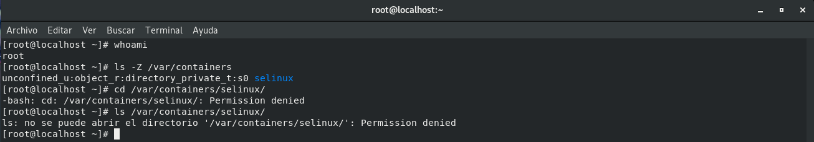
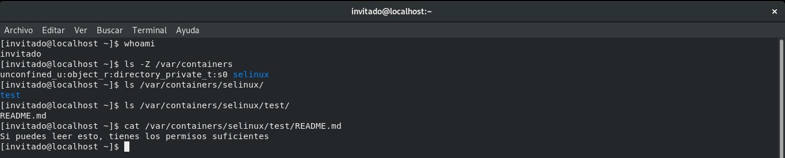
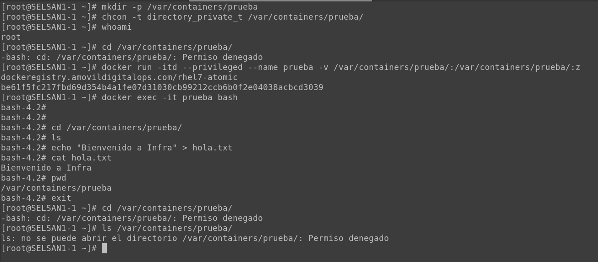
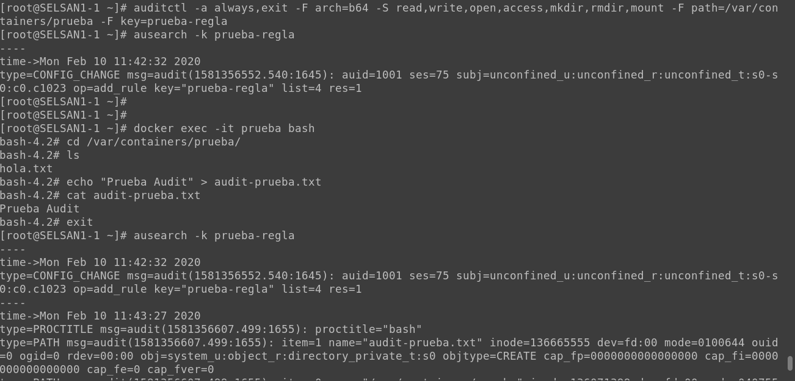
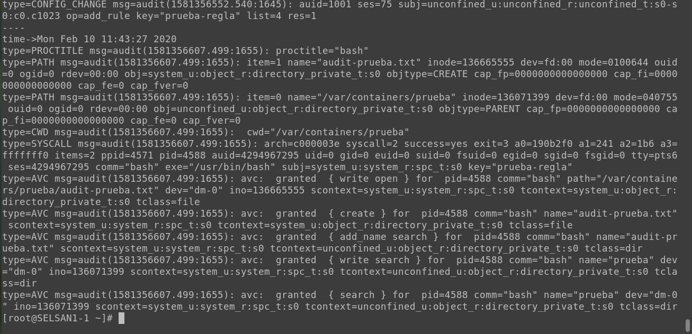

# Bloqueo de usuario con Selinux
## Prerequisitos

* Virtual con redhat 7.x / centos 7.x
* Git
* Selinux en modo Enforcing

## Desarrollo

Instalamos las dependencias para la creación de la politica de Selinux.
```bash
yum install -y selinux-policy-devel \
    selinux-policy-doc \
    selinux-policy-minimum \
    selinux-policy-mls \
    selinux-policy-sandbox
```

Clonamos el repositorio con los archivos para la creación de la política

```bash
git clone https://infracode.amxdigital.net/desarrollo-tecnologico/bloqueo-de-usuario-root-con-selinux.git /opt/bloqueo-usuario-selinux
```

Nos movemos al directorio donde se encuentra el archivo que contiene la política

```bash
cd /opt/bloqueo-usuario-selinux/selinux-files
```

Compilamos el módulo creado.
```bash
make -f /usr/share/selinux/devel/Makefile
```

Cargamos a Selinux la nueva política.
```bash
semodule -i myprivate.pp
```

## Creación de usuario

Creación de usuario, mapeado al usuario selinux user_u
```bash
useradd <nombre del usuario> -Z user_u -m -g operaciones
```

**Antes de aplicar la política es importante cambiar el propietario del directorio que bloquearemos, haciendo propietario al usuario que acabamos de crear, con el propósito de permitir que el usuario tenga acceso de lectura, escritura y ejecución sobre el directorio**

```bash
chown <uid del usuario>:<uid del grupo> -R <directorio>
```

Cambiamos el contexto al directorio que deseamos modificar el acceso.
```bash
chcon -Rt directory_private_t <directorio>
```
Verificamos que el acceso haya sido denegado tanto para el usuario root como para cualquier otro usuario y a su vez confirmamos que el usuario creado con el mapeo al usuario selinux **user_t** tenga acceso al directorio.

## Pruebas

### Acceso a un usuario Linux
A continuación observamos cómo el usuario **root** no cuenta con el permiso suficiente para acceder al directorio **/var/containers/selinux** que hemos creado y al cual hemos modificado su contexto.



Sin embargo, para el usuario **invitado**, podemos observar que dicho acceso se obtiene sin problemas, siendo este el usuario que hemos creado para dichas pruebas.



### Acceso desde un contenedor

A continuación observamos que el directorio, queda inhabilitado para el usuario root, sin embargo cuando se crea un contenedor teniendo como volumen el directorio que fue bloqueado, podemos observar que se puede acceder a el sin ningún problema.

**NOTA**: El despliegue del contenedor debe realizarse con la bandera **--privileged**



De igual forma podemos obervar que la auditoria, con el uso de audit, puede llevarse acabo sin ningun problema.


