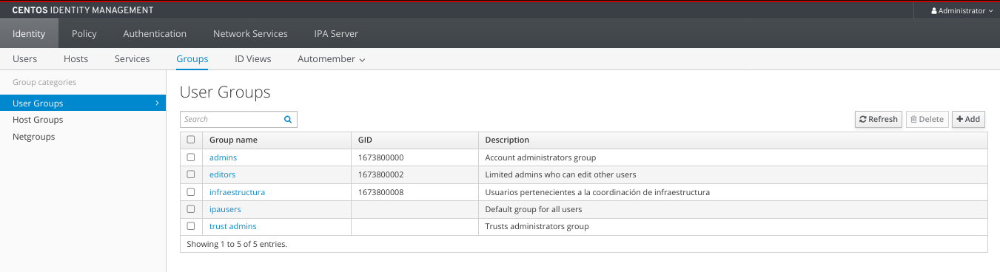
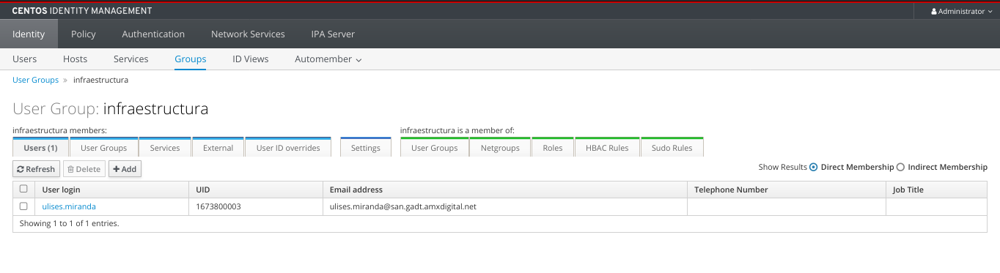
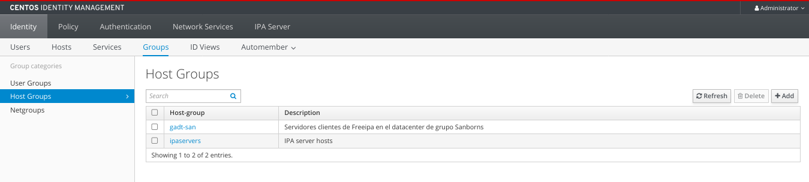
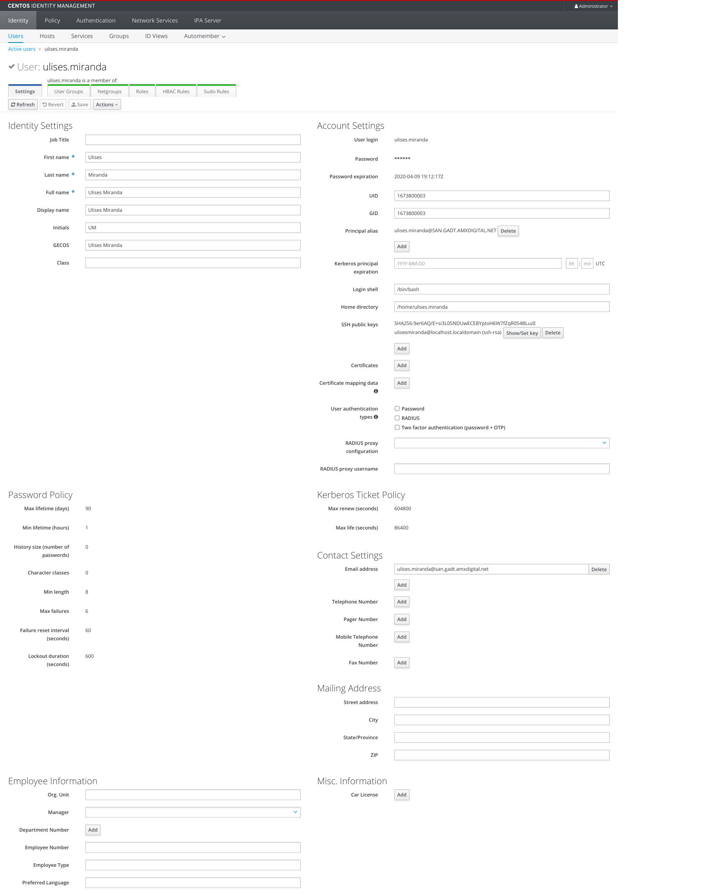
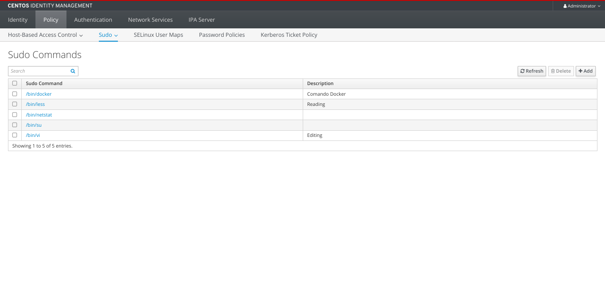
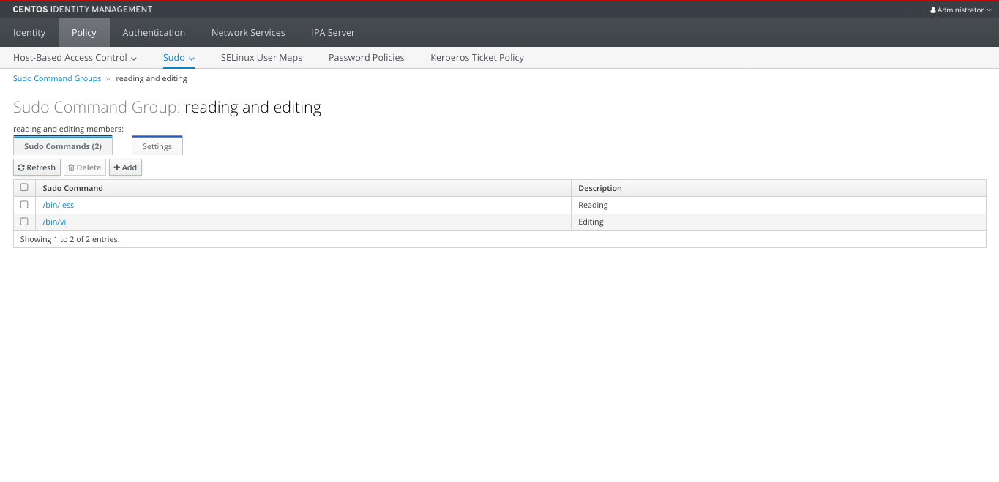
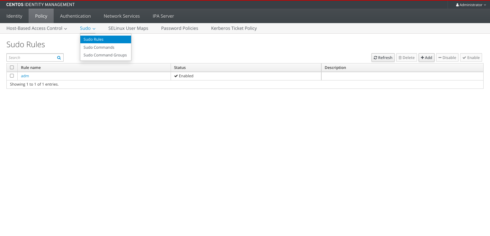
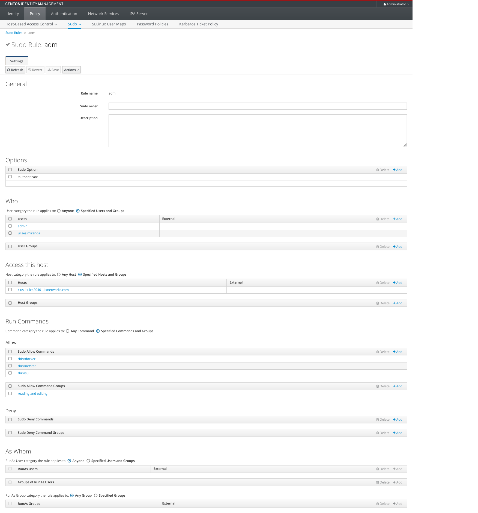

# Uso y administración de Freeipa

## Prerrequisitos
+ VM Centos/Rhel 7

## Agregar host cliente

### Configuración host 
+ FQDN

    Verificar que el cliente conozca al servidor de Freeipa mediante FQDN
+ Instalación

    Instalar paquete necesario para configurar al servidor como host cliente de Freeipa.
    ```sh
    yum install -y freeipa-client
    ```
    Iniciar el instalador y configurador de Freeipa-client:

    >La configuración es interactiva
    ```sh
    ipa-client-install --mkhomedir --hostname <fqdn hostname cliente>
    ```
    Se solicitarán algunos datos del FreeIPA.

+ sshd

    Modificar el servicio sshd para deshabilitar login con password:
    ```sh
    sed -i 's/ChallengeResponseAuthentication.*/ChallengeResponseAuthentication no/g' /etc/ssh/sshd_config
    sed -i 's/PasswordAuthentication.*/PasswordAuthentication no/g' /etc/ssh/sshd_config
    ```
+ sssd cache

    Modificar el timeout para la actualización de las reglas sudo que se hagan a los usuarios:
    ```sh
    sed -i 's/\[sssd\]/entry_cache_sudo_timeout = 0\n[sssd]/g' /etc/sssd/sssd.conf
    ```
    
    Reiniciar servicio
    ```sh
    systemctl restart sssd
    ```

## Creación de grupos

FreeIpa permite crear tres tipos de grupos:
    
+ Grupos de Usuarios
+ Grupos de Hosts Clientes
+ Netgroups

>También es posible hacer grupos de grupos. (Groupception)

### Grupos de Usuarios



La creación de grupos de usuarios se realiza para un mejor control de todos los usuarios registrados en IPA.



### Grupos de Hosts Clientes

Es posible crear grupos de hosts clientes para administrar los servidores que se conectan a Freeipa.



## Creación de usuarios

La creación de usuarios ofrece diferentes valores a editar, se pueden editar tanto datos personales y de control como de seguridad. Definir passwords o llaves de acceso, la terminal por defecto que tendrá (/bin/bash), certificados, el tipo de autenticación que tendrá y otros más.

También se pueden editar los grupos asignados, sus roles, reglas HBAC y las reglas sudo que este usuario tendrá asignadas.



## Creación de Sudo Commands

La creación de comandos que deben ser ejecutados con *sudo* se hace aquí, es para especificar una lista con estos comandos y porteriormente usarlos en *sudo rules* y *sudo command groups*.



## Creación de Sudo Command Groups

Los *sudo command groups* son un conjunto de *sudo commands*, estos grupos se crean para un mejor control de los comandos sudo.



## Creación de Sudo Rules

Las reglas de sudo son necesarias para otorgar permisos a usuarios de poder correr comando que requieran *sudo*. 

Se pueden especificar diferentes parámetros en la regla. Es el equivalente a editar el archivo *sudoers* dentro del servidor.



### Options
El primer parámetro a editar es el de opciones, parámetro necesario para permitir ciertas acciones. 

+ !authenticate
    
    La opción *!authenticate* es usada para no pedir contraseña al usuario que corre un comando con sudo. Necesaria cuando los usuarios no tienen contraseña.

### Who
El siguiente parámetro a especificar es a quienes se puede aplicar esta regla, especificar usuarios, grupos o a todos los que la tengan asignada.

### Access this host

En este apartado se especifica qué cliente host podrán tener esta regla. Pueden ser uno, varios, o cualquiera, así como grupos de hosts.

### Run Commands

Aquí se pueden especificar los *sudo commands* anteriormente creados que contrandrá esta regla asi como *sudo command groups*. De igual forma se puede especificar que pueda correr cualquier comando con sudo sin necesidad de haberlo creado antes como *sudo command*.
Se tiene la opción de denegar el permiso a un *sudo command* o *sudo command group* específico. 

### As Whom

En este apartado se especifica como qué otros usuarios se puede correr un comando, puede ser uno, varios o cualquier otro usuario o grupos de usuarios.

