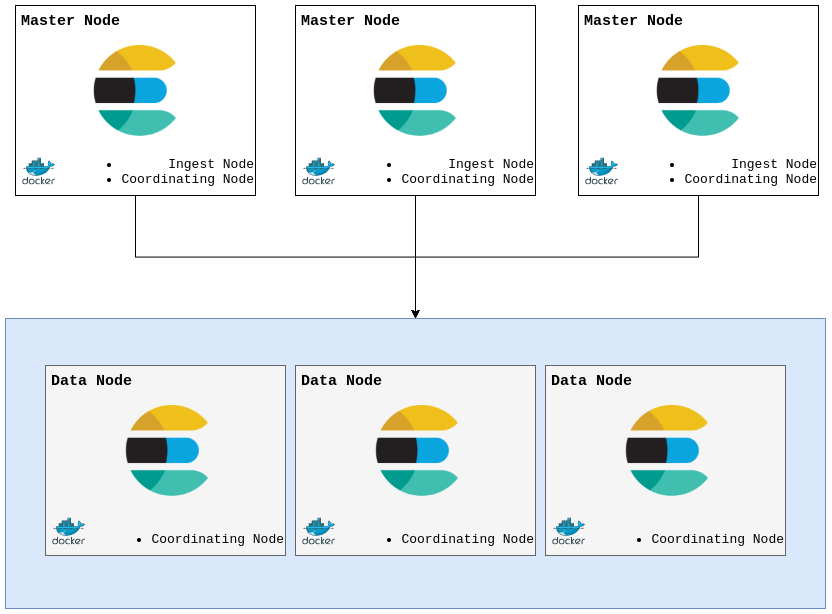

# Graylog HA
## Prerequisitos

* Imagen dockeregistry.amovildigitalops.com/graylog-enterprise:2.4.6-1
* Permitir el trafico en los puertos 
  * Elasticsearch: **9200**, **9300**, **9400**
  * Graylog: **9000**
* Dominio y vhost para Graylog

## Teoría

### Tipos de nodos en cluster de Elasticsearch

Los cluster de Elasticsearch trabajan con 5 tipos de nodos:
* Master Eligible Node
* Data Node
* Ingest Node
* Coordinating Node
* Machine learning Node

*NOTA: En Elasticsearch es posible que un nodo pueda pertenecer a más de un tipo.*
  
#### Master Elegible Node
La principal función de estos nodos es la administración y gestión del cluster, dichos nodos cuentan con permisos de escritura y lectura, sobre los nodos tipo data.

Una vez que el cluster es puesto en marcha, la elección del nodo master, es llevada a cabo entre los nodos de este tipo. Es importante señalar que al ocurrir la caida de alguno de estos nodos, de manera autómatica se lleva a cabo la elección de un nuevo nodo master, obviamente dicha elección se suscita **solo** entre este tipo de nodos.

#### Data Node
El principal propósito de este tipo de nodos es almacenar toda la información que llega a Elasticesarch. Es por esto que los nodos de datos manejan operaciones relacionadas con datos como CRUD, búsqueda y agregaciones. Estas operaciones son intensivas en E / S, memoria y CPU. Es importante monitorear estos recursos y agregar más nodos de datos si están sobrecargados.

#### Ingest Node
Los Ingest Node se encargan de un preprocesamiento de los documentos que son almacenados en Elasticsearch, para este caso nos referimos a preprocesamiento, al hecho de realizar ciertas configuraciones (por ejemplo, agregar o quitar valores) al documento original antes de almacenarlo.

#### Coordinating Node
La función de este tipo de nodos es similar a un pequeño balanceador de carga, puesto que tiene como finalidad el enrutamiento de las peticiones que llegan al cluster de Elasticsearch.

#### Machine learning Node
Este tipo de nodos permiten resolver peticiones que trabajan directamente con mecanismos de Machin Learning. Para habilitar este tipo de nodos es necesario tener instalado X-Pack.

## Desarrollo

### Despliegue de Elasticsearch

Para este despliegue se propone un cluster con los componentes mínimos, siendo 3 Nodos Master Elegible Node (los cuales a su vez seran Ingest Node y Coordinating Node) y Tres Nodos Data (los cuales también seran Coordinating Node).

**NOTA**: Para la elección de los nodos Master Elegible Node, se recomienda seguir la siguiente formula.

```math
Nodos Master = (master\_eligible\_nodes / 2) + 1
```

Donde:
* master_eligible_nodes >= 2: Es la cantidad de nodos que pueden ser propuestos para master.

**Arquitectura Propuesta**



```Para el despliegue de los nodos Master utilizamos el siguiente Runit```

```bash
#!/bin/bash
sysctl -w vm.max_map_count=262144
ELASTIC_CONTAINER="elasticsearch-master1.service"

mkdir -p /var/containers/$ELASTIC_CONTAINER/usr/share/elasticsearch/{data,logs}
chown 1000:0 -R /var/containers/$ELASTIC_CONTAINER

IP_SERVER="10.23.144.138"
ELASTIC_CLUSTER_NAME="cluster-elasticsearch"
ELASTIC_NODE_NAME="elastic-master1"
ELASTIC_NODE_MASTER="true"
ELASTIC_NODE_DATA="false"
ELASTIC_NODE_INGEST="true"
ELASTIC_PATH_DATA="/usr/share/elasticsearch/data"
ELASTIC_PATH_LOGS="/usr/share/elasticsearch/logs"
ELASTIC_XPACK_SECURITY_ENABLED="false"
ELASTIC_NETWORK_HOST="0.0.0.0"
ELASTIC_NETWORK_PUBLISH_HOST=$IP_SERVER
ELASTIC_HTTP_HOST="0.0.0.0"
ELASTIC_HTTP_PORT="9200-9300"
ELASTIC_HTTP_PUBLISH_PORT="9200"
ELASTIC_HTTP_PUBLISH_HOST=$IP_SERVER
ELASTIC_TRANSPORT_TCP_PORT="9300-9400"
ELASTIC_TRANSPORT_HOST="0.0.0.0"
ELASTIC_TRANSPORT_PUBLISH_HOST=$IP_SERVER
ELASTIC_TRANSPORT_PUBLISH_PORT="9300"
ELASTIC_DISCOVERY_ZEN_PING_UNICAST_HOSTS="master1,master2,master3,nodo1,nodo2,nodo3" 
ELASTIC_DISCOVERY_ZEN_PING_TIMEOUT="5s"
ELASTIC_DISCOVERY_ZEN_MINIMUM_MASTER_NODES="2" 
ELASTIC_DISCOVERY_ZEN_FD_PING_RETRIES="5"
ELASTIC_DISCOVERY_ZEN_FD_PING_TIMEOUT="120s" 

docker run  -itd --name $ELASTIC_CONTAINER \
    -h $ELASTIC_CONTAINER \
    --cap-add=IPC_LOCK \
    --ulimit nofile=65536:65536 \
    --ulimit memlock=-1:-1 \
    --memory-swappiness=0 \
    -v /var/containers/$ELASTIC_CONTAINER/usr/share/elasticsearch/data:/usr/share/elasticsearch/data:z \
    -v /var/containers/$ELASTIC_CONTAINER/usr/share/elasticsearch/logs:/usr/share/elasticsearch/logs:z \
    -v /etc/localtime:/etc/localtime:ro \
    -e "cluster.name=$ELASTIC_CLUSTER_NAME" \
    -e "path.data=$ELASTIC_PATH_DATA" \
    -e "path.logs=$ELASTIC_PATH_LOGS" \
    -e "node.name=$ELASTIC_NODE_NAME" \
    -e "node.master=$ELASTIC_NODE_MASTER" \
    -e "node.data=$ELASTIC_NODE_DATA" \
    -e "node.ingest=$ELASTIC_NODE_INGEST" \
    -e "network.host=$ELASTIC_NETWORK_HOST" \
    -e "network.bind_host=$ELASTIC_NETWORK_HOST" \
    -e "network.publish_host=$ELASTIC_NETWORK_PUBLISH_HOST" \
    -e "http.host=$ELASTIC_HTTP_HOST" \
    -e "http.port=$ELASTIC_HTTP_PORT" \
    -e "http.publish_host=$ELASTIC_HTTP_PUBLISH_HOST" \
    -e "discovery.zen.ping.unicast.hosts=$ELASTIC_DISCOVERY_ZEN_PING_UNICAST_HOSTS" \
    -e "discovery.zen.ping_timeout=$ELASTIC_DISCOVERY_ZEN_PING_TIMEOUT" \
    -e "discovery.zen.minimum_master_nodes=$ELASTIC_DISCOVERY_ZEN_MINIMUM_MASTER_NODES" \
    -e "discovery.zen.fd.ping_retries=$ELASTIC_DISCOVERY_ZEN_FD_PING_RETRIES" \
    -e "discovery.zen.fd.ping_timeout=$ELASTIC_DISCOVERY_ZEN_FD_PING_TIMEOUT" \
    -e "xpack.security.enabled=$ELASTIC_XPACK_SECURITY_ENABLED" \
    -e "transport.tcp.port=$ELASTIC_TRANSPORT_TCP_PORT" \
    -e "transport.host=$ELASTIC_TRANSPORT_HOST" \
    -e "transport.publish_host=$ELASTIC_TRANSPORT_PUBLISH_HOST" \
    -e "http.publish_port=$ELASTIC_HTTP_PUBLISH_PORT" \
    -e "transport.publish_port=$ELASTIC_TRANSPORT_PUBLISH_PORT" \
    -e "bootstrap.memory_lock=true" \
    -e "node.ml=false" \
    -e "xpack.ml.enabled=false" \
    -e "ES_JAVA_OPTS=-Xms2g -Xmx2g" \
    -e TZ=America/Mexico_City \
    -p 9200:9200 \
    -p 9400:9400 \
    -p 9300:9300 \
    docker.elastic.co/elasticsearch/elasticsearch:5.6.9
```

Donde:
* **IP_SERVER**: Es la Ip del servidor donde se encontrará el nodo de Elastic.
* **ELASTIC_DISCOVERY_ZEN_PING_UNICAST_HOSTS**: Lista de Ips o Hostname de los servidores correspondientes a los nodos del cluster. Deben ser alcanzables entre sí. (Debe ser el mismo en cada nodo)
* **ELASTIC_CLUSTER_NAME**: Nombre del cluster. (Debe ser el mismo en cada nodo)
* **ELASTIC_NODE_NAME**: Nombre del nodos. Debe ser único para cada nodo

Se recomendia mantener esta configuración para las demás variables.


```Para el despliegue de los nodos Data utilizamos el siguiente Runit```

```bash
#!/bin/bash
sysctl -w vm.max_map_count=262144
ELASTIC_CONTAINER="elasticsearch-data1.service"

mkdir -p /var/containers/$ELASTIC_CONTAINER/usr/share/elasticsearch/{data,logs}
chown 1000:0 -R /var/containers/$ELASTIC_CONTAINER

IP_SERVER="10.23.144.135"
ELASTIC_CLUSTER_NAME="cluster-elasticsearch"
ELASTIC_NODE_NAME="elastic-data1"
ELASTIC_NODE_MASTER="false"
ELASTIC_NODE_DATA="true"
ELASTIC_NODE_INGEST="false"
ELASTIC_PATH_DATA="/usr/share/elasticsearch/data"
ELASTIC_PATH_LOGS="/usr/share/elasticsearch/logs"
ELASTIC_XPACK_SECURITY_ENABLED="false"
ELASTIC_NETWORK_HOST="0.0.0.0"
ELASTIC_NETWORK_PUBLISH_HOST=$IP_SERVER
ELASTIC_HTTP_HOST="0.0.0.0"
ELASTIC_HTTP_PORT="9200-9300"
ELASTIC_HTTP_PUBLISH_PORT="9200"
ELASTIC_HTTP_PUBLISH_HOST=$IP_SERVER
ELASTIC_TRANSPORT_TCP_PORT="9300-9400"
ELASTIC_TRANSPORT_HOST="0.0.0.0"
ELASTIC_TRANSPORT_PUBLISH_HOST=$IP_SERVER
ELASTIC_TRANSPORT_PUBLISH_PORT="9300"
ELASTIC_DISCOVERY_ZEN_PING_UNICAST_HOSTS="master1,master2,master3,nodo1,nodo2,nodo3" 
ELASTIC_DISCOVERY_ZEN_PING_TIMEOUT="5s"
ELASTIC_DISCOVERY_ZEN_MINIMUM_MASTER_NODES="2" 
ELASTIC_DISCOVERY_ZEN_FD_PING_RETRIES="5"
ELASTIC_DISCOVERY_ZEN_FD_PING_TIMEOUT="120s" 

docker run  -itd --name $ELASTIC_CONTAINER \
    -h $ELASTIC_CONTAINER \
    --cap-add=IPC_LOCK \
    --ulimit nofile=65536:65536 \
    --ulimit memlock=-1:-1 \
    --memory-swappiness=0 \
    -v /var/containers/$ELASTIC_CONTAINER/usr/share/elasticsearch/data:/usr/share/elasticsearch/data:z \
    -v /var/containers/$ELASTIC_CONTAINER/usr/share/elasticsearch/logs:/usr/share/elasticsearch/logs:z \
    -v /etc/localtime:/etc/localtime:ro \
    -e "cluster.name=$ELASTIC_CLUSTER_NAME" \
    -e "path.data=$ELASTIC_PATH_DATA" \
    -e "path.logs=$ELASTIC_PATH_LOGS" \
    -e "node.name=$ELASTIC_NODE_NAME" \
    -e "node.master=$ELASTIC_NODE_MASTER" \
    -e "node.data=$ELASTIC_NODE_DATA" \
    -e "node.ingest=$ELASTIC_NODE_INGEST" \
    -e "network.host=$ELASTIC_NETWORK_HOST" \
    -e "network.bind_host=$ELASTIC_NETWORK_HOST" \
    -e "network.publish_host=$ELASTIC_NETWORK_PUBLISH_HOST" \
    -e "http.host=$ELASTIC_HTTP_HOST" \
    -e "http.port=$ELASTIC_HTTP_PORT" \
    -e "http.publish_host=$ELASTIC_HTTP_PUBLISH_HOST" \
    -e "discovery.zen.ping.unicast.hosts=$ELASTIC_DISCOVERY_ZEN_PING_UNICAST_HOSTS" \
    -e "discovery.zen.ping_timeout=$ELASTIC_DISCOVERY_ZEN_PING_TIMEOUT" \
    -e "discovery.zen.minimum_master_nodes=$ELASTIC_DISCOVERY_ZEN_MINIMUM_MASTER_NODES" \
    -e "discovery.zen.fd.ping_retries=$ELASTIC_DISCOVERY_ZEN_FD_PING_RETRIES" \
    -e "discovery.zen.fd.ping_timeout=$ELASTIC_DISCOVERY_ZEN_FD_PING_TIMEOUT" \
    -e "xpack.security.enabled=$ELASTIC_XPACK_SECURITY_ENABLED" \
    -e "transport.tcp.port=$ELASTIC_TRANSPORT_TCP_PORT" \
    -e "transport.host=$ELASTIC_TRANSPORT_HOST" \
    -e "transport.publish_host=$ELASTIC_TRANSPORT_PUBLISH_HOST" \
    -e "http.publish_port=$ELASTIC_HTTP_PUBLISH_PORT" \
    -e "transport.publish_port=$ELASTIC_TRANSPORT_PUBLISH_PORT" \
    -e "bootstrap.memory_lock=true" \
    -e "node.ml=false" \
    -e "xpack.ml.enabled=false" \
    -e "ES_JAVA_OPTS=-Xms2g -Xmx2g" \
    -e TZ=America/Mexico_City \
    -p 9200:9200 \
    -p 9400:9400 \
    -p 9300:9300 \
    docker.elastic.co/elasticsearch/elasticsearch:5.6.9
```

Donde:
* **IP_SERVER**: Es la Ip del servidor donde se encontrará el nodo de Elastic.
* **ELASTIC_DISCOVERY_ZEN_PING_UNICAST_HOSTS**: Lista de Ips o Hostname de los servidores correspondientes a los nodos del cluster. Deben ser alcanzables entre sí. (Debe ser el mismo en cada nodo)
* **ELASTIC_CLUSTER_NAME**: Nombre del cluster. (Debe ser el mismo en cada nodo)
* **ELASTIC_NODE_NAME**: Nombre del nodos. Debe ser único para cada nodo

Se recomendia mantener esta configuración para las demás variables.

### Despliegue de Graylog

Para el despliegue de Graylog hacemos uso del siguiente runit

`Despliegue de Mongo`

```bash
mkdir -p /var/containers/Graylog/mongo

chown -R 2003:2004 /var/containers/Graylog/mongo

docker run -td --name mongo-graylog \
    -v /var/containers/Graylog/mongo/:/data/db:z \
    -v /etc/localtime:/etc/localtime:ro \
    -e TZ=America/Mexico_City \
    --restart unless-stopped \
    -d mongo:3
```

**NOTA**: Si Mongo se despliega en un servidor diferente a Graylog, es necesario exponer el puerto **27017**.

Donde:

* **MONGO_CONTAINER**: Nombre del contenedor de Mongo

`Despliegue de Graylog`

```bash
mkdir -p /var/containers/Graylog/data/journal
mkdir -p /var/containers/Graylog/GeoIP/
mkdir -p /var/containers/Graylog/config
mkdir -p /var/containers/Graylog/graylog-archive

chown -R 1100:1100 /var/containers/Graylog/config
chown -R 1100:1100 /var/containers/Graylog/GeoIP/
chown -R 1100:1100 /var/containers/Graylog/graylog-archive

if [ ! -f /var/containers/Graylog/config/graylog.conf ]; then
    echo 'aXNfbWFzdGVyID0gdHJ1ZQpub2RlX2lkX2ZpbGUgPSAvdXNyL3NoYXJlL2dyYXlsb2cvZGF0YS9jb25maWcvbm9kZS1pZApwYXNzd29yZF9zZWNyZXQgPSAxTTN0c0wxZjNaQkVlS3FPMUs5VzdYeUxiV3FpS0k1eU1KekdwRVJPd00xWUdsSmV4U1FKTmdZZlBzN0RwYU1YQjNIdFk2aW0zc1ZpSTczU3BLVnJOdWVCa210TU80MEQKcm9vdF91c2VybmFtZSA9IGFteGdhCnJvb3RfcGFzc3dvcmRfc2hhMiA9IGU5Y2VlNzFhYjkzMmZkZTg2MzMzOGQwOGJlNGRlOWRmZTM5ZWEwNDliZGFmYjM0MmNlNjU5ZWM1NDUwYjY5YWUKcm9vdF90aW1lem9uZSA9IEFtZXJpY2EvTWV4aWNvX0NpdHkKcGx1Z2luX2RpciA9IC91c3Ivc2hhcmUvZ3JheWxvZy9wbHVnaW4KcmVzdF9saXN0ZW5fdXJpID0gaHR0cDovLzAuMC4wLjA6OTAwMC9hcGkvCndlYl9saXN0ZW5fdXJpID0gaHR0cDovLzAuMC4wLjA6OTAwMC8KZWxhc3RpY3NlYXJjaF9ob3N0cyA9IGh0dHA6Ly9lbGFzdGljc2VhcmNoOjkyMDAKZWxhc3RpY3NlYXJjaF9jb21wcmVzc2lvbl9lbmFibGVkID0gdHJ1ZQphbGxvd19sZWFkaW5nX3dpbGRjYXJkX3NlYXJjaGVzID0gZmFsc2UKYWxsb3dfaGlnaGxpZ2h0aW5nID0gZmFsc2UKb3V0cHV0X2JhdGNoX3NpemUgPSA1MDAKb3V0cHV0X2ZsdXNoX2ludGVydmFsID0gMQpvdXRwdXRfZmF1bHRfY291bnRfdGhyZXNob2xkID0gNQpvdXRwdXRfZmF1bHRfcGVuYWx0eV9zZWNvbmRzID0gMzAKcHJvY2Vzc2J1ZmZlcl9wcm9jZXNzb3JzID0gNQpvdXRwdXRidWZmZXJfcHJvY2Vzc29ycyA9IDMKcHJvY2Vzc29yX3dhaXRfc3RyYXRlZ3kgPSBibG9ja2luZwpyaW5nX3NpemUgPSA2NTUzNgppbnB1dGJ1ZmZlcl9yaW5nX3NpemUgPSA2NTUzNgppbnB1dGJ1ZmZlcl9wcm9jZXNzb3JzID0gMgppbnB1dGJ1ZmZlcl93YWl0X3N0cmF0ZWd5ID0gYmxvY2tpbmcKbWVzc2FnZV9qb3VybmFsX2VuYWJsZWQgPSB0cnVlCm1lc3NhZ2Vfam91cm5hbF9kaXIgPSAvdXNyL3NoYXJlL2dyYXlsb2cvZGF0YS9qb3VybmFsCmxiX3JlY29nbml0aW9uX3BlcmlvZF9zZWNvbmRzID0gMwptb25nb2RiX3VyaSA9IG1vbmdvZGI6Ly9tb25nby9ncmF5bG9nCm1vbmdvZGJfbWF4X2Nvbm5lY3Rpb25zID0gMTAwCm1vbmdvZGJfdGhyZWFkc19hbGxvd2VkX3RvX2Jsb2NrX211bHRpcGxpZXIgPSA1CmNvbnRlbnRfcGFja3NfbG9hZGVyX2VuYWJsZWQgPSB0cnVlCmNvbnRlbnRfcGFja3NfZGlyID0gL3Vzci9zaGFyZS9ncmF5bG9nL2RhdGEvY29udGVudHBhY2tzCmNvbnRlbnRfcGFja3NfYXV0b19sb2FkID0gZ3Jvay1wYXR0ZXJucy5qc29uCnByb3hpZWRfcmVxdWVzdHNfdGhyZWFkX3Bvb2xfc2l6ZSA9IDMyCg==' | base64 -w0 -d > /var/containers/Graylog/config/graylog.conf
fi 

if [ ! -f /var/containers/Graylog/config/log4j2.xml ]; then 
    echo 'PD94bWwgdmVyc2lvbj0iMS4wIiBlbmNvZGluZz0iVVRGLTgiPz4KPENvbmZpZ3VyYXRpb24gcGFja2FnZXM9Im9yZy5ncmF5bG9nMi5sb2c0aiI+CiAgICA8QXBwZW5kZXJzPgogICAgICAgIDxDb25zb2xlIG5hbWU9IlNURE9VVCIgdGFyZ2V0PSJTWVNURU1fT1VUIj4KICAgICAgICAgICAgPFBhdHRlcm5MYXlvdXQgcGF0dGVybj0iJWQgJS01cDogJWMgLSAlbSVuIi8+CiAgICAgICAgPC9Db25zb2xlPgoKICAgICAgICA8IS0tIEludGVybmFsIEdyYXlsb2cgbG9nIGFwcGVuZGVyLiBQbGVhc2UgZG8gbm90IGRpc2FibGUuIFRoaXMgbWFrZXMgaW50ZXJuYWwgbG9nIG1lc3NhZ2VzIGF2YWlsYWJsZSB2aWEgUkVTVCBjYWxscy4gLS0+CiAgICAgICAgPE1lbW9yeSBuYW1lPSJncmF5bG9nLWludGVybmFsLWxvZ3MiIGJ1ZmZlclNpemU9IjUwMCIvPgogICAgPC9BcHBlbmRlcnM+CiAgICA8TG9nZ2Vycz4KICAgICAgICA8IS0tIEFwcGxpY2F0aW9uIExvZ2dlcnMgLS0+CiAgICAgICAgPExvZ2dlciBuYW1lPSJvcmcuZ3JheWxvZzIiIGxldmVsPSJpbmZvIi8+CiAgICAgICAgPExvZ2dlciBuYW1lPSJjb20uZ2l0aHViLmpvc2NoaS5qYWRjb25maWciIGxldmVsPSJ3YXJuIi8+CiAgICAgICAgPCEtLSB0aGlzIGVtaXRzIGEgaGFybWxlc3Mgd2FybmluZyBmb3IgQWN0aXZlRGlyZWN0b3J5IGV2ZXJ5IHRpbWUgd2hpY2ggd2UgY2FuJ3Qgd29yayBhcm91bmQgOiggLS0+CiAgICAgICAgPExvZ2dlciBuYW1lPSJvcmcuYXBhY2hlLmRpcmVjdG9yeS5hcGkubGRhcC5tb2RlbC5tZXNzYWdlLkJpbmRSZXF1ZXN0SW1wbCIgbGV2ZWw9ImVycm9yIi8+CiAgICAgICAgPCEtLSBQcmV2ZW50IERFQlVHIG1lc3NhZ2UgYWJvdXQgTHVjZW5lIEV4cHJlc3Npb25zIG5vdCBmb3VuZC4gLS0+CiAgICAgICAgPExvZ2dlciBuYW1lPSJvcmcuZWxhc3RpY3NlYXJjaC5zY3JpcHQiIGxldmVsPSJ3YXJuIi8+CiAgICAgICAgPCEtLSBEaXNhYmxlIG1lc3NhZ2VzIGZyb20gdGhlIHZlcnNpb24gY2hlY2sgLS0+CiAgICAgICAgPExvZ2dlciBuYW1lPSJvcmcuZ3JheWxvZzIucGVyaW9kaWNhbC5WZXJzaW9uQ2hlY2tUaHJlYWQiIGxldmVsPSJvZmYiLz4KICAgICAgICA8IS0tIFN1cHByZXNzIGNyYXp5IGJ5dGUgYXJyYXkgZHVtcCBvZiBEcm9vbHMgLS0+CiAgICAgICAgPExvZ2dlciBuYW1lPSJvcmcuZHJvb2xzLmNvbXBpbGVyLmtpZS5idWlsZGVyLmltcGwuS2llUmVwb3NpdG9yeUltcGwiIGxldmVsPSJ3YXJuIi8+CiAgICAgICAgPCEtLSBTaWxlbmNlIGNoYXR0eSBuYXR0eSAtLT4KICAgICAgICA8TG9nZ2VyIG5hbWU9ImNvbS5qb2VzdGVsbWFjaC5uYXR0eS5QYXJzZXIiIGxldmVsPSJ3YXJuIi8+CiAgICAgICAgPCEtLSBTaWxlbmNlIEthZmthIGxvZyBjaGF0dGVyIC0tPgogICAgICAgIDxMb2dnZXIgbmFtZT0ia2Fma2EubG9nLkxvZyIgbGV2ZWw9Indhcm4iLz4KICAgICAgICA8TG9nZ2VyIG5hbWU9ImthZmthLmxvZy5PZmZzZXRJbmRleCIgbGV2ZWw9Indhcm4iLz4KICAgICAgICA8Um9vdCBsZXZlbD0id2FybiI+CiAgICAgICAgICAgIDxBcHBlbmRlclJlZiByZWY9IlNURE9VVCIvPgogICAgICAgICAgICA8QXBwZW5kZXJSZWYgcmVmPSJncmF5bG9nLWludGVybmFsLWxvZ3MiLz4KICAgICAgICA8L1Jvb3Q+CiAgICA8L0xvZ2dlcnM+CjwvQ29uZmlndXJhdGlvbj4K' | base64 -w0 -d > /var/containers/Graylog/config/log4j2.xml
fi

docker run  -td --name graylog --link mongo-graylog:mongo \
    -p 9000:9000 \
    -p 12201:12201 \
    -p 514:514 \
    -p 5555:5555 \
    -p 5556-5580:5556-5580 -p 6666-6690:6666-6690/udp -p 7777-7778:7777-7778/udp -p 8888-8898:8888-8898 \
    -e GRAYLOG_WEB_ENDPOINT_URI="http://graylog.amxgadt.com" \
    -e GRAYLOG_PASSWORD_SECRET="abcdefg123456789" \
    -e "ES_JAVA_OPTS=-Xms1024m -Xmx4096m" \
    --ulimit nproc=1048576:1048576 \
    --restart unless-stopped \
    -e TZ=America/Mexico_City \
    -v /var/containers/Graylog/data/journal/:/usr/share/graylog/data/journal:z \
    --ulimit nproc=1048576:1048576 \
    -v /var/containers/Graylog/config/:/usr/share/graylog/data/config/:z \
    -v /etc/localtime:/etc/localtime:ro \
    -v /var/containers/Graylog/GeoIP/:/etc/graylog/server/:z \
    -v /var/containers/Graylog/graylog-archive:/tmp/graylog-archive:z \
    dockeregistry.amovildigitalops.com/graylog-enterprise:2.4.6-1
```
**NOTA**: En el archivo [graylog.conf](conf/graylog.conf) es necesario modificar las líneas:
* *elasticsearch_hosts* donde se debera apuntar al cluster de Elasticsearch.
* *password_secret* donde se deberá colocar un token para el cifrado de los password.
* *root_username* donde se deberá colocar el nombre del usuario root de Graylog.
* *root_password_sha2* donde se deberá colocar el password en SHA2

Para la exposición de Graylog con Nginx se puede tomar como ejemplo el archivo [graylog.conf](nginx/graylog.conf) que se encuentra en este repositorio.