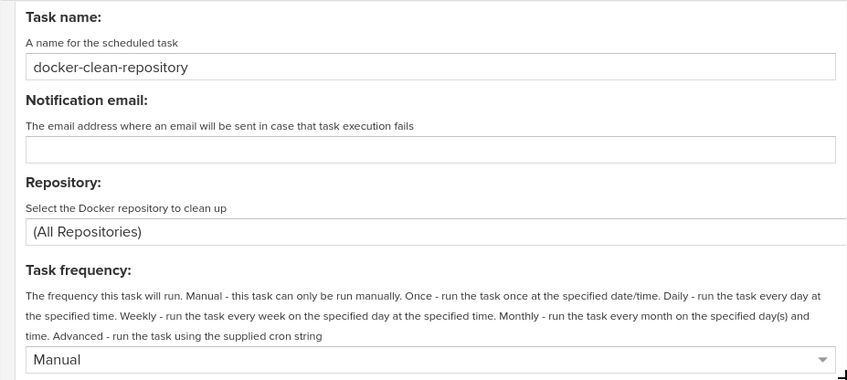
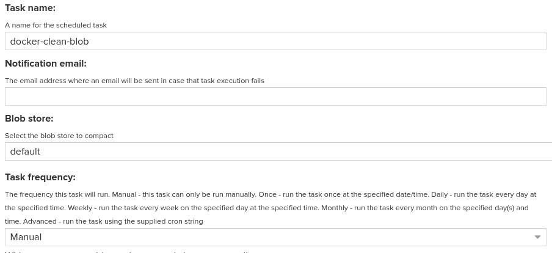

# Ciclo de vida de las imagenes Docker

Gestión de las imagenes Docker almacenadas en un registry Nexus.

## Prerequisitos

* Repositorio Nexus
* Python 2.7.X
* Git

## Desarrollo

## Creación de Tasks en Nexus

Para llevar a cabo la limpieza del repositorio nos apoyaremos de tareas propias de Nexus. A continuación nos situamos en **Server administration and configuration / System / Tasks** y seleccionamos **Create Task**

En tipo seleccionamos **Docker - deleted unused manifests and images** y la configuramos con los siguientes parametros.



*NOTA: Si asi lo desea, puede cambiar el nombre del Task*

Finalmente seleccionamos **Create task**

A continuación crearemos un segundo Task el cual nos permitirá reclamar el espacio en disco.

En tipo seleccionamos **Admin - Compact blob store** y la configuramos con los siguientes parametros.



*NOTA: Si asi lo desea, puede cambiar el nombre del Task*

**NOTA: En la sección Blob Store, seleccionar el Blob donde se almacenan las imagenes de los diferentes registry, si el almacenamiento se lleva a caba en más de un Blob, es necesario crear un Task a cada Blob**

Finalmente seleccionamos **Create task**

## Configuración archivos python

Clonamos el repositorio con los archivos que permitiran la gestión de las imagenes del repositorio Nexus

```bash
git clone https://infracode.amxdigital.net/desarrollo-tecnologico/images-life /opt/images-life
```

A continuacion configuramos una tarea en Crontab para ejecutar la limpieza del repositorio todos los dias a las 2:00 am. 
**NOTA: Ajustar la configuración a sus necesidades**

*Abrimos el archivo de configuracion de Crontab*
```bash
crontab -e
```

*Programamos la tarea*
```bash
0 2 * * * /bin/python /opt/images-life/python/dockerLifeCycleNexus.py --user admin --password abcd1234 --host http://10.23.143.8:8081 --images 2
```
Donde:

* **--user**: Es el usuario con el que se realizará la conexión al repositorio, dicho usuario debe tener permisos para interactuar con repositorios de tipo Docker.

* **--password**: Password del usuario con el que se llevara a cabo la conexión con el repositorio.

* **--host**: Dominio o Ip donde esta deplegada la instancia Nexus (Ej. http://nexus.amxga.net)

* **--images**: Número minimo de versiones que se tendrán almacenadas por cada imagen
*Guardamos cambios y salimos del editor*