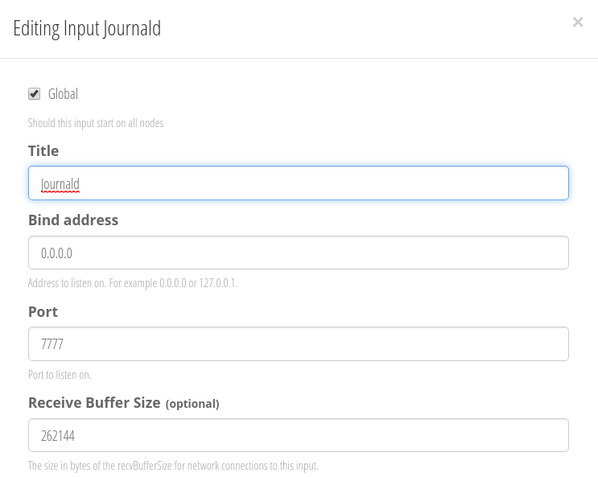
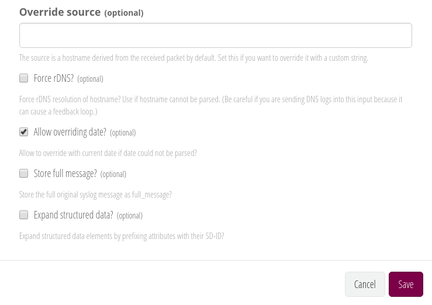
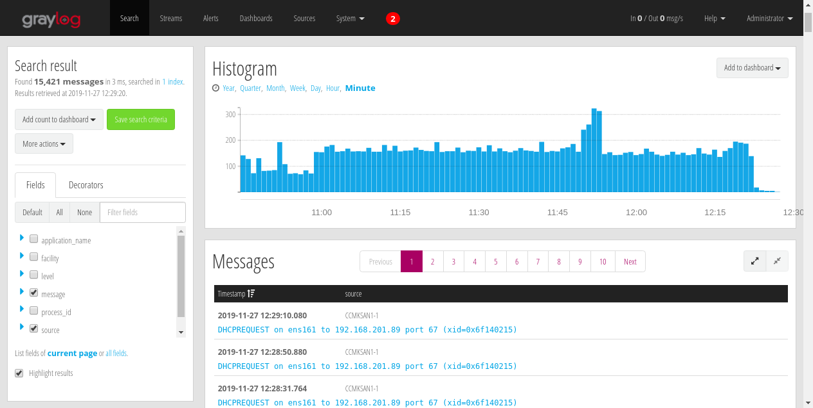

# Forwarding Journald to Graylog

Envio de logs a Graylog generados por Journald, utilizando como intermedirario Rsyslog.

## Prerequisitos

* Virtual Rhel/CentOS 7
* Graylog

## Desarrollo
### Configuración Journald

Para habilitar el envio de logs a Rsyslog, modificamos el archivo de configuración **/etc/systemd/journald.conf** agregando las siguientes entradas

```conf
[Journal]
...
ForwardToSyslog=yes
MaxLevelSyslog=debug
...
```
**NOTA**: En ocasiones dichas entradas ya se encuentran en el archivo de configuración solo que comentadas, para estos casos solo hace falta descomendar dichas líneas.

Reiniciamos el servicio de Journald para hacer efectivos los cambios

```bash
systemctl restart systemd-journald
```


### Configuración Rsyslog

Para la instalación de Rsyslog (en caso de que el servicio no se encuentre), hacemos uso del siguiente comando:

```bash
yum install rsyslog -y
```

Iniciamos el servicio:

```bash
systemctl enable rsyslog && systemctl start rsyslog
```

A continuación instalamos el siguiente modulo, para posteriormente habilitar el envío de los logs provenientes de Journald

```bash
yum install rsyslog-mmjsonparse -y
```

Para hablitar la recepción y envío de logs provenientes de Journald, generamos el siguiente archivo de configuración con el contenido que se muestra a continuación

*vi /etc/rsyslog.d/journald.conf*
```conf
module(load="mmjsonparse")
*.* @<Ip o Hostname de Graylog>:<Puerto por donde escuchará el Input de Graylog>;RSYSLOG_SyslogProtocol23Format
```

Reinicamos el servicio de Graylog para hacer efectivos los cambios

```bash
systemctl restart rsyslog
```

### Configuración de Graylog

Ubicados en la interfaz de Graylog, en la sección **System/Inputs**, creamos un nuevo Input del tipo **Syslog UDP**.

A continuación se muestra un ejemplo de la configuración basica que dicho Input debe tener.




**NOTA**: En la sección *Port* debe colocarse el mismo valor que se colocó durante la configuración de Rsyslog, en el apartado *\<Puerto por donde escuchará el Input de Graylog\>*

Guardamos el nuevo Input y a continuación comenzaremos a ver la entrada de logs en dicho Input

