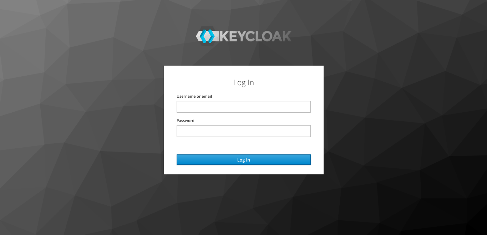

# Microcks-0.8.1

Creación y levantamiento de imagen Microcks 0.8.1

## Prerrequisitos

+ Docker 1.13.X
+ Virtual CentOS / Rhel.
+ Imagen dockeregistry.amovildigitalops.com/rhel7-atomic
+ Imagen dockeregistry.amovildigitalops.com/atomic-rhel7-java-8
+ Git.
+ Mongo 3 o superior.
+ Keycloak 3.4 o superior.

El levantamiento de microcks requiere de diferentes prerrequisitos, utiiza como base de datos Mongo 3 o superior. El levantamiento de Mongo no se especifica aquí, sin embargo, se puede revisar en el proyecto [Mongodb 4.2.0](https://infracode.amxdigital.net/desarrollo-tecnologico/mongo-4.0.2).

Lo mismo para Keycloack, se puede revisar el levantamiento de esa imagen en el proyecto [Keycloak-8.0.1](https://infracode.amxdigital.net/desarrollo-tecnologico/keycloak-8).

## Creación de imágenes

Se requieren dos imágenes para Microcks:
* Microcks-0.8.1
* Microcks-Postman (Bridge entre Postman y Microcks para testing de API's)

### Microcks Postman

Clonar el repositorio para construir Microcks-Postman y nos posicionamos dentro del directorio.

```sh
git clone https://github.com/microcks/microcks-postman-runtime && cd microcks-postman-runtime
```

Cambiar el dockerfile para construir Microcks-Postman.
```sh
echo 'RlJPTSBkb2NrZXJlZ2lzdHJ5LmFtb3ZpbGRpZ2l0YWxvcHMuY29tL3JoZWw3LWF0b21pYwoKTEFCRUwgbWFpbnRhaW5lcj0iTWF1cmljaW8gTWVsw6luZGV6ICYmIEtldmluIEfDs21leiAvIEdBRFQtQU1YIgoKUlVOIGN1cmwgLXNMIGh0dHBzOi8vcnBtLm5vZGVzb3VyY2UuY29tL3NldHVwXzEwLnggfCBiYXNoIC0gJiYgXAogICAgY3VybCBodHRwczovL3JlcG9zLmFteGRpZ2l0YWwubmV0L3JoZWwtc2VydmVyLXJoc2NsLTctcnBtcy5yZXBvICAtbyAvZXRjL3l1bS5yZXBvcy5kL3JoZWwtc2VydmVyLXJoc2NsLTctcnBtcy5yZXBvICYmIGN1cmwgaHR0cHM6Ly9yZXBvcy5hbXhkaWdpdGFsLm5ldC9yaGVsLTctc2VydmVyLXJwbXMucmVwbyAtbyAvZXRjL3l1bS5yZXBvcy5kL3JoZWwtNy1zZXJ2ZXItcnBtcy5yZXBvICYmIFwKICAgIG1pY3JvZG5mIGluc3RhbGwgLXkgbm9kZWpzICYmIG1pY3JvZG5mIGNsZWFuIGFsbAoKIyBEZWZpbmUgd29ya2luZyBkaXJlY3RvcnkKUlVOIG1rZGlyIC1wIC9vcHQvYXBwLXJvb3Qvc3JjICYmIG1rZGlyIC1wIC9vcHQvYXBwLXJvb3Qvc3JjL2xpYgpXT1JLRElSIC9vcHQvYXBwLXJvb3Qvc3JjCgojIENvcHkgZmlsZXMgYW5kIGluc3RhbGwgZGVwZW5kZW5jaWVzCkNPUFkgLyogL29wdC9hcHAtcm9vdC9zcmMvCkNPUFkgL2xpYi8qIC9vcHQvYXBwLXJvb3Qvc3JjL2xpYi8KUlVOIG5wbSBpbnN0YWxsCgojIFNldCB0aGUgcnVubmluZyBlbnZpcm9ubWVudCBhcyBwcm9kdWN0aW9uCkVOViBOT0RFX0VOViBwcm9kdWN0aW9uCkVOViBMT0dfTEVWRUwgaW5mbwpFTlYgUE9SVCAzMDAwCgojIEV4cG9zZSBvbiBzcGVjaWZpZWQgbmV0d29yayBwb3J0CkVYUE9TRSAzMDAwCgojIEV4ZWN1dGluZyBkZWZhdWx0cwpDTUQgWyJub2RlIiwgImFwcC5qcyJdCg==' | base64 -d > Dockerfile
```

Construir imagen Microcks-Postman
```sh
docker build -t dockeregistry.amovildigitalops.com/rhel7-atomic-postman-microcks .
```

Levantar contenedor Microcks-Postman (Exponer el puerto sólo si estará en un host distinto a Microcks).
```sh
docker run -d --name postman-microcks \
              -p 3000:3000 \
              dockeregistry.amovildigitalops.com/rhel7-atomic-postman-microcks
```

> Se puede testear el funcionamiento de Microcks-Postman con el siguiente comando (De no exponer el puerto 3000, apuntar a la IP del contenedor en vez de a localhost):
```sh
curl -X POST http://localhost:3000/tests/598850b8b2799dac88a33cd5 -H "Content-Type: application/json" -d '{"operation": "GET /order/:id", "callbackUrl": "http://localhost:9090/api/tests/598850b8b2799dac88a33cd5/testCaseResult", "testScript": { "listen": "test", "script": { "type": "text/javascript", "exec": [ "var jsonData = JSON.parse(responseBody);", "var expectedId = globals[\"id\"]", "tests[\"Check id value\"] = jsonData.id === expectedId;", "tests[\"Check id value again\"] = jsonData.id === expectedId;" ] } }, "requests": [ { "endpointUrl": "http://localhost:8080/rest/Test%20API/0.0.1/order/123456", "name": "get-123456", "method": "GET", "queryParams": [{"key": "id", "value": "123456"}] } ] }'
```

> Debería contestar algo como lo siguiente:

```
New Postman collection test launched
```

### Microcks

Clonar el repositorio.
```sh
git clone https://infracode.amxdigital.net/desarrollo-tecnologico/microcks-0.8.1 /opt/microcks-0.8.1
```
Copiar archivo **microcks-0.8.1.jar** al directorio donde se creará la imagen de Microcks.
```sh
cp /mediainstall/microcks-0.8.1.jar /opt/microcks-0.8.1/docker-microcks/
```

> Verificar que el archivo **microcks-0.8.1.jar** se encuentra en el directorio */opt/microcks-0.8.1/docker-microcks/*

Crear la imagen.
```sh
docker build -t dockeregistry.amovildigitalops.com/rhel7-atomic-microcks-0.8.1 /opt/microcks-0.8.1/docker-microcks/
```
Levantar contenedor Microcks.
```sh
#############################################################
#                                                           #
#                    Runit for Microcks                     #
#                                                           #
#############################################################

mkdir -p /var/containers/microcks/deployments/config


docker run -d --name microcks \
              -p 8080:8080 \
              -v /var/containers/microcks/deployments/config:/deployments/config:z \
              -e SPRING_PROFILES_ACTIVE=prod \
              -e SPRING_DATA_MONGODB_URI=mongodb://<User-MongoDB>:<Password-MongoDB>@<IP-MongoDB>:27017 \
              -e SPRING_DATA_MONGODB_DATABASE=microcks \
              -e POSTMAN_RUNNER_URL=http://<IP-Postman-Microcks>:3000 \
              -e KEYCLOAK_URL=http://<IP y puerto o dominio de Keycloak>/auth \
              dockeregistry.amovildigitalops.com/rhel7-atomic-microcks-0.8.1
```

**NOTA:** Microcks se expone por el puerto 8080, al ingresar te redirige a Keycloak para la autenticación, se debe dar de alta Microcks en la aplicación de Keycloak.

## Alta de Microcks en Keycloak

Ingresar a Keycloak:



Agregar un realm:


Cargamos el realm [microcks_realm.json](/docker-microcks/microcks_realm.json).

**NOTA:** Cuidar dentro del realm los parámetros que queremos configurar, sobre todo *redirectUris*, que es el dominio por el que sale Microcks. También se configuran el usuario y contraseña iniciales.


