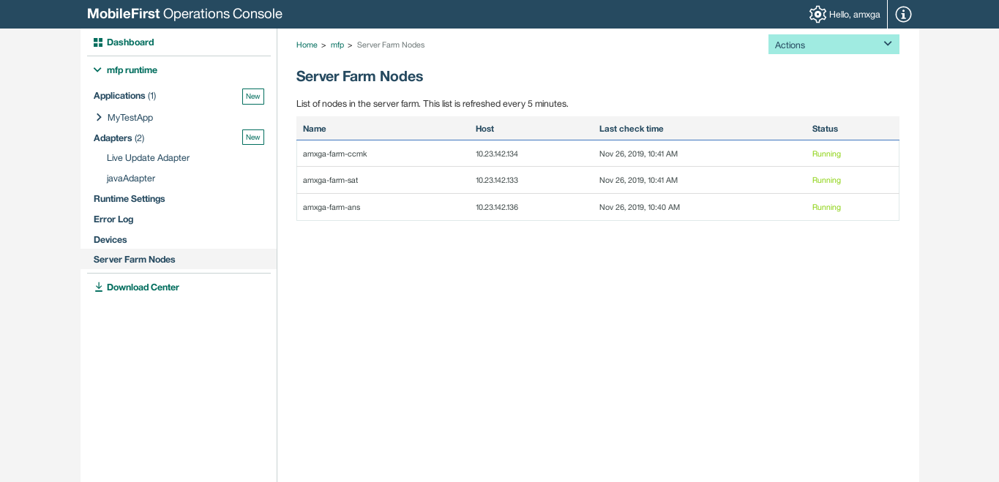

# Levantar MobileFirst.

## Creación de la BD en DB2.

Levantar contenedor.
```sh
instancia=db2amx
mkdir -p /var/containers/db2/$instancia/home/
docker run -td --hostname=db2105.service --privileged=true --name db2105 --cap-add=IPC_OWNER -p 50000:50000 -v /etc/localtime:/etc/localtime:ro --volume=/var/containers/db2/$instancia/home/:/home/ -e "instuser=$instancia" -e "instport=50000" -e "instpasswd=mipasswordmuysecreto" --entrypoint /root/entrypoint.sh --ulimit nofile=102400:102400 dockeregistry.amovildigitalops.com/rhel68db2105:v1.0
```
Crear la BD.
```sh
docker exec -it --user db2amx db2105 /opt/IBM/db2/V10.5/bin/db2

create database MFPDATA
```
Obtener ip del contenedor db2
```sh
docker inspect -f '{{range .NetworkSettings.Networks}}{{.IPAddress}}{{end}}' db2105
```
**Guardar este dato que se usará después.**

## Mobilefirst Platform Server.

Levantar contenedor de Mobilefirst Platform Server
```sh
docker run -td --privileged=true --name $MFPF_CONTAINER \
    -p 80:80 -p 443:443 \
    -v /var/containers/$MFPF_CONTAINER/opt/ibm/wlp/usr/servers/:/opt/ibm/wlp/usr/servers/:z \
    -v /etc/localtime:/etc/localtime:ro \
    -v /usr/share/zoneinfo:/usr/share/zoneinfo:ro \
    --health-cmd='/sbin/docker-health-check.sh' \
    --health-interval=10s \
    --restart unless-stopped \
    -h $MFPF_DOMAIN \
    -e TZ=America/Mexico_City \
    -e "IP_ADDRESS=$MFPF_IP_SERVER" \
    -e "MFPF_SERVER_HTTPPORT=80" \
    -e "MFPF_SERVER_HTTPSPORT=443" \
    -e "MFPF_DB2_SERVER_NAME=$MFPF_DB2_HOST" \
    -e "MFPF_DB2_PORT=$MFPF_DB2_PORT" \
    -e "MFPF_DB2_DATABASE_NAME=$MFPF_DB2_DATABASE" \
    -e "MFPF_DB2_USERNAME=$MFPF_DB2_USER" \
    -e "MFPF_DB2_PASSWORD=$MFPF_DB2_PASSWORD" \
    -e "MFPF_USER=$MFPF_USER" \
    -e "MFPF_USER_PASSWORD=$MFPF_USER_PASSWORD" \
    -e "MFPF_ADMIN_USER=$MFPF_ADMIN_USER" \
    -e "MFPF_ADMIN_USER_PASSWORD=$MFPF_ADMIN_USER_PASSWORD" \
    -e "ANALYTICS_ADMIN_USER=$ANALYTICS_ADMIN_USER" \
    -e "ANALYTICS_ADMIN_PASSWORD=$ANALYTICS_ADMIN_PASSWORD" \
    -e "ANALYTICS_URL=$ANALYTICS_URL" \
    -e "MFPF_CLUSTER_MODE=Farm" \
    -e "MFPF_SERVER_ID=$MFPF_SERVER_ID" \
    dockeregistry.amovildigitalops.com/rhel7-atomic-mfpserverfarm
```

Donde: 
* MFPF_CONTAINER="mobilefirst-farm" # Nombre del contenedor
* MFPF_DOMAIN="mfp.san.gadt.amxdigital.net" # Dominio con el que se expondra mfp
* MFPF_IP_SERVER="10.23.142.134" # Ip del servidor donde estará desplegado mfp, debe ser el de la vlan por el que se comnunicará con los otros nodos
* MFPF_DB2_PORT="50000" # Puerto de db2
* MFPF_DB2_HOST="10.23.142.134" # Ip o Hostname de db2
* MFPF_DB2_USER="db2amx" # Usuario de db2
* MFPF_DB2_PASSWORD="mipasswordmuysecreto" # Password de db2
* MFPF_DB2_DATABASE="MFPDATA" # Nombre de la base de datos
* MFPF_USER="amxga" # Primer usuario para ingresar a Mfp
* MFPF_USER_PASSWORD="abcd1234" # Password del usuario de arriba
* MFPF_ADMIN_USER="amxgaadmin" # Con este usuario tambien se puede acceder, pero a su vez Mfp lo usa internamente para comunicaciones (debe ser el mismo en todos los nodos)
* MFPF_ADMIN_USER_PASSWORD="abcd12345" # Password del usuario de arriba (debe ser el mismo en todos los nodos)
* ANALYTICS_ADMIN_USER="analitics" # Usuario del servicio Analytics (No es relevante pero no puede ir en blanco, si el Analytics no esta arriba puedes poner lo que sea)
* ANALYTICS_ADMIN_PASSWORD="abcd123" # Password del usuario de arriba (No es relevante pero no puede ir en blanco, si el Analytics no esta arriba puedes poner lo que sea)
* ANALYTICS_URL="http://10.23.143.8:9082" # Ip o hostname del Analytics (No es relevante pero no puede ir en blanco, si el Analytics no esta arriba puedes poner lo que sea)
* MFPF_SERVER_ID="amxga-farm1" # Este es un ID que se le asocia a este nodo de Mfp, debe ser unico para cada nodo

## Mobilefirst Platform Analytics.

Levantar contenedor de analytics.
```sh
docker run -td --name MFAnalytics \
           -p 9080:9080 \
           -p 54328:54328 \
           -e ANALYTICS_ADMIN_USER=amxga \
           -e ANALYTICS_ADMIN_PASSWORD=abcd1234 \
           dockeregistry.amovildigitalops.com/rhel7-atomic-mfanalytics8
```
Donde:
* ANALYTICS_ADMIN_USER = Usuario de MobileFirst Analytics.
* ANALYTICS_ADMIN_PASSWORD = Password de Mobilefirst Analytics.


## Migrar imagen de Mobilefirst versión anterior a nueva y hacerlo parte de una granja.

Editar el archivo *server.xml* y agregar las siguientes directivas al final del bloque \<server>.
```sh
<jndiEntry jndiName="mfp.admin.farm.heartbeat" value='"10"'/>
<jndiEntry jndiName="mfp.admin.farm.missed.heartbeats.timeout" value='"10"'/>
<jndiEntry jndiName="mfp.admin.farm.reinitialize" value='"true"'/>
```
**NOTA:** Mantener los valores en heartbeat y heartbeats.timeout en 10, así como reinitialize en 'true'.

Edtitar el archivo *server.env* y modificar la directiva:
```sh
MFPF_CLUSTER_MODE=Standalone ==> MFPF_CLUSTER_MODE=Farm
```
Agregar estas directivas al final del archivo *server.env*
```sh
IP_ADDRESS=10.23.142.134
HOSTNAME=10.23.142.134
ADMIN_HOST=10.23.142.134
```
Donde:
* IP_ADDRESS = IP del servidor host.
* ADMIN_HOST = IP del servidor host.
* HOSTNAME = IP del servidor host.

Reiniciar contenedor.
```sh
docker restart mobilefirst
```
Entrar al servicio y verificar que se añada la vista *Server Farm Nodes* y aparezca el servidor.
