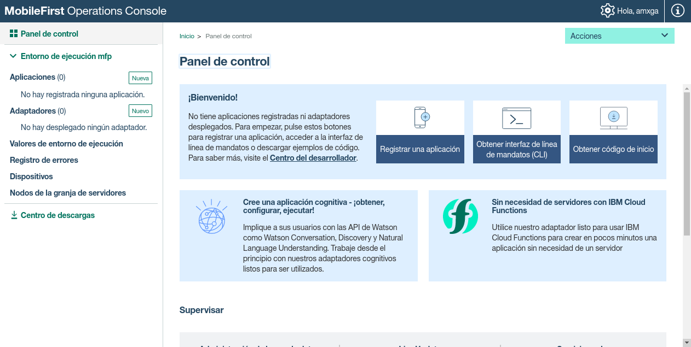
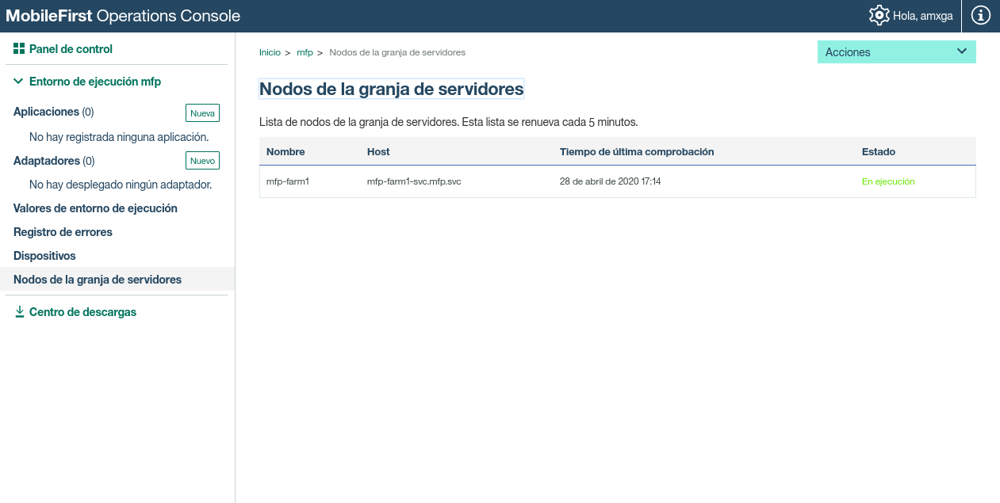

# Mobilefirst en Openshift

## Prerequisitos

* Imagen docker **dockeregistry.amovildigitalops.com/rhel7-atomic-mfpserverfarm**
* Imagen docker **dockeregistry.amovildigitalops.com/rhel68db2105:v1.0** (con la modificación al [entrypoint.sh](ibm.docker/entrypoint.sh))
* Proyecto creado en OCP/OKD

## Desarrollo

### Estructura del directorio

En cada uno de los directorios se encuentran los yamls necesarios para el despliegue de Mobilefirst distribuidos de la siguiente manera.

* **cm**: Yamls para creación de ConfigMaps
* **dc**: Yamls para creación de DeploymentConfig
* **pvc**: Yamls para creación de PersistentVolumeClaim
* **sc**: Yamls para creación de Secrets
* **svc**: Yamls para creación de Service

### Configuraciones previas

Para este despliegue supondremos que el proyecto creado para Mobilefirst se llamará **mfp** en caso de tener un valor diferente es necesario modificar los siguientes datos, de los siguientes archivos.

En el archivo [mfp.cm.yaml](cm/mfp.cm.yaml):

```yaml
MFPF_DB2_SERVER_NAME: mfp-db2-svc.<nombre del proyecto>.svc
```

En el archivo [mfp.dc.yaml](dc/mfp.dc.yaml)

```yaml
- name: IP_ADDRESS 
    value: "mfp-farm1-svc.<nombre del proyecto>.svc"
```
---
A continuación ajustamos los valores de los objetos Secrets [mfp.db2.sc.yaml](sc/mfp.db2.sc.yaml) y [mfp.sc.yaml](sc/mfp.sc.yaml).

Dichos objetos contienen los nombres de usuarios y passwords para la configuración de los servicios, tanto de Db2 como de Mobilefirst. En este sentido, es necesario ajustar según lo deseado.

> NOTA: Los valores de las variables configuradas en los objetos Secrets deberá estar cifrada en base64.

---

En el archivo [mfp.cm.yaml](cm/mfp.cm.yaml) se encuentra la configuración de la base de datos a la cual apuntará Mobilefirst, asi como la dirección del servicio de Analytics.

En este sentido las variables a modificar son
```yaml
MFPF_DB2_DATABASE_NAME: MFPDATA
ANALYTICS_URL: "https://mfp-analytics.apps.okd.amx.gadt.amxdigital.net"
```
Donde:
* **MFPF_DB2_DATABASE_NAME**: Es el nombre de la base de datos.
* **ANALYTICS_URL**: La Url por donde será expuesto el servicio de Analytics.

> NOTA: La variable ANALYTICS_URL no puede estar vacia, no importa si el servicio no existe es necesario que esta variable apunte a algo, de lo contrario el pod no levantará.

---

Antes de realizar el despliegue es importante ajustar el tamaño de los volumenes en los archivos [mfp.db2.pvc.yaml](pvc/mfp.db2.pvc.yaml) y [mfp.pvc.yaml](pvc/mfp.pvc.yaml), principalmente el de la base de datos.

Los valores configurados son de 3GB para el volúmen de Mobilefirst y de 5GB para la Db2.

---
En el archivo [mfp.dc.yaml](dc/mfp.dc.yaml) ajustar el dominio con el que será expuesto el servicio de Mobilefirst. Dicho dominio debera coincidir con el dominio configurado en el objeto **Route**.

```yaml
hostnames:
  - "<dominio para Mobilefirst>"
```
---

> Los comandos que se muestran a continuación deberán ejecutarse en el proyecto creado para Mobilefirst desde algún nodo Master.

Permitir que los pods puedan ejecutarse con cualquier usuario, en caso de que no se especifique en el Dockerfile

```bash
oc adm policy add-scc-to-group anyuid system:authenticated
```

Permitir que un contenedor pueda levantarse como privilegiado, en caso de usa el service account **default**.

```bash
oc adm policy add-scc-to-user privileged -z default
```

### Despliegue

El orden de despliegue de cada objeto deberá realizarse de la siguiente manera.

1. PersistenVolumeClaim
2. Secrets
3. ConfigMap
4. Service
5. DeploymentConfig
   1. Db2
   2. Mobilefirst
6. Routes

La creación del objeto **Route** queda como ejercicio para el lector.

> NOTA: Antes de realizar el despliegue del objeto DeploymentConfig del servicio Mobilefirst es importante crear, de manera manual, la base de datos con el nombre que se colocó en [mfp.cm.yaml](cm/mfp.cm.yaml).




### Nuevo nodo

Para agregar un nuevo nodo a la granja es necesario generar nuevamente los siguientes objetos:

* PersistentVolumeClaim ([mfp.pvc.yaml](pvc/mfp.pvc.yaml))
* Service ([mfp.svc.yaml](svc/mfp.svc.yaml))
* DeploymentConfig ([mfp.dc.yaml](dc/mfp.dc.yaml))

Ajustando el Id que se le otorgo al primer nodo, podemos apoyarnos de los siguientes comandos sed.

```bash
MFPF_NEW_NODE="mfp-farm2"
cat pvc/mfp.pvc.yaml | sed "s%mfp-farm1%$MFPF_NEW_NODE%g" > pvc/mfp.pvc.$MFPF_NEW_NODE.yaml
cat svc/mfp.svc.yaml | sed "s%mfp-farm1%$MFPF_NEW_NODE%g" > svc/mfp.svc.$MFPF_NEW_NODE.yaml
cat dc/mfp.dc.yaml | sed "s%mfp-farm1%$MFPF_NEW_NODE%g" > dc/mfp.dc.$MFPF_NEW_NODE.yaml
```