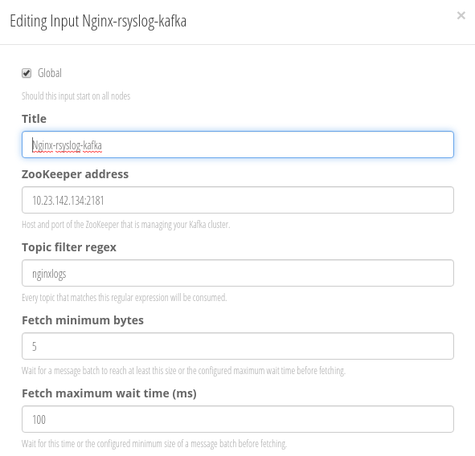
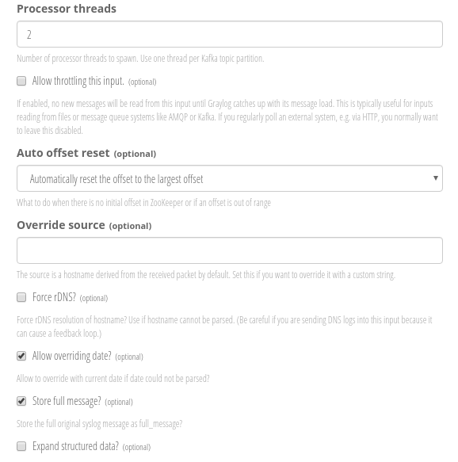
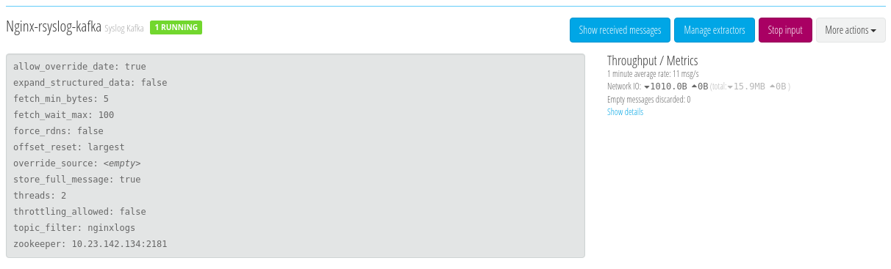
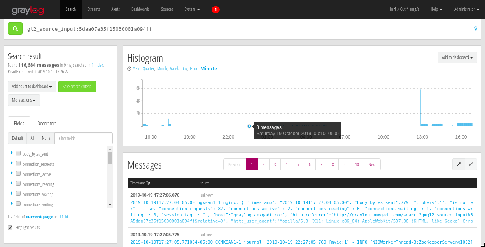

# Nginx, Rsyslog, Kafka y Graylog

Integración de Nginx, Rsyslog, Kafka y Graylog

## Prerequisito

* Virtual CentOS/Rhel
* Docker 1.13.X
* Imagen dockeregistry.amovildigitalops.com/atomic-rhel7-java-8:latest

## Desarrollo

### Imagen Kafka-2.0.3

Creamos el directorio donde almacenaremos los archivos utilizados para la construcción de la imagen de Kafka

```bash
mkdir -p /opt/kafka-2.0.3
```

A continuación generamos el archivo *Dockerfile* y *entrypoint.sh* utilizados para la creación de la imagen

*Dockerfie*
```bash
echo "RlJPTSBkb2NrZXJlZ2lzdHJ5LmFtb3ZpbGRpZ2l0YWxvcHMuY29tL2F0b21pYy1yaGVsNy1qYXZhLTg6bGF0ZXN0CkxBQkVMIG1haW50YWluZXIgIk1hdXJpY2lvIE1lbGVuZGV6LiBLZXZpbiBHb21lei4iCgpVU0VSIHJvb3QKIyBBY3R1YWxpemFjacOzbiBkZSByZXBvc2l0b3Jpb3MKUlVOIG1pY3JvZG5mIHVwZGF0ZSAteSAmJiBtaWNyb2RuZiBjbGVhbiBhbGwgJiYgbWljcm9kbmYgaW5zdGFsbCBtb2Rfc3NsIHdnZXQgLXkKCiMgRGVzY2FyZ2EgZGUgS2Fma2EKV09SS0RJUiAvb3B0CgpSVU4gd2dldCBodHRwczovL3d3dy11cy5hcGFjaGUub3JnL2Rpc3Qva2Fma2EvMi4zLjAva2Fma2FfMi4xMi0yLjMuMC50Z3ogJiYgXAogICAgdGFyIC16dnhmIGthZmthXzIuMTItMi4zLjAudGd6ICYmIFwKICAgIHJtIC1mIGthZmthXzIuMTItMi4zLjAudGd6ICYmIFwKICAgIG1rZGlyIC1wIC9vcHQva2Fma2FfMi4xMi0yLjMuMC9sb2dzCgpSVU4gZ3JvdXBhZGQgLXIga2Fma2EgLS1naWQ9OTA5MjsgXAogICAgdXNlcmFkZCAtciAtZyBrYWZrYSAtLXVpZD05MDkyIGthZmthOyBcCiAgICBjaG93biBrYWZrYTprYWZrYSAvb3B0L2thZmthXzIuMTItMi4zLjAve2NvbmZpZyxsb2dzfQoKIyBWYXJpYWJsZSBkZSBlbnRvcm5vIFpvb2tlZXBlcgpFTlYgUEFUSD0iL29wdC9rYWZrYV8yLjEyLTIuMy4wL2JpbjokUEFUSCIgXAogICAgWk9PS0VFUEVSX0hPU1Q9ImxvY2FsaG9zdCIgXAogICAgS0FGS0FfRElSPSIvb3B0L2thZmthXzIuMTItMi4zLjAiCgoKIyBJbnN0YWxhY2nDs24gZGUgZ29zdQpFTlYgR09TVV9WRVJTSU9OPTEuMTAKClJVTiBjZCAvdG1wICYmIFwKICAgY3VybCAtc1NMIGh0dHBzOi8vZ2l0aHViLmNvbS90aWFub24vZ29zdS9yZWxlYXNlcy9kb3dubG9hZC8kR09TVV9WRVJTSU9OL2dvc3UtYW1kNjQuYXNjIC1vIGdvc3UuYXNjICYmIFwKICAgY3VybCAtc1NMIGh0dHBzOi8vZ2l0aHViLmNvbS90aWFub24vZ29zdS9yZWxlYXNlcy9kb3dubG9hZC8kR09TVV9WRVJTSU9OL2dvc3UtYW1kNjQgLW8gL3Vzci9sb2NhbC9iaW4vZ29zdSAmJiBcCiAgIGNobW9kICt4IC91c3IvbG9jYWwvYmluL2dvc3UgJiYgXAogICBybSBnb3N1LmFzYwoKIyBFbnRyeXBvaW50CkNPUFkgZW50cnlwb2ludC5zaCAvClJVTiBjaG1vZCAreCAvZW50cnlwb2ludC5zaAoKIyBWb2x1bWVuZXMKVk9MVU1FIFsgIi9vcHQva2Fma2FfMi4xMi0yLjMuMC9sb2dzIl0KClVTRVIga2Fma2EKRU5UUllQT0lOVCBbIi9lbnRyeXBvaW50LnNoIl0KQ01EIFsia2Fma2Etc2VydmVyLXN0YXJ0LnNoIiwgIi9vcHQva2Fma2FfMi4xMi0yLjMuMC9jb25maWcvc2VydmVyLnByb3BlcnRpZXMiXQoKRVhQT1NFIDkwOTI=" | base64 -d -w0 > /opt/kafka-2.0.3/Dockerfile
```

*entrypoint.sh*
```bash
echo "IyEvYmluL2Jhc2gKCnNldCAtZQoKIyBBbGxvdyB0aGUgY29udGFpbmVyIHRvIGJlIHN0YXJ0ZWQgd2l0aCBgLS11c2VyYAppZiBbWyAiJDEiID0gImthZmthLXNlcnZlci1zdGFydC5zaCAke0tBRktBX0RJUn0vY29uZmlnL3NlcnZlci5wcm9wZXJ0aWVzIiAmJiAiJChpZCAtdSkiID0gJzAnIF1dOyB0aGVuCiAgICBjaG93biAtUiBrYWZrYSAiJHtLQUZLQV9ESVJ9L2NvbmZpZyIgIiR7S0FGS0FfRElSfS9sb2dzIgogICAgZXhlYyBnb3N1IGthZmthICIkMCIgIiRAIgpmaQoKIyBDb25maWd1cmFjaW9uIGRlIEthZmthCmlmIFtbIC1mICIke0tBRktBX0RJUn0vY29uZmlnL3NlcnZlci5wcm9wZXJ0aWVzIiBdXTsgdGhlbgogICAgc2VkIC1pIC1lICJzL15icm9rZXIuaWQ9MC9icm9rZXIuaWQ9LTEvIiAiJHtLQUZLQV9ESVJ9L2NvbmZpZy9zZXJ2ZXIucHJvcGVydGllcyIKICAgIHNlZCAtaSAtZSAicy9eI2xpc3RlbmVycz1QTEFJTlRFWFQ6XC9cLzo5MDkyL2xpc3RlbmVycz1QTEFJTlRFWFQ6XC9cLzo5MDkyLyIgIiR7S0FGS0FfRElSfS9jb25maWcvc2VydmVyLnByb3BlcnRpZXMiCiAgICBzZWQgLWkgLWUgInMvXmxvZy5kaXJzPVwvdG1wXC9rYWZrYS1sb2dzL2xvZy5kaXJzPVwvb3B0XC9rYWZrYV8yLjEyLTIuMy4wXC9sb2dzLyIgIiR7S0FGS0FfRElSfS9jb25maWcvc2VydmVyLnByb3BlcnRpZXMiCiAgICBzZWQgLWkgLWUgInMvXnpvb2tlZXBlci5jb25uZWN0PWxvY2FsaG9zdDoyMTgxL3pvb2tlZXBlci5jb25uZWN0PSR7Wk9PS0VFUEVSX0hPU1R9OjIxODEvIiAiJHtLQUZLQV9ESVJ9L2NvbmZpZy9zZXJ2ZXIucHJvcGVydGllcyIKICAgIGlmIFsgISAteiAiJHtBRFZFUlRJU0VEX0hPU1RfTkFNRX0iIF0gJiYgWyAhIC16ICIke0FEVkVSVElTRURfUE9SVH0iIF07IHRoZW4KICAgICAgICBlY2hvIC1lICJcbmFkdmVydGlzZWQuaG9zdC5uYW1lPSR7QURWRVJUSVNFRF9IT1NUX05BTUV9IiA+PiAiJHtLQUZLQV9ESVJ9L2NvbmZpZy9zZXJ2ZXIucHJvcGVydGllcyIKICAgICAgICBlY2hvIC1lICJcbmFkdmVydGlzZWQucG9ydD0ke0FEVkVSVElTRURfUE9SVH0iID4+ICIke0tBRktBX0RJUn0vY29uZmlnL3NlcnZlci5wcm9wZXJ0aWVzIgogICAgICAgIGVjaG8gLWUgIlxuYWR2ZXJ0aXNlZC5saXN0ZW5lcnM9UExBSU5URVhUOi8vJHtBRFZFUlRJU0VEX0hPU1RfTkFNRX06JHtBRFZFUlRJU0VEX1BPUlR9IiA+PiAiJHtLQUZLQV9ESVJ9L2NvbmZpZy9zZXJ2ZXIucHJvcGVydGllcyIKICAgIGZpCmZpCgpleGVjICIkQCI=" | base64 -d -w0 > /opt/kafka-2.0.3/entrypoint.sh
```

Construimos la imagen con el siguiente comando

```bash
docker build -t kafka-amx:2.0.3 /opt/kafka-2.0.3
```

### Imagen Zookeeper-3.5.5

Creamos el directorio donde almacenaremos los archivos utilizados para la construcción de la imagen de Zookeeper

```bash
mkdir -p /opt/zookeeper-3.5.5
```

A continuación generamos el archivo *Dockerfile* y *entrypoint.sh* utilizados para la creación de la imagen

*Dockerfie*
```bash
echo "RlJPTSBkb2NrZXJlZ2lzdHJ5LmFtb3ZpbGRpZ2l0YWxvcHMuY29tL2F0b21pYy1yaGVsNy1qYXZhLTgKCkxBQkVMIG1haW50YWluZXIgIk1hdXJpY2lvIE1lbGVuZGV6LiBLZXZpbiBHb21lei4gLyBBTVggR0EiCgpVU0VSIHJvb3QKCiMgQWN0dWFsaXphY2lvbiBkZSByZXBvc2l0b3Jpb3MKUlVOIG1pY3JvZG5mIGluc3RhbGwgc2hhZG93LXV0aWxzIC15ICYmIG1pY3JvZG5mIGNsZWFuIGFsbCAmJiBtaWNyb2RuZiBpbnN0YWxsIHdnZXQgLXkgJiYgbWljcm9kbmYgY2xlYW4gYWxsCgojIERlc2NhcmdhIGRlIFpvb2tlZXBlcgpXT1JLRElSIC9vcHQKClJVTiB3Z2V0IGh0dHBzOi8vd3d3LXVzLmFwYWNoZS5vcmcvZGlzdC96b29rZWVwZXIvem9va2VlcGVyLTMuNS41L2FwYWNoZS16b29rZWVwZXItMy41LjUtYmluLnRhci5neiAmJiBcCiAgICB0YXIgLXp4ZiBhcGFjaGUtem9va2VlcGVyLTMuNS41LWJpbi50YXIuZ3ogJiYgXAogICAgcm0gLWYgYXBhY2hlLXpvb2tlZXBlci0zLjUuNS1iaW4udGFyLmd6ICYmIFwKICAgIG12IGFwYWNoZS16b29rZWVwZXItMy41LjUtYmluIHpvb2tlZXBlci0zLjUuNSAmJiBcCiAgICBta2RpciAtcCAvb3B0L3pvb2tlZXBlci0zLjUuNS97ZGF0YSxsb2dzLGRhdGFsb2dzfQoKUlVOIGdyb3VwYWRkIC1yIHpvb2tlZXBlciAtLWdpZD0yMTgxOyBcCiAgICB1c2VyYWRkIC1yIC1nIHpvb2tlZXBlciAtLXVpZD0yMTgxIHpvb2tlZXBlcjsgXAogICAgY2hvd24gem9va2VlcGVyOnpvb2tlZXBlciAvb3B0L3pvb2tlZXBlci0zLjUuNS97ZGF0YSxsb2dzLGNvbmYsZGF0YWxvZ3N9CgojIFZhcmlhYmxlIGRlIGVudG9ybm8gWm9va2VlcGVyCkVOViBQQVRIPSIvb3B0L3pvb2tlZXBlci0zLjUuNS9iaW46JFBBVEgiIFwKICAgIEpWTUZMQUdTPSIiIFwKICAgIFpPT19DTElFTlRfUEFTU1dPUkQ9IiIgXAogICAgWk9PX0NMSUVOVF9VU0VSPSIiIFwKICAgIFpPT19IRUFQX1NJWkU9IjEwMjQiIFwKICAgIFpPT19JTklUX0xJTUlUPSIxMCIgXAogICAgWk9PX0xPR19MRVZFTD0iSU5GTyIgXAogICAgWk9PX01BWF9DTElFTlRfQ05YTlM9IjYwIiBcCiAgICBaT09fUE9SVF9OVU1CRVI9IjIxODEiIFwKICAgIFpPT19SRUNPTkZJR19FTkFCTEVEPSJubyIgXAogICAgWk9PX1NFUlZFUlM9IiIgXAogICAgWk9PX1NFUlZFUl9JRD0iMSIgXAogICAgWk9PX1NFUlZFUl9QQVNTV09SRFM9IiIgXAogICAgWk9PX1NFUlZFUl9VU0VSUz0iIiBcCiAgICBaT09fU1lOQ19MSU1JVD0iNSIgXAogICAgWk9PX1RJQ0tfVElNRT0iMjAwMCIgXAogICAgWk9PX0RBVEFfRElSPSIvb3B0L3pvb2tlZXBlci0zLjUuNS9kYXRhIiBcCiAgICBaT09fQ09ORl9ESVI9Ii9vcHQvem9va2VlcGVyLTMuNS41L2NvbmYiIFwKICAgIFpPT19EQVRBX0xPR19ESVI9Ii9vcHQvem9va2VlcGVyLTMuNS41L2RhdGFsb2dzIiBcCiAgICBaT09fTE9HX0RJUj0iL29wdC96b29rZWVwZXItMy41LjUvbG9ncyIgXAogICAgWk9PX0FVVE9QVVJHRV9QVVJHRUlOVEVSVkFMPSIwIiBcCiAgICBaT09fQVVUT1BVUkdFX1NOQVBSRVRBSU5DT1VOVD0iMyIgCiAgICAjWk9PX1NFUlZFUlM9InNlcnZlci4xPWxvY2FsaG9zdDoyODg4OjM4ODgiCgojIEluc3RhbGFjacOzbiBkZSBnb3N1CkVOViBHT1NVX1ZFUlNJT049MS4xMCBcCiAgICBHT1NVX0dQR19LRVk9QjQyRjY4MTkwMDdGMDBGODhFMzY0RkQ0MDM2QTlDMjVCRjM1N0RENAoKUlVOIGNkIC90bXAgJiYgXAogIGN1cmwgLXNTTCBodHRwczovL2dpdGh1Yi5jb20vdGlhbm9uL2dvc3UvcmVsZWFzZXMvZG93bmxvYWQvJEdPU1VfVkVSU0lPTi9nb3N1LWFtZDY0LmFzYyAtbyBnb3N1LmFzYyAmJiBcCiAgY3VybCAtc1NMIGh0dHBzOi8vZ2l0aHViLmNvbS90aWFub24vZ29zdS9yZWxlYXNlcy9kb3dubG9hZC8kR09TVV9WRVJTSU9OL2dvc3UtYW1kNjQgLW8gL3Vzci9sb2NhbC9iaW4vZ29zdSAmJiBcCiAgY2htb2QgK3ggL3Vzci9sb2NhbC9iaW4vZ29zdSAmJiBcCiAgcm0gZ29zdS5hc2MKCgojIEVudHJ5cG9pbnQKQ09QWSBlbnRyeXBvaW50LnNoIC8KUlVOIGNobW9kICt4IC9lbnRyeXBvaW50LnNoCgojIFZvbHVlbWVuZXMKIyBWT0xVTUUgWyAiJFpPT19EQVRBX0RJUiIsICIkWk9PX0RBVEFfTE9HX0RJUiIsICIkWk9PX0xPR19ESVIiIF0KClVTRVIgem9va2VlcGVyCkVOVFJZUE9JTlQgWyIvZW50cnlwb2ludC5zaCJdCkNNRCBbInprU2VydmVyLnNoIiwgInN0YXJ0LWZvcmVncm91bmQiXQoKRVhQT1NFIDIxODEgMjg4OCAzODg4" | base64 -d -w0 > /opt/zookeeper-3.5.5/Dockerfile
```

*entrypoint.sh*
```bash
echo "IyEvYmluL2Jhc2gKCnNldCAtZQoKIyBBbGxvdyB0aGUgY29udGFpbmVyIHRvIGJlIHN0YXJ0ZWQgd2l0aCBgLS11c2VyYAppZiBbWyAiJDEiID0gJ3prU2VydmVyLnNoJyAmJiAiJChpZCAtdSkiID0gJzAnIF1dOyB0aGVuCiAgICBjaG93biAtUiB6b29rZWVwZXIgIiRaT09fREFUQV9ESVIiICIkWk9PX0RBVEFfTE9HX0RJUiIgIiRaT09fTE9HX0RJUiIgIiRaT09fQ09ORl9ESVIiCiAgICBleGVjIGdvc3Ugem9va2VlcGVyICIkMCIgIiRAIgpmaQoKIyBDcmVhY2lvbiBkZSBhcmNoaXZvIGRlIGNvbmZpZ3VyYWNpb24gZGUgWm9va2VlcGVyIGVuIGNhc28gZGUgcXVlIG5vIHNlIGVuY3VlbnRyZQppZiBbWyAhIC1mICIkWk9PX0NPTkZfRElSL3pvby5jZmciIF1dOyB0aGVuCiAgICBDT05GSUc9IiRaT09fQ09ORl9ESVIvem9vLmNmZyIKICAgIGVjaG8gImRhdGFEaXI9JFpPT19EQVRBX0RJUiIgPj4gIiRDT05GSUciCiAgICBlY2hvICJkYXRhTG9nRGlyPSRaT09fREFUQV9MT0dfRElSIiA+PiAiJENPTkZJRyIKICAgIGVjaG8gInRpY2tUaW1lPSRaT09fVElDS19USU1FIiA+PiAiJENPTkZJRyIKICAgIGVjaG8gImluaXRMaW1pdD0kWk9PX0lOSVRfTElNSVQiID4+ICIkQ09ORklHIgogICAgZWNobyAic3luY0xpbWl0PSRaT09fU1lOQ19MSU1JVCIgPj4gIiRDT05GSUciCiAgICBlY2hvICJhdXRvcHVyZ2Uuc25hcFJldGFpbkNvdW50PSRaT09fQVVUT1BVUkdFX1NOQVBSRVRBSU5DT1VOVCIgPj4gIiRDT05GSUciCiAgICBlY2hvICJhdXRvcHVyZ2UucHVyZ2VJbnRlcnZhbD0kWk9PX0FVVE9QVVJHRV9QVVJHRUlOVEVSVkFMIiA+PiAiJENPTkZJRyIKICAgIGVjaG8gIm1heENsaWVudENueG5zPSRaT09fTUFYX0NMSUVOVF9DTlhOUyIgPj4gIiRDT05GSUciCiAgICBlY2hvICJjbGllbnRQb3J0PSRaT09fUE9SVF9OVU1CRVIiID4+ICIkQ09ORklHIgpmaQoKIyBXcml0ZSBteWlkIG9ubHkgaWYgaXQgZG9lc24ndCBleGlzdAppZiBbWyAhIC1mICIkWk9PX0RBVEFfRElSL215aWQiIF1dOyB0aGVuCiAgICBlY2hvICIke1pPT19NWV9JRDotMX0iID4gIiRaT09fREFUQV9ESVIvbXlpZCIKZmkKCmV4ZWMgIiRAIg==" | base64 -d -w0 > /opt/zookeeper-3.5.5/entrypoint.sh
```

Construimos la imagen con el siguiente comando

```bash
docker build -t zookeeper-amx:3.5.5 /opt/zookeeper-3.5.5
```

### Despliegue cluster Kafka - Zookeeper

Primero llevamos a cabo el despliegue de Zookeeper, dicho despliegue es realizado con la imagen construida en pasos anteriores.

```bash
mkdir -p /var/containers/zookeeper/opt/zookeeper-3.5.5/{datalogs,data}

chown 2181:root /var/containers/zookeeper/opt/zookeeper-3.5.5/{datalogs,data}

docker run -d --name zookeeper \
    -v /var/containers/zookeeper/opt/zookeeper-3.5.5/datalogs:/opt/zookeeper-3.5.5/datalogs:z \
    -v /var/containers/zookeeper/opt/zookeeper-3.5.5/data:/opt/zookeeper-3.5.5/data:z \
    -e HOSTNAME=zookeeper \
    --hostname zookeeper \
    -p 2181:2181 \
    zookeeper-amx:3.5.5
```

A continuación levantaremos un cluster compuesto por 3 instancias Kafka, el despliegue de cada una de las instancias se lleva a cabo con los siguientes comandos.

**NOTA**: Es importante señalar que la comunicación entre cada una de las instancias de Kafka por defecto se mantiene a tráves del hostname del contenedor, en este sentido se presenta el siguiente problema, para poder desplegar la instancia 1 de kafka es necesario que esta instancia conozca a traves de su hostname a la instancia 2 y 3, en este sentido observamos una dependencia que complica el despliegue, la manera de evitar dicho problema es establecer la ip del servidor (**ADVERTISED_HOST_NAME**) en el que se despliega el contenedor y el puerto (**ADVERTISED_PORT**) al que es mapeado el puerto 9092 del contenedor, como medio por el cual se anunciarán dichas instancias.


Para el despliegue de las 3 instancias ejecutamos los siguientes comandos, *es importante señalar que para este despliegue el contenedor de Zookeeper se encuentra corriendo en el mismo servidor*:

```bash
mkdir -p /var/containers/{kafka1/opt/kafka_2.12-2.3.0/logs,kafka2/opt/kafka_2.12-2.3.0/logs,kafka3/opt/kafka_2.12-2.3.0/logs}

chown 9092:root /var/containers/{kafka1/opt/kafka_2.12-2.3.0/logs,kafka2/opt/kafka_2.12-2.3.0/logs,kafka3/opt/kafka_2.12-2.3.0/logs}

docker run -d --name kafka1 \
    -v /var/containers/kafka1/opt/kafka_2.12-2.3.0/logs:/opt/kafka_2.12-2.3.0/logs:z \
    -p 9091:9092 \
    -e ZOOKEEPER_HOST=zookeeper \
    -e HOSTNAME=kafka1 \
    -e ADVERTISED_HOST_NAME=10.23.142.134 \
    -e ADVERTISED_PORT=9091 \
    --hostname kafka1 \
    --link zookeeper:zookeeper \
    kafka-amx:2.0.3

docker run -d --name kafka2 \
    -v /var/containers/kafka2/opt/kafka_2.12-2.3.0/logs:/opt/kafka_2.12-2.3.0/logs:z \
    -p 9092:9092 \
    -e ZOOKEEPER_HOST=zookeeper \
    -e HOSTNAME=kafka2 \
    -e ADVERTISED_HOST_NAME=10.23.142.134 \
    -e ADVERTISED_PORT=9092 \
    --hostname kafka2 \
    --link zookeeper:zookeeper \
    kafka-amx:2.0.3

docker run -d --name kafka3 \
    -v /var/containers/kafka3/opt/kafka_2.12-2.3.0/logs:/opt/kafka_2.12-2.3.0/logs:z \
    -p 9093:9092 \
    -e ZOOKEEPER_HOST=zookeeper \
    -e HOSTNAME=kafka3 \
    -e ADVERTISED_HOST_NAME=10.23.142.134 \
    -e ADVERTISED_PORT=9093 \
    --hostname kafka3 \
    --link zookeeper:zookeeper \
    kafka-amx:2.0.3
```

Donde:
* \<ip server>: Es la ip del servidor donde esta desplegado el contenedor.

### Envio de logs de Nginx a Rsyslog

Para habilitar el envió de los logs generados en Nginx, modificamos el archivo donde se encuentra la configuración de Nginx agregando lo siguiente:

*/etc/nging/nginx.conf*
```conf
http{
    ....
        log_format graylog2_json escape=json '{ "timestamp": "$time_iso8601", '
                 '"body_bytes_sent":$body_bytes_sent, '
                 '"ciphers":"$ssl_cipher", '
                 '"is_router": false, '
                 '"connection_requests": $connection_requests, '
                 '"connections_active" : $connections_active, '
                 '"connections_reading" : $connections_reading, '
                 '"connections_waiting" : $connections_waiting, '
                 '"connections_writing" : $connections_writing, '
                 '"session_tag" : "$cookie_session_tag", '
                 '"host":"$host", '
                 '"http_referrer":"$http_referer", '
                 '"http_user_agent":"$http_user_agent", '
                 '"http_version":"$server_protocol", '
                 '"http_x_forwarded_for":"$http_x_forwarded_for",'
                 '"real_ip_addr":"$http_x_true_client_ip", '
                 '"remote_addr":"$remote_addr", '
                 '"request_method":"$request_method", '
                 '"request":"$request", '
                 '"request_time":$request_time, '
                 '"response_status":$status, '
                 '"tls":"$ssl_protocol", '
                 '"upstream_addr":"$upstream_addr", '
                 '"upstream_cache_status" : "$upstream_cache_status", '
                 '"upstream_header_time":"$upstream_header_time", '
                 '"upstream_response_time":"$upstream_response_time", '
                 '"nginx_access":true }';
    access_log      syslog:server=<ip_rsyslog>:<puerto_rsyslog>     graylog2_json; #Enviar a Rsyslog
}
```
Donde:
* <ip_rsyslog>: Es la ip donde se encuentra corriendo Rsyslog
* <puerto_rsyslog>: Es el puerto donde esta escuchando rsyslog (514)

### Configuración topic Kafka

Kafka trabaja en un esquema basado en temas (topic), el cual le permite tener segmentados los diferentes mensajes que recibirá, evitando un choque entre ellos, a partir de este aspecto crearemos un topic que guardará los mensajes provenientes de Rsyslog.

Ubicados en el servidor donde se llevó a cabo el despliegue del cluster de Kafka, generamos un nuevo topic al cual nombaremos **nginxlogs**.

```bash
docker exec -it kafka bash -c "kafka-topics.sh --create --zookeeper zookeeper:2181 --topic nginxlogs --partitions 3 --replication-factor 3"
```

### Conexión Rsyslog y Kafka

*NOTA: La siguiente configuración es realizada, suponiendo que el servicio de Rsyslog se encuentra instalado directamente en el servidor*

Para llevar a cabo la integración de Rsyslog con Kafka primero instalamos el modulo omkafka.

```bash
yum install rsyslog-kafka -y
```

A continuación creamos el archivo **/etc/rsyslog.d/kafka.conf** con el siguiente contenido:

*/etc/rsyslog.d/kafka.conf*
```conf
module(load="imfile")
module(load="omkafka")

input(type="imfile"
  File="/var/log/messages"
  Tag="NginxLogs"
  Facility="nginx"
)


action(
  broker=["<ip kafka>:<puerto kafka>"]
  type="omkafka"
  topic="<nombre del topic>"
)
```

Donde:

* \<ip kafka>: La Ip del servidor donde se encuentra una de las instancias Kafka
* \<puerto kafka>: Puerto del servidor mapeado a la instancia Kafka
* \<nombre del topic>: Topic creado en kafka
  
Reiniciamos el servicio de Rsyslog

```bash
systemctl restart rsyslog
```

### Conexión Kafka y Graylog

Para la integración de Kafka con Graylog, desde el panel de Graylog generamos un nuevo Input del tipo **Syslog Kafka**, cuya configuración deberá tener un aspecto como el siguiente:




Donde:

* Zookeeper address: Es la Ip de la instancia Zookeer
* Topic filter regex: Nombre del topic creado en Kafka

Enseguida importamos un extractor en el input creado, el contenido de dicho extractor deberá ser el siguiente:

```json
{
  "extractors": [
    {
      "title": "Json_regex",
      "extractor_type": "regex",
      "converters": [],
      "order": 0,
      "cursor_strategy": "copy",
      "source_field": "message",
      "target_field": "json",
      "extractor_config": {
        "regex_value": "nginx:\\s+(.*)"
      },
      "condition_type": "none",
      "condition_value": ""
    },
    {
      "title": "Json_extract",
      "extractor_type": "json",
      "converters": [],
      "order": 1,
      "cursor_strategy": "copy",
      "source_field": "json",
      "target_field": "",
      "extractor_config": {
        "list_separator": ", ",
        "kv_separator": "=",
        "key_prefix": "",
        "key_separator": "_",
        "replace_key_whitespace": false,
        "key_whitespace_replacement": "_"
      },
      "condition_type": "none",
      "condition_value": ""
    },
    {
      "title": "Rewrite request",
      "extractor_type": "regex_replace",
      "converters": [],
      "order": 3,
      "cursor_strategy": "cut",
      "source_field": "request",
      "target_field": "request",
      "extractor_config": {
        "replacement": "$1",
        "regex": "^[A-Z]* (.*)"
      },
      "condition_type": "none",
      "condition_value": ""
    },
    {
      "title": "Get user from session tag",
      "extractor_type": "split_and_index",
      "converters": [],
      "order": 6,
      "cursor_strategy": "cut",
      "source_field": "session_tag",
      "target_field": "session_tag_user",
      "extractor_config": {
        "index": 2,
        "split_by": "@"
      },
      "condition_type": "none",
      "condition_value": ""
    },
    {
      "title": "Remove @ from session tag",
      "extractor_type": "regex_replace",
      "converters": [],
      "order": 2,
      "cursor_strategy": "copy",
      "source_field": "session_tag",
      "target_field": "session_tag",
      "extractor_config": {
        "replacement": "$1",
        "regex": "^(.*)@$"
      },
      "condition_type": "none",
      "condition_value": ""
    },
    {
      "title": "Remove and store http version from request verb",
      "extractor_type": "regex_replace",
      "converters": [],
      "order": 5,
      "cursor_strategy": "cut",
      "source_field": "request",
      "target_field": "http_version",
      "extractor_config": {
        "replacement": "$1",
        "regex": ".*( HTTP\\/[0-9\\.]+)"
      },
      "condition_type": "none",
      "condition_value": ""
    },
    {
      "title": "Parse upstream_header_time as number",
      "extractor_type": "copy_input",
      "converters": [
        {
          "type": "numeric",
          "config": {}
        }
      ],
      "order": 7,
      "cursor_strategy": "copy",
      "source_field": "upstream_header_time",
      "target_field": "upstream_header_time",
      "extractor_config": {},
      "condition_type": "regex",
      "condition_value": "[0-9\\.]+"
    },
    {
      "title": "Parse upstream_response_time as number",
      "extractor_type": "copy_input",
      "converters": [
        {
          "type": "numeric",
          "config": {}
        }
      ],
      "order": 8,
      "cursor_strategy": "copy",
      "source_field": "upstream_response_time",
      "target_field": "upstream_response_time",
      "extractor_config": {},
      "condition_type": "regex",
      "condition_value": "[0-9\\.]+"
    },
    {
      "title": "Remove QueryString from request",
      "extractor_type": "regex",
      "converters": [],
      "order": 4,
      "cursor_strategy": "copy",
      "source_field": "request",
      "target_field": "request_noqs",
      "extractor_config": {
        "regex_value": "([\\/a-zA-Z0-9\\.%@\\-_]+)\\??"
      },
      "condition_type": "none",
      "condition_value": ""
    }
  ],
  "version": "2.4.6"
}
```

Inciamos el Input creado y verificamos que se encuentre corriendo y recibiendo logs.



