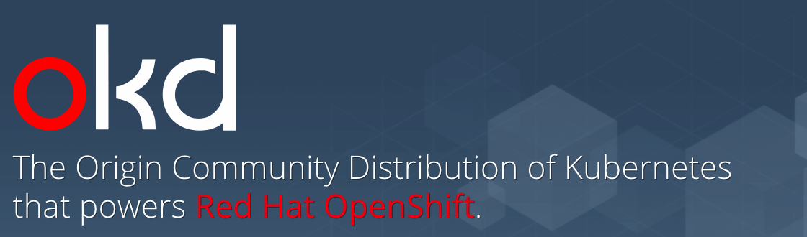

# OKD



Repositorio dedicado al despliegue de OKD 3.11

## Índice

1. [Aprovisionamiento de Infraestructura](#id1) 
2. [Creación y Configuración de volumenes](#id2)
3. [Configuración DNS](#id3)
4. [Configuración Nginx](#id4)
5. [Configuración de Ansible](#id5)
6. [Configuración Inventario OKD](#id6)
7. [Despliegue y configuración cluster Ceph](#id7)
8. [Configuración Load Balancer](#id8)
9. [Despliegue OKD](#id9)
10. [Configuraciones post instalación OKD](#id10)
11. [Escalado del Cluster](docs/ManageCluster.md)

# Proyecto OKD

Como primer paso clonamos este repositorio en el servidor dedicado como nodo de Control, dicho servidor es el mismo donde se realizará la instalación de [Ansible](docs/Ansible.md)

```bash
git clone https://infracode.amxdigital.net/desarrollo-tecnologico/okd.git /opt/okd-devtech
```

> Eventualmente es importante asignar permisos al usuario creado para ansible, permitiendo el acceso a dicho directorio.

*E.g. Suponemos que el usuario de Ansible se llama **ansible** y se cuenta con el grupo de linux **operaciones***

```bash
sudo chown ansible:operaciones -R /opt/okd-devtech
```

<div id='id1' />

# Aprovisionamiento de Infraestructura

> A continuación se muestran los requerimientos mínimos para el despliegue de OKD.

Arquitectura propuesta para cluster de OKD básico.

|Host (VM)      |   Nodo        |   vCPUs   |  RAM \[GB] |  HDD (Base)  |  HDD (Adicional)  |
|---------------|---------------|-----------|------------|--------------|-------------------|
|OKDMAST1-1     |  Master/etcd  |     4     |     8      |      50      |        100        |
|OKDAPP1-1      |   App         |     4     |     8      |      50      |        200        |
|OKDINFRA1-1    |   Infra       |     4     |     8      |      50      |        200        |
|OKDLB1-1       | Load Balancer |     2     |     4      |      50      |        100        |

## Basics for VMs

Para cada VM se realizarán los pasos básicos necesarios.

+ Hardening inicial.
+ Configuración persistente de default gateway.
+ Pruebas de conectividad externas.
+ Kernel

### Hardening RHEL 7

Para realizar el hardening se utiliza el playbook [0.5.hardening-hosts.yml](../playbooks/0.5.hardening-hosts.yml)
> El script para realizar el hardening se encuentra en [rhel7_hardening-2020.sh](../scripts/rhel7_hardening-2020.sh)

Desde el usuario ansible

```sh
ansible-playbook -i /opt/okd-devtech/playbooks/0.inventory-vcloud -v /opt/okd-devtech/playbooks/0.5.hardening-hosts.yml
```

**Nota importante:** Si el despliegue se hace sobre la nueva vcloud usando hosts con la imagen template de rhel7:

+ Red Hat Enterprise Linux Server release 7.6 (Maipo) Red Hat 7.6 MySQL - Hasta 4 vCPU

Correr estos comandos ansible

```sh
ansible -a "bash -c 'rm -f /etc/yum.repos.d/mysql*'" -i /opt/okd-devtech/playbooks/0.inventory-vcloud all
ansible -a "bash -c 'yum remove -y mysql kmod-kvdo'" -i /opt/okd-devtech/playbooks/0.inventory-vcloud all
ansible -a "bash -c 'echo \"nobody:x:99:\" >> /etc/group'" -i /opt/okd-devtech/playbooks/0.inventory-vcloud all
ansible -a "bash -c 'echo \"nobody:x:99:99:Nobody:/:/sbin/nologin\" >> /etc/passwd'" -i /opt/okd-devtech/playbooks/0.inventory-vcloud all

```

### Kernel necesario

Para la instalación de OKD es necesario tener la última versión del kernel, en este caso *Linux 3.10.0-1127.el7.x86_64*

Se puede verificar con el comando:

```sh
uname -rs
```

<div id='id2' />

# Creación y Configuración de volúmenes

> A continuación se muestran los requerimientos mínimos para el despliegue de OKD.

Se deben configurar diferentes volúmenes a sus repectivos directorios en los que trabaja OKD 3.11

> En caso de que el disco no este particionado, generamos una nueva partición.

```
fdisk -l #Listamos los discos
fdisk /dev/sdb #Generamos una particion al disco (/dev/sdb es el disco que hemos añadido)
# # n ==> para una nueva particion
# # p ==> Particion primaria
# # 1 ==> Para indicar que es la primera particion
# # (Enter) ==> Para ocupar todo el disco
# # w ==> Guardar y salir
```

> No olvidar desmontar el volumen donde ya se encuentre montado el disco de almacenamiento adicional. (Si aplica)
```sh
# Ejemplo para desmontar el volumen en /disco_2

umount /disco_2
sed -i '/^LABEL=disco_2.*/d' /etc/fstab
```

Crear el physical volume y el volume group que se usarán para los volúmenes lógicos.
```sh
pvcreate -f /dev/sdb1
vgcreate datavg1 /dev/sdb1
```

## Volúmenes para nodos Master/etcd

Para estos servidores se acondicionaros los LVMs de la siguiente manera:

+ /var/lib/openshift 10G
+ /var/lib/etcd 10G
+ /var/lib/docker 20G
+ /var/lib/containers 20G
+ /var/lib/origin 20G
+ /var/log 20G

Ejemplo para crear y montar un volúmen lógico en */var/lib/openshift*

```sh
# /var/lib/openshift 15G
lvcreate -L 15G -n lv_var_lib_openshift datavg1
mkfs.xfs /dev/mapper/datavg1-lv_var_lib_openshift
mkdir -p /var/lib/openshift
mount /dev/mapper/datavg1-lv_var_lib_openshift /var/lib/openshift
tail -n1 /etc/mtab >> /etc/fstab
```
> Para comandos completos ver el script hecho para todos los volúmenes en [lvms_okd_master_etcd.sh](scripts/lvms_okd_master_etcd.sh)

Después de crear y montar todos los lvms, verificar que todo esté correcto y reiniciar la vm.

```sh

lsblk
vgs
cat /etc/fstab

# Revisar a fondo que el proceso se haya hecho correctamente, 
# al finalizar debe realizarse un reboot, si no se hizo bien, 
# se corre el riesgo de que el servidor no vuelva del reinicio.

reboot
```

## Volúmenes para nodos App/Infra y Load Balancer

Para estos servidores se acondicionaros los LVMs de la siguiente manera:

+ /var/lib/openshift 25G
+ /var/lib/docker 50G
+ /var/lib/containers 50G
+ /var/lib/origin 25G
+ /var/log 50G

Ejemplo para crear y montar un volúmen lógico en */var/lib/openshift*

```sh
# /var/lib/openshift 15G
lvcreate -L 15G -n lv_var_lib_openshift datavg1
mkfs.xfs /dev/mapper/datavg1-lv_var_lib_openshift
mkdir -p /var/lib/openshift
mount /dev/mapper/datavg1-lv_var_lib_openshift /var/lib/openshift
tail -n1 /etc/mtab >> /etc/fstab
```
> Para comandos completos ver el script hecho para todos los volúmenes en [lvms_okd_app.sh](scripts/lvms_okd_app.sh)

Después de crear y montar todos los lvms, verificar que todo esté correcto y reiniciar la vm.

```sh

lsblk
vgs
cat /etc/fstab

# Revisar a fondo que el proceso se haya hecho correctamente, 
# al finalizar debe realizarse un reboot, si no se hizo bien, 
# se corre el riesgo de que el servidor no vuelva del reinicio.

reboot
```

## Eliminar LVMs

En caso de necesitar borrar un LVM aquí está un ejemplo.

```sh
lsblk # Para identificar el lvm a borrar, en este caso será lv_var_lib_origin_openshift

umount /var/lib/origin/openshift
lvremove /dev/datavg1/lv_var_lib_origin_openshift

# Verificar liberación del espacio
vgs

## No olvidar eliminar la línea de montaje en /etc/fstab ##
```

<div id='id3' />

# Setup DNS para OKD

Prerrequisitos:

+ Imagen dockeregistry.amovildigitalops.com/atomic-rhel7-bind
+ Dominio asociado al cluster de OKD, para esta configuración suponemos que se tiene control sobre el dominio **cs.gadt.amxdigital.net**, caso contrario ajustar a la configuración propia.

Reglas de firewall para tráfico dns.

```sh
firewall-cmd --permanent --add-port=53/tcp
firewall-cmd --permanent --add-port=53/udp
firewall-cmd --reload
```

Runit para levantar contenedor Bind.

```sh

#######################################
#                                     #
#             Runit Bind 9            #
#                                     #
#######################################

BIND_CONTAINER="bind"
BIND_DOMAIN="cs.gadt.amxdigital.net" # Dominio asociado

mkdir -p /var/containers/$BIND_CONTAINER{/var/named/views/,/var/named/zones/,/etc/named} -p
chown 25:0 -R /var/containers/$BIND_CONTAINER

docker run -itd --name $BIND_CONTAINER \
    -p 53:53/tcp \
    -p 53:53/udp \
    -h $BIND_CONTAINER.$BIND_DOMAIN \
    -v /etc/localtime:/etc/localtime:ro \
    -v /usr/share/zoneinfo:/usr/share/zoneinfo:ro \
    -v /var/containers/$BIND_CONTAINER/var/named/views/:/var/named/views/:z \
    -v /var/containers/$BIND_CONTAINER/var/named/zones/:/var/named/zones/:z \
    -v /var/containers/$BIND_CONTAINER/etc/named:/etc/named:z \
    -e "TZ=America/Mexico_City" \
    dockeregistry.amovildigitalops.com/atomic-rhel7-bind
```

Configuraciones ejemplo para vistas y zonas.

> E.g. contenido del archivo /var/containers/$BIND_CONTAINER/var/named/views/views.conf

> Para esta configuración se creo la zona **okd.cs.gadt.amxdigital.net** en la cual residen los nodos de OKD, la zona **dcv.cs.gadt.amxdigital.net** hace referencia al resto de los servidores que hay en el datacenter

> En la zona interna (*internal-zone*) es preciso pertimitir peticiones desde la DMZ y la VLAN 3, para esta configuración dichos segmentos de red son 10.10.26.0/25; 10.10.27.0/25; respectivamente.

> En la zona externa (*external-zone*) deberá resolver peticiones de cualquier lado.

```sh
view "internal-zone" {
    match-clients { 10.10.26.0/25; 10.10.27.0/25; };
    zone "okd.cs.gadt.amxdigital.net" IN {
       type master;
       file "zones/internal/okd.cs.gadt.amxdigital.net";
     };
    zone "dcv.cs.gadt.amxdigital.net" IN {
       type master;
       file "zones/internal/dcv.cs.gadt.amxdigital.net";
     };
};
view "external-zone" {
    match-clients { any; };
    zone "cs.gadt.amxdigital.net" IN {
       type master;
       file "zones/external/cs.gadt.amxdigital.net";
     };
};
```

> E.g. contenido del archivo /var/containers/$BIND_CONTAINER/var/named/zones/internal/okd.cs.gadt.amxdigital.net

> Aqui se configura el wildcard asociado a OKD con el que se expondrán las aplicaciones desplegadas dentro de OKD, en este ejemplo dicha línea es ``` *.apps.okd      IN A            200.57.183.50 ``` la cual apunta al servidor Nginx.

```sh
$TTL 3600
@       IN      SOA     okd.cs.gadt.amxdigital.net.  . (
                1267456419      ; Serial
                10800   ; Refresh
                3600    ; Retry
                3600    ; Expire
                1)      ; Minimum
        IN              NS  ns0
        IN              A   10.10.26.3;
ns0             IN A            10.10.27.3
csmast01-1      IN A            10.10.27.4
cslb01-1        IN A            10.10.27.5
csinfra01-1     IN A            10.10.27.6
consola         IN A            10.10.27.6
csapp01-1       IN A            10.10.27.7
*.apps          IN A            200.57.183.50
```

> E.g. contenido del archivo /var/containers/$BIND_CONTAINER/var/named/zones/internal/dcv.cs.gadt.amxdigital.net

```sh
$TTL 3600
@       IN      SOA     okd.cs.gadt.amxdigital.net.  . (
                1267456419      ; Serial
                10800   ; Refresh
                3600    ; Retry
                3600    ; Expire
                1)      ; Minimum
        IN              NS  ns0
        IN              A   10.10.26.3;
ns0             IN A            10.10.26.3
csjablab      IN A              10.10.26.11
```

> E.g. contenido del archivo /var/containers/$BIND_CONTAINER/var/named/zones/external/cs.gadt.amxdigital.net

> Aqui se configura el wildcard asociado a OKD con el que se expondrán las aplicaciones desplegadas dentro de OKD, en este ejemplo dicha línea es ``` *.apps.okd      IN A            200.57.183.50 ``` la cual apunta al servidor Nginx.


```sh
$TTL    3600
@       IN      SOA     cs.gadt.amxdigital.net.  . (
                1267456429      ; Serial
                10800   ; Refresh
                3600    ; Retry
                3600    ; Expire
                1)      ; Minimum
        IN              NS  ns0
        IN              A   200.57.183.50;
ns0             IN A            200.57.183.50
*               IN A            200.57.183.50
*.apps.okd      IN A            200.57.183.50
```

<div id='id4'/>

# Configuración Nginx

Las configuraciones que se muestran a continuación son validas cuando la firma de certificados es realizada con Letsencrypt.

## Prerequisitos

* Nginx >= 1.16.1
* Letsencrypt >= 1.0.0
* Subdominio asociado.
* Acceso a la configuración de zona donde se encuentra el subdominio asociado.
  
## Desarrollo

Para esta configuración suponemos que el subdominio asociado para exponer los diferentes servicios desplegados en OKD es **apps.okd.cs.gadt.amxdigital.net**. En cada uno de los comandos es preciso ajustarlos con el subdominio otorgado (basta con sustituir **apps.okd.cs.gadt.amxdigital.net**).

Primero generamos el certificado para el wildcard asociado a **\*.apps.okd.cs.gadt.amxdigital.net**

```bash
certbot certonly --manual -d *.apps.okd.cs.gadt.amxdigital.net -d apps.okd.cs.gadt.amxdigital.net --agree-tos --no-bootstrap --manual-public-ip-logging-ok --preferred-challenges dns-01 --server https://acme-v02.api.letsencrypt.org/directory
```

Durante el proceso de la creación del certificado, el cliente Certbot mostrará un mensaje como el siguiente:

```conf
- - - - - - - - - - - - - - - - - - - - - - - - - - - - - - - - - - - - - - - -
Please deploy a DNS TXT record under the name
_acme-challenge.apps.okd.cs.gadt.amxdigital.net with the following value:

EOo2Xx5qwGxr_jwm970MXVPpnb8gSAvNkrqUY2r0aNM

Before continuing, verify the record is deployed.
- - - - - - - - - - - - - - - - - - - - - - - - - - - - - - - - - - - - - - - -
```

Es importante agregar dicho registro TXT en el archivo de zona que contiene la configuración del subdominio asociado. Un ejemplo de como luciria dicho archivo utilizando la herramienta Bind es el siguiente:

```conf
$TTL	3600
@   	IN  	SOA 	amx.gadt.amxdigital.net.  . (
             	1267456429  	; Serial
             	10800   ; Refresh
             	3600	; Retry
             	3600	; Expire
             	1)      ; Minimum
 	IN      	NS  ns0
 	IN      	A   201.161.69.133;	

ns0       	    IN A         	201.161.69.133
*		        IN A            201.161.69.133
*.apps.okd      IN A            201.161.69.133
_acme-challenge.apps.okd  IN  TXT  XUJzyejF4VKPPy27ToxLUnI6VGMLhnAEpmfv1gDMwyU
```

Después de agregar dicha entrada continuamos con el proceso, una vez finalizado obtendremos un mensaje como el siguiente en el que se muestra la ubicación de los certificados ya creados.

```conf
IMPORTANT NOTES:
 - Congratulations! Your certificate and chain have been saved at:
   /etc/letsencrypt/live/apps.okd.cs.gadt.amxdigital.net/fullchain.pem
   Your key file has been saved at:
   /etc/letsencrypt/live/apps.okd.cs.gadt.amxdigital.net/privkey.pem
   Your cert will expire on 2020-07-19. To obtain a new or tweaked
   version of this certificate in the future, simply run certbot again
   with the "certonly" option. To non-interactively renew *all* of
   your certificates, run "certbot renew"
```

A continuación generamos el archivo de configuración Nginx que dará de alta el subdominio:

```nginx
server {
    server_name  *.apps.okd.cs.gadt.amxdigital.net;
 
    proxy_max_temp_file_size 0;
    proxy_buffering off;

    location / {

        proxy_pass https://10.23.144.147$request_uri;
        proxy_set_header        Host           "$host";

        proxy_ssl_name $host;
        proxy_ssl_server_name on;
        proxy_ssl_protocols  TLSv1 TLSv1.1 TLSv1.2;
        proxy_ssl_session_reuse off;
        proxy_intercept_errors off;
        proxy_redirect off;
        proxy_http_version 1.1;
        proxy_set_header  X-Real-IP  $remote_addr;
        proxy_set_header  X-Forwarded-For $proxy_add_x_forwarded_for;
        add_header Last-Modified $date_gmt;
        proxy_set_header Connection keep-alive;
        add_header Cache-Control 'no-store, no-cache, must-revalidate, proxy-revalidate, max-age=0';
        if_modified_since off;
        expires off;
        etag off;
        proxy_set_header Upgrade $http_upgrade;
        proxy_set_header Connection "upgrade";
        client_max_body_size 0;
    }

    location /auth/ {
        
        proxy_pass https://10.23.144.147$request_uri;
        proxy_set_header        Host           "$host";

        proxy_ssl_name $host;
        proxy_ssl_server_name on;
        proxy_ssl_protocols  TLSv1 TLSv1.1 TLSv1.2;
        proxy_ssl_session_reuse off;

        proxy_redirect off;
        proxy_http_version 1.1;
        proxy_set_header Connection keep-alive;
        proxy_set_header  X-Real-IP  $remote_addr;
        proxy_set_header  X-Forwarded-For $proxy_add_x_forwarded_for;
        add_header Last-Modified $date_gmt;
        add_header Cache-Control 'no-store, no-cache, must-revalidate, proxy-revalidate, max-age=0';
        if_modified_since off;
        expires off;
        etag off;
        client_max_body_size 0;
    }

    proxy_hide_header X-Powered-By;
    proxy_hide_header Server;

    listen 443 ssl;
    ssl_certificate /etc/letsencrypt/live/apps.okd.cs.gadt.amxdigital.net/fullchain.pem;
    ssl_certificate_key /etc/letsencrypt/live/apps.okd.cs.gadt.amxdigital.net/privkey.pem;
    include /etc/letsencrypt/options-ssl-nginx.conf;
    ssl_dhparam /etc/letsencrypt/ssl-dhparams.pem;
}
server {
    server_name  *.apps.okd.cs.gadt.amxdigital.net;
    listen 80;
    return 301 https://$host$request_uri;
}
```

Es importante ajustar las líneas, apuntando a los valores propios.

* server_name  *.apps.okd.cs.gadt.amxdigital.net;
* proxy_pass https://10.23.144.147$request_uri;
* ssl_certificate /etc/letsencrypt/live/apps.okd.cs.gadt.amxdigital.net/fullchain.pem;
* ssl_certificate_key /etc/letsencrypt/live/apps.okd.cs.gadt.amxdigital.net/privkey.pem;

**NOTA**: 

> El proxy_pass debe apuntarse al servidor cuya función es de **Load Balancer**. Los valores de las líneas ssl_certificate_key y ssl_certificate son los mismos arrojados por el cliente de certbot cuando fue creado el certificado.

Finalmente recargamos la configuración de Nginx.

```conf
nginx -s reload
```

<div id='id5'/>

# Ansible


Configuración del servicio Ansible para despliegue y configuración de OKD

## Prerequisitos

* Permisos de superusuario
* Servidor dedicado
* Debe existir el grupo de linux **operaciones**

> Para esta configuración suponemos que el nomnbre del usuario de Ansible es **ansible**, caso contrario ajustar dicha configuración sustituyendo el nombre de este usuario.

> La ejecución de los siguientes comandos se deberán realizar en el servidor dedicado, también llamado Nodo de Control

## Desarrollo

### Instalación de Ansible

Para el despliegue de OKD se requiere una versión 2.6 o mayor de Ansible, la via más rápida para su instalación en los SO Rhel7 es a traves del repositorio EPEL.

```bash
yum install https://releases.ansible.com/ansible/rpm/release/epel-7-x86_64/ansible-2.9.7-1.el7.ans.noarch.rpm -y
```

### Usuario Ansible

A continuación generamos un usuario dedicado, con el cual se llevarán a cabo cada uno de los despliegues.

```bash
sudo useradd -g operaciones -m ansible
```

A dicho usuario le otorgamos permisos de superusuario en el archivo */etc/sudoers*.

```bash
sudo echo "ansible ALL=(ALL)       NOPASSWD: ALL" >> /etc/sudoers
```

Logueados como el usuario **ansible** ```sudo su ansible``` generamos las llaves rsa para la conexión con los demas servidores.

`Generamos el directorio donde se almacenarán las llaves rsa`
```bash
mkdir -p ~/.ssh
```

`Solo damos enter en cada una de las opciones`
```bash
ssh-keygen -b 4096 -t rsa
```

Si se mantuvieron las opciones por defecto, el comando generará dos archivos ubicados en **/home/ansible/.ssh/**, nombrados id_rsa.pub, id_rsa.

Añadimos la llave privada al agente ssh de dicho usuario para permitir la conexión con los otros servidores.

```bash
eval $(ssh-agent -s)
ssh-add /home/ansible/.ssh/id_rsa
```

### Alta del usuario Ansible

Una vez que el usuario Ansible ha sido configurado en el servidor que llevará a cabo los despliegues, damos de alta en el resto de los servidores del cluster a dicho usuario.

```bash
useradd -m -g operaciones ansible
mkdir -p /home/ansible/.ssh/
touch /home/ansible/.ssh/authorized_keys
chmod 700 /home/ansible/.ssh/
chmod 600 /home/ansible/.ssh/authorized_keys
echo 'PUBLIC_KEY' > /home/ansible/.ssh/authorized_keys
chown ansible /home/ansible/ -R
```

Donde:
* **PUBLIC_KEY** es el contenido del archivo /home/ansible/.ssh/id_rsa.pub

<div id='id6'/>

# Configuración Inventario

> Antes de llevar a cabo el despliegue de OKD es preciso ajustar los valores del inventario que se muestran a continuación, a la configuración propia.

En cuanto a los grupos del inventario:
* **[OSEv3:children]**: Se indican los grupos utilizados por OKD.
* **[OSEv3:vars]**: Se definen las variables con las que se configurará OKD
* **[all]**: Todos los nodos
* **[okd]**: Solo los nodos de OKD, se excluyen los que conforman a los nodos de Ceph, este grupo es utilizado por los playbooks creados para la preparación de los hosts.
* **[etcd]**: Se indican los nodos que serán etcd.
* **[masters]**: Se indican los nodos que serán master.
* **[nodes]**: Solo los nodos de OKD, se excluyen los que conforman a los nodos de Ceph, este grupo es utilizado por los playbooks con los que se levanta OKD.
* **[app]**: Se indican los nodos app de OKD, este grupo es utilizado por los playbooks con los que se levanta OKD.
* **[lb]**: Se indican los nodos app de OKD, este grupo es utilizado por los playbooks con los que se levanta OKD.
* **[ceph]**: Se indican los nodos que conformarán al cluster de Ceph, este grupo es utilizado por los playbooks creados para la preparación de los hosts.
  
Etiquetas utilizadas en el grupo **[nodes]**
* **\<FQDN del servidor\> openshift_node_group_name='node-config-master'**: Permite definir que nodos son los de master.
* **\<FQDN del servidor\> openshift_node_group_name='node-config-infra'**: Permite definir que nodos se son los de infra.
* **\<FQDN del servidor\> openshift_node_group_name='node-config-compute'**: Permite definir que nodos se son los de app.

*En las siguientes variables apuntar al dominio asociado a la consola de Openshift*

> El dominio de la consola debe apuntar a la Ip del LoadBalancer.

```conf
openshift_master_cluster_hostname
openshift_master_cluster_public_hostname
openshift_console_hostname
```

*La siguiente variable configura el primer usuario de Openshift, utilizando htpasswd*
```conf
openshift_master_htpasswd_users
```

> Las siguientes configuraciones aplican cuando se tiene considerado el aprovisionamiento dinámico de los volúmenes.

*Se habilita el aprovisionamiento dinámico de los volúmenes*
> En caso de hacer un despliegue sin almacenamiento dinámico colocar esta sección como **false** y omitir las configuraciones restantes. Importante comentar las variables en el inventario
```conf
openshift_master_dynamic_provisioning_enabled=true
```

*Se habilita el aprovisionamiento dinámico de los volúmenes de las metricas.*
```conf
openshift_metrics_cassandra_storage_type=dynamic
```

*Nombre del Storga Class configurado para el aprovisionamiento dinámico de las metricas*
> Dicho valor debe coincidir con el valor configurado en la creación del Storage Class [StorageClass](PostInstall.md)
```conf
openshift_metrics_cassandra_pvc_storage_class_name="dynamic"
```

*Nombre del Storga Class configurado para el aprovisionamiento dinámico del logging*
> Dicho valor debe coincidir con el valor configurado en la creación del [Storage Class](docs/PostInstall.md)
```conf
openshift_logging_es_pvc_storage_class_name="dynamic"
```

*Tamaño del volumen utilizado para las metricas*
```conf
openshift_metrics_storage_volume_size
```

*Tamaño del pvc para el logging del cluster*
```conf
openshift_logging_es_pvc_size=100Gi
```

*Tamaño del pvc para las metricas del cluster*
```conf
openshift_metrics_storage_volume_size=100Gi
```

<div id='id7'/>

> Esta configuración solo se aplica cuando se tiene planeada una configuración de volumenes aprovisionados de manera dinámica, en caso de no ser así, pasar al siguiente punto.

# Ceph

A continuación se describe el proceso para llevar a cabo la configuración y despliegue de un Cluster Ceph conformado por:

* Nodos Monitor
* Nodos OSD
* Nodos Manager

Es importante señalar que un servidor puede cumplir más de una función, es decir, puede ser Monitor, OSD y Manager al mismo tiempo.

## Prerequisitos

* La cantidad mínima de nodos son:
  *  2 nodos Monitor
  *  2 nodos OSD
  *  2 nodos Manager.
* Instalación y configuración de Ansible.
* Requerimientos mínimos de Hardware de cada servidor
  
  | Nodo    | Cores | RAM   | HDD Base | HDD Extra|
  |---------|-------|-------|----------|----------|
  | Monitor |   8   | 16 GB | 50 GB    | 100 GB   |
  | OSD     |   8   | 16 GB | 50 GB    | 1024 GB  |
  | Manager |   8   | 16 GB | 50 GB    | 100 GB   |

* El SO empleado en este despliegue es Rhel 7.
* Inventario Ansible con una sección **[ceph]** en la que se encuentren listados todos los servidores dedicados para Ceph
* Contar con permisos de superusuario en todos los servidores involucrados

**NOTA**: Dicho despliegue sera realizado desde un servidor al cual nos referiremos como Nodo de Control a partir de este momento, dicho servidor no forma parte del Cluster.

**NOTA**: El despliegue sera realizado desde el Nodo de Control con el usuario configurado para Ansible, es importante que dicho usuario no tenga por nombre **ceph**.

**NOTA**: Los discos extras de los servidores dedicados como nodos OSD **NO** deberán contar con ningún tipo de volumen lógico o partición.

## Desarrollo

### Instalación de paquetes

Como primer paso realizamos la instalación cliente de para el despliegue de Ceph en el Nodo de Control.

Para ello configuramos el repo de yum con el archivo [ceph.repo](../ceph/ceph.repo) ubicado en este repositorio.

```bash
sudo cp ../ceph/ceph.repo /etc/yum.repos.d/ceph.repo
```

Limpiamos la caché de yum e instalamos el cliente.

```bash
sudo yum clean all && sudo yum install ceph-deploy -y
```

Para la configuración e instalación de paquetes utilizados en cada nodo haremos uso del playbook [2.preparing-hosts-ceph.yml](../playbooks/2.preparing-hosts-ceph.yml) ubicado en este repositorio.

*Ejecución del playbook*

```bash
ansible-playbook -i [inventario] /opt/okd-devtech/2.preparing-hosts-ceph.yml
```

### Despliegue

Ubicados en el home del usuario para Ansible generamos un directorio para almacenar los archivos de configuración utilizados por Ceph durante el despliegue.

> E.g. Suponemos que el usuario de Ansible tiene el nombre **ansible**

```bash
sudo su ansible
mkdir -p ~/okd-ceph
cd ~/okd-ceph
```

Situados en el directorio creado, hacemos un reconocimiento de los servidores que conformarán el cluster de Ceph y a su vez generamos el archivo de configuración utilizado por la herramienta de despliegue.

```bash
ceph-deploy new [servidor1] [servidor2] [servidor3] ...
```

**NOTA**: Deberá colocarse el fqdn de cada servidor.

E.g.

```bash
ceph-deploy new okdamxceph1-2.okd.amx.gadt.amxdigital.net okdamxceph2-1.okd.amx.gadt.amxdigital.net okdamxceph3-1.okd.amx.gadt.amxdigital.net okdamxceph4-1.okd.amx.gadt.amxdigital.net
```

A continuación instalamos las dependencias faltantes con la herramienta de instalación, a tráves de:

```bash
ceph-deploy install [servidor1] [servidor2] [servidor3] ...
```

**NOTA**: Deberá colocarse el fqdn de cada servidor.

E.g.

```bash
ceph-deploy install okdamxceph1-2.okd.amx.gadt.amxdigital.net okdamxceph2-1.okd.amx.gadt.amxdigital.net okdamxceph3-1.okd.amx.gadt.amxdigital.net okdamxceph4-1.okd.amx.gadt.amxdigital.net
```

A continuación configuramos los servidores dedicados como nodos Monitor.

```bash
ceph-deploy --overwrite-conf mon create [monitor1] [monitor2] [monitor3] ..
ceph-deploy mon create-initial
```

**NOTA**: Deberá colocarse solamente el hostname del servidor.

E.g.

```bash
ceph-deploy --overwrite-conf mon create okdamxceph1-2 okdamxceph2-1 okdamxceph3-1 okdamxceph4-1
ceph-deploy mon create-initial
```

Enseguida copiamos los archivos de configuración creados en el paso anterior con la siguiente instrucción.

```bash
ceph-deploy admin [servidor1] [servidor2] [servidor3] ...
```

**NOTA**: Deberá colocarse el fqdn de cada servidor

E.g.

```bash
ceph-deploy admin okdamxceph1-2.okd.amx.gadt.amxdigital.net okdamxceph2-1.okd.amx.gadt.amxdigital.net okdamxceph3-1.okd.amx.gadt.amxdigital.net okdamxceph4-1.okd.amx.gadt.amxdigital.net
```

Para la configuración de los nodos OSD se realiza con la siguiente sentencia

```bash
ceph-deploy osd create --data [Path del disco extra] [osd1]
ceph-deploy osd create --data [Path del disco extra] [osd2]
ceph-deploy osd create --data [Path del disco extra] [osd3]
...
```

**NOTA**: Deberá colocarse el fqdn de cada servidor

E.g.

```bash
ceph-deploy osd create --data /dev/sdb okdamxceph1-2.okd.amx.gadt.amxdigital.net
ceph-deploy osd create --data /dev/sdb okdamxceph2-1.okd.amx.gadt.amxdigital.net
ceph-deploy osd create --data /dev/sdb okdamxceph3-1.okd.amx.gadt.amxdigital.net
ceph-deploy osd create --data /dev/sdb okdamxceph4-1.okd.amx.gadt.amxdigital.net
```

Finalmente la configuración de los nodos Manager se lleva a cabo con el comando

```bash
ceph-deploy mgr create [Manager1]
ceph-deploy mgr create [Manager2]
```

**NOTA**: Deberá colocarse el fqdn de cada servidor

E.g.

```bash
ceph-deploy mgr create okdamxceph1-2.okd.amx.gadt.amxdigital.net
ceph-deploy mgr create okdamxceph2-1.okd.amx.gadt.amxdigital.net
```

Para verificar el estado del cluster, haremos uso de ansible utilizando la siguiente instrucción:

```bash
ansible -a "ceph health" -i [inventario] -b ceph
```

Teniendo una salida como la siguiente:

```bash
cluster:
  id:     477e46f1-ae41-4e43-9c8f-72c918ab0a20
  health: HEALTH_OK
```

<div id='id8'/>

# Load Balancer

> Los siguientes comandos deberán ser ejecutados en el servidor dedicado como Nodo de Control (El que tiene instalado Ansible).

## Desarrollo

### Configuración de archivo haproxy.cfg

> Las modificaciones deberán realizarse en ambos backend del archivo, **atomic-openshift-api** y **router-openshift-ssl-2**

Antes de llevar a cabo la ejecución del playbook es importante configurar el archivo */opt/okd-devtech/playbooks/haproxy.cfg*.

```conf
    server      master0 10.10.27.4:8443 check
```

Se deberá colocar la Ip de los servidores Master, dicha Ip debe ser conocida por el servidor Load Balancer.

En caso de tener mas de un Master, basta con agregar mas líneas similares, es importante cuidar el id asociado a ese servidor master. En el ejemplo anterior dicho id es **master0**.

A contnuación se muestra un ejemplo de como luciria esa sección con mas nodos master.

```bash
    server      master0 10.10.27.4:8443 check
    server      master1 10.10.27.5:8443 check
```

### Ejecución del Playbook

> Los siguientes comandos deberán ser ejecutados como el usuario Ansible.

```bash
sudo su ansible
```

Realizamos el acondicionamiento del servidor dedicado como Load Balancer.

*Nos ubicamos en el directorio donde se encuentra el playbook*
```bash
cd /opt/okd-devtech/playbooks/
```

*Ejecución del playbook. Suponemos que el inventario es **/opt/okd-devtech/playbooks/0.inventory***
```bash
ansible-playbook -i /opt/okd-devtech/playbooks/0.inventory /opt/okd-devtech/playbooks/3.preparing-host-lb.yml
```

<div id='id9'/>

# Despliegue OKD

> **Todo el despliegue de OKD debe hacerse desde el nodo de control (El nodo que tiene ansible)**

## Prerrequisitos para el despliegue

* Haber clonado el repositorio [OKD AMX](https://infracode.amxdigital.net/desarrollo-tecnologico/okd/tree/master) en el /opt/okd-devtech.
* Clonar el repositorio oficial de OKD en el /opt/openshift-ansible ([OKD 3.11](https://github.com/openshift/openshift-ansible)).
* DNS correctamente configurado con el mismo hostname en cada vm cumpliendo con un FQDN.
* Paquetes necesarios en nodo de control.
* Usuario ansible en todos los nodos del cluster.
* Edición del inventario según necesidades del cluster. ([Inventario](../playbooks/0.inventory))
* Setup completo de volúmenes para el cluster.


Clonar repositorios.

```sh
git clone -b release-3.11 https://github.com/openshift/openshift-ansible.git /opt/openshift-ansible
```

Asignamos permisos para que el usario de Ansbile pueda navegar sin problemas dentro del directorio

*E.g. Suponemos que el usuario de Ansible se llama **ansible** y se cuenta con el grupo de linux **operaciones***
```bash
sudo chown ansible:operaciones -R /opt/openshift-ansible
```

Instalar los paquetes requeridos en el nodo de control.

```sh
yum install -y httpd-tools java-1.8.0-openjdk-headless
```

Probar la conexión con ansible desde el nodo de control.

```sh
ansible -m ping -b -i /opt/okd-devtech/playbooks/0.inventory all
```

Agregar repositorio de Openshift origin

```sh
echo 'W2NlbnRvcy1vcGVuc2hpZnQtb3JpZ2luMzExXQpuYW1lPUNlbnRPUyBPcGVuU2hpZnQgT3JpZ2luCmJhc2V1cmw9aHR0cDovL21pcnJvci5jZW50b3Mub3JnL2NlbnRvcy83L3BhYXMveDg2XzY0L29wZW5zaGlmdC1vcmlnaW4zMTEvCmVuYWJsZWQ9MQpncGdjaGVjaz0wCgpbY2VudG9zLW9wZW5zaGlmdC1vcmlnaW4zMTEtdGVzdGluZ10KbmFtZT1DZW50T1MgT3BlblNoaWZ0IE9yaWdpbiBUZXN0aW5nCmJhc2V1cmw9aHR0cDovL2J1aWxkbG9ncy5jZW50b3Mub3JnL2NlbnRvcy83L3BhYXMveDg2XzY0L29wZW5zaGlmdC1vcmlnaW4zMTEvCmVuYWJsZWQ9MApncGdjaGVjaz0wCgoKW2NlbnRvcy1vcGVuc2hpZnQtb3JpZ2luMzExLWRlYnVnaW5mb10KbmFtZT1DZW50T1MgT3BlblNoaWZ0IE9yaWdpbiBEZWJ1Z0luZm8KYmFzZXVybD1odHRwOi8vZGVidWdpbmZvLmNlbnRvcy5vcmcvY2VudG9zLzcvcGFhcy94ODZfNjQvCmVuYWJsZWQ9MApncGdjaGVjaz0wCgpbY2VudG9zLW9wZW5zaGlmdC1vcmlnaW4zMTEtc291cmNlXQpuYW1lPUNlbnRPUyBPcGVuU2hpZnQgT3JpZ2luIFNvdXJjZQpiYXNldXJsPWh0dHA6Ly92YXVsdC5jZW50b3Mub3JnL2NlbnRvcy83L3BhYXMvU291cmNlL29wZW5zaGlmdC1vcmlnaW4zMTEvCmVuYWJsZWQ9MApncGdjaGVjaz0wCgo=' | base64 -d > CentOS-OpenShift-Origin311.repo
ansible -m copy -a "src=CentOS-OpenShift-Origin311.repo  dest=/etc/yum.repos.d/CentOS-OpenShift-Origin311.repo owner=root group=root mode='644'" -b -i /opt/okd-devtech/playbooks/0.inventory all
ansible -a "bash -c 'yum clean all'" -b -i /opt/okd-devtech/playbooks/0.inventory all
rm -f CentOS-OpenShift-Origin311.repo
```

## Ejecución de playbooks

### Preparación de hosts previa a instalación OKD

```sh
ansible-playbook -i /opt/okd-devtech/playbooks/0.inventory -b /opt/okd-devtech/playbooks/1.preparing-hosts.yml -v
```

### Playbooks de instalación OKD

> Recomendamos correr uno por uno los playbooks e ir atendiendo issues que salgan.

> Importante¡¡ Si se tiene planeado el uso de aprovisionamiento dinámico con Ceph, como se menciona en esta guía, la ejecución de los Playbooks **openshift-logging/config.yml**, **openshift-metrics/config.yml** deberá realizarse una vez que se haya realizado la conexión entre OKD y el cluster de Ceph de lo contario el Playbook 
```sh
cd /opt/openshift-ansible/playbooks

ansible-playbook -i /opt/okd-devtech/playbooks/0.inventory -vvvv openshift-checks/pre-install.yml
ansible-playbook -i /opt/okd-devtech/playbooks/0.inventory -vvvv openshift-node/bootstrap.yml
ansible-playbook -i /opt/okd-devtech/playbooks/0.inventory -vvvv openshift-etcd/config.yml
ansible-playbook -i /opt/okd-devtech/playbooks/0.inventory -vvvv openshift-loadbalancer/config.yml
ansible-playbook -i /opt/okd-devtech/playbooks/0.inventory -vvvv openshift-master/config.yml
ansible-playbook -i /opt/okd-devtech/playbooks/0.inventory -vvvv openshift-master/additional_config.yml
ansible-playbook -i /opt/okd-devtech/playbooks/0.inventory -vvvv openshift-node/join.yml
ansible-playbook -i /opt/okd-devtech/playbooks/0.inventory -vvvv openshift-hosted/config.yml
ansible-playbook -i /opt/okd-devtech/playbooks/0.inventory -vvvv openshift-monitoring/config.yml
ansible-playbook -i /opt/okd-devtech/playbooks/0.inventory -vvvv openshift-web-console/config.yml
ansible-playbook -i /opt/okd-devtech/playbooks/0.inventory -vvvv openshift-console/config.yml
ansible-playbook -i /opt/okd-devtech/playbooks/0.inventory -vvvv openshift-metrics/config.yml
ansible-playbook -i /opt/okd-devtech/playbooks/0.inventory -vvvv metrics-server/config.yml
ansible-playbook -i /opt/okd-devtech/playbooks/0.inventory -vvvv openshift-logging/config.yml
ansible-playbook -i /opt/okd-devtech/playbooks/0.inventory -vvvv openshift-monitor-availability/config.yml
ansible-playbook -i /opt/okd-devtech/playbooks/0.inventory -vvvv openshift-descheduler/config.yml
ansible-playbook -i /opt/okd-devtech/playbooks/0.inventory -vvvv openshift-autoheal/config.yml
ansible-playbook -i /opt/okd-devtech/playbooks/0.inventory -vvvv olm/config.yml
```

<div id='id10'/>

# Pasos Post Instalación

## Creación de Router

> Los siguientes comandos deberán ser ejecutados desde un Nodo Master, con privilegios de super usuario.

*Logueo en OKD como administrador*
```bash
oc login -u system:admin
```

*Nos situamos en el proyecto openshift-infra*
```bash
oc project openshift-infra
```

*Agregamos el contexto para el manejo de red a la cuenta de servicio **router***
```bash
oc adm policy add-scc-to-user hostnetwork -z router
```

*Preparamos el dc para despliegue del router*
```bash
oc adm router openshift-router --replicas=0 --service-account=router
```

*Configuramos al router para hacer uso del wildcard asociado a OKD*
```bash
oc set env dc/openshift-router ROUTER_ALLOW_WILDCARD_ROUTES=true
```

*Realizamos el despliegue del Router*
```bash
oc scale dc/openshift-router --replicas=1
```

## Creación de usuarios

> Los siguientes comandos deberán ser ejecutados en cada Nodo Master, con privilegios de super usuarios.

*Creación de usuario y contraseña*
```bash
htpasswd -nb <user_name> <password> >> /etc/origin/master/htpasswd
```

> Los siguientes comandos deberán ser ejecutados desde un Nodo Master, con privilegios de super usuarios.

*Logueo en OKD como administrador*
```bash
oc login -u system:admin
```

*Otorgamos los permisos de administrador de cluster al usuario creado anteriormente*
```bash
oc create clusterrolebinding <username> --clusterrole=cluster-admin --user=<username>
```

## Integración cluster de Ceph

> La configuración aqui mostrada solo aplica cuando se tiene almacenamiento dinámico proporcionado por Ceph

> El siguiente comando deberá ser ejecutado en un Nodo Mon de Ceph con privilegios de superusuario

*Obtenemos la key en base64 para autenticación con Ceph*
```bash
ceph auth get-key client.admin | base64
```

*Creamos el pool utilizado por OKD*
```bash
ceph osd pool create kube 128
```

> Los siguientes comandos deberán ser ejecutados desde un Nodo Master, con privilegios de super usuarios.

*Logueo en OKD como administrador*
```bash
oc login -u system:admin
```

*Nos ubicamos en el proyecto kube-system*
```bash
oc project kube-system
```

*Creación del yaml para el objeto Secret de la Key de Ceph*
```bash
cat<<-EOF > ceph.secret.yaml
apiVersion: v1
kind: Secret
metadata:
  name: ceph-secret # Nombre del secret con la key de Ceph
data:
  key: QVFBOFF2SlZheUJQRVJBQWgvS2cwT1laQUhPQno3akZwekxxdGc9PQ== # Key obtenida en pasos anteriores
type: kubernetes.io/rbd 
EOF
```

*Creación del yaml para el objeto StorageClass de Ceph*
```bash
cat<<-EOF > ceph.storage.class.yaml
apiVersion: storage.k8s.io/v1beta1
kind: StorageClass
metadata:
  name: dynamic # Nombre del Storage Class
  annotations:
    storageclass.kubernetes.io/is-default-class: "true"
provisioner: kubernetes.io/rbd
parameters:
  monitors: 192.168.1.11:6789,192.168.1.12:6789,192.168.1.13:6789 # Ip de los Nodos Mon de Ceph
  adminId: admin
  adminSecretName: ceph-secret # Nombre del secret con la key de Ceph
  adminSecretNamespace: kube-system 
  pool: kube  
  userId: admin  
  userSecretName: ceph-secret # Nombre del secret con la key de Ceph
EOF
```

*Creacion de objetos Secret y StorageClass*
```bash
oc create -f ceph.secret.yaml
oc create -f ceph.storage.class.yaml
```

A continuación modificamos el Template con el que se crean los proyectos en OKD. Con dichas modificaciones integraremos la creación del objeto Secret con la key para la autenticación con Ceph

> Todos los comandos deberán ser ejecutados en un Nodo Master

*Logueo en OKD como administrador*
```bash
oc login -u system:admin
```

*Obtenemos el template actual con el que se crean los proyectos en OKD*
```bash
oc adm create-bootstrap-project-template -o yaml > template.yaml
```

*Integramos la definición del objeto Secret con la key de Ceph*
> Modificamos el archivo template.yaml
```yaml
apiVersion: v1
kind: Template
metadata:
  creationTimestamp: null
  name: project-request
objects:
- apiVersion: v1
  kind: Project
  ....

- apiVersion: v1
  kind: Secret
  metadata:
    name: ceph-secret # Nombre del secret con la key de Ceph
  data:
    key: QVFCbEV4OVpmaGJtQ0JBQW55d2Z0NHZtcS96cE42SW1JVUQvekE9PQ== # Key obtenida en pasos anteriores
  type:
    kubernetes.io/rbd
    ....
```

*Nos ubicamos en el proyecto openshift*
```bash
oc project openshift
```

*Creamos el Template de los proyectos*
```bash
oc create -f template.yaml
```

> Las siguientes modificaciones deberán realizarse en cada uno de los Nodos Master

*Indicamos el Template con el que se crearán los proyectos a partir de este instante*

*Modificamos el archivo **/etc/origin/master/master-config.yaml***
```yaml
...
projectConfig:
  projectRequestTemplate: "openshift/project-request"
...
```

*Recargamos el Api de Openshift para hacer efectivos los cambios*

> El siguiente comando deberá ser ejecutado desde el nodo Ansible. Se da por hecho que el inventario contiene una sección [masters]

```bash
ansible -a "bash -c '/usr/local/bin/master-restart api'" masters -i <inventario>
ansible -a "bash -c '/usr/local/bin/master-restart controllers'" masters -i <inventario>
```

## Issues 

**Problema**

```bash
standard_init_linux.go:178: exec user process caused "no such file or directory"
```

El problema anterior representa un bug de la imagen con la cual se despliega el pod de monitoreo de Grafana.

```bash
docker.io/grafana/grafana:5.2.1
```

**Solución**

La solución al bug anterior es subir la versión de la imagen de la **docker.io/grafana/grafana:5.2.1** a la **docker.io/grafana/grafana:5.2.2**.

*Ubicados en el servidor donde se hizo del despliegue del Pod de Grafana del proyecto openshift-monitoring, descargamos la nueva imagen*
```bash
docker pull docker.io/grafana/grafana:5.2.2
```

*Eliminamos la imagen anterior*
```bash
docker rmi -f docker.io/grafana/grafana:5.2.1
```

*Reetiquetamos la imagen más reciente para que el Deployment realice el despliegue con dicha imagen*
```bash
docker tag docker.io/grafana/grafana:5.2.2 docker.io/grafana/grafana:5.2.1
```

En la consola web eliminamos el Pod de Grafana para que de manera automática se realice el despliegue del nuevo contenedor con la nueva imagen.


**Problema**

```bash
cat: /opt/app-root/src/init_failures: No such file or directory
```

Cuando se inicia el pod, se ejecuta el script init.sh. Este script crea un archivo vacío "init_complete" una vez finalizado con éxito o, en caso de error, crea el archivo "init_faiures" con el motivo del error como contenido.

La sonda de preparación de elasticsearch pod está comprobando si la fase de inicio ha sido exitosa (verificando la existencia del archivo init_complete) o informa el error (contenido de fallo_inicial). 

**Solución**

Dentro de un nodo Master ejecutar el siguiente comando.

*Nos logueamos en OKD*
```bash
oc login -u system:admin
```

*Nos ubicamos en el proyecto donde se encuentra el Pod de Elastic*
```bash
oc project openshift-logging
```

*Creamos un archivo vacío dentro del contenedor*
> El Pod de Elasticsearch debe estar en ejecución

```bash
for p in $(oc get pods -l component=es -o jsonpath={.items[*].metadata.name}); do   oc exec -c elasticsearch $p -- touch /opt/app-root/src/init_failures;  done
```