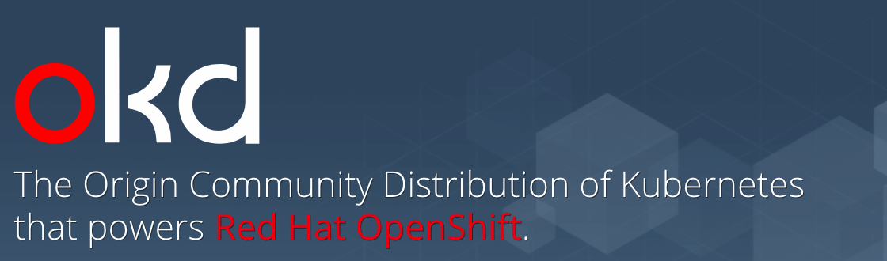

# OKD



Repositorio dedicado al despliegue de OKD 3.11

## Índice

|Main topic                                        |    Documento particular              |
|--------------------------------------------------|--------------------------------------|
|1. [Aprovisionamiento de Infraestructura](#id1)   |    [Doc1](docs/Arquitectura.md)      |
|2. [Basics for VMs](#id2)                         |    [Doc2](docs/Arquitectura.md)      |
|3. [Configuración de volúmenes](#id3)             |    [Doc3](docs/Volumes.md)           |
|4. [Configuración de Ansible](#id4)               |    [Doc4](docs/Ansible.md)           |
|5. [Despliegue y configuración cluster Ceph](#id5)|    [Doc5](docs/Ceph.md)              |
|6. [Configuración Nginx](#id6)                    |    [Doc6](docs/Nginx.md)             |

<div id='id1' />

## Aprovisionamiento de Infraestructura

Arquitectura propuesta para cluster de OKD básico.

|Host (VM)      |   Nodo        |   vCPUs   |  RAM \[GB] |  HDD (Base)  |  HDD (Adicional)  |
|---------------|---------------|-----------|------------|--------------|-------------------|
|OKDAMXMAST1-1  |  Master/etcd  |     8     |     16     |      50      |        500        |
|OKDAMXMAST2-2  |  Master/etcd  |     8     |     16     |      50      |        500        |
|OKDAMXMAST3-2  |  Master/etcd  |     8     |     16     |      50      |        500        |
|OKDAMXAPP1-1   |   App/Infra   |     8     |     16     |      50      |        500        |
|OKDAMXAPP2-1   |   App/Infra   |     8     |     16     |      50      |        500        |
|OKDAMXLB1-1    | Load Balancer |     8     |     16     |      50      |        500        |
|OKDAMXCEPH1-2  |     Ceph      |     8     |     16     |      50      |       1024        |
|OKDAMXCEPH2-1  |     Ceph      |     8     |     16     |      50      |       1024        |
|OKDAMXCEPH3-1  |     Ceph      |     8     |     16     |      50      |       1024        |
|OKDAMXCEPH4-1  |     Ceph      |     8     |     16     |      50      |       1024        |

<div id='id2' />

## Basics for VMs

Para cada VM se realizarán los pasos básicos necesarios.

+ Hardening inicial.
+ Configuración persistente de default gateway.
+ Pruebas de conectividad externas.

### Hardening RHEL 7

El script para realizar el hardening se encuentra en [rhel7_hardening-2020.sh](scripts/rhel7_hardening-2020.sh)

<div id='id3' />

## Configuración de volúmenes

Se deben configurar diferentes volúmenes a sus repectivos directorios en los que trabaja OKD 3.11

> En caso de que el disco no este particionado, generamos una nueva partición.

```
fdisk -l #Listamos los discos
fdisk /dev/sdb #Generamos una particion al disco (/dev/sdb es el disco que hemos añadido)
# # n ==> para una nueva particion
# # p ==> Particion primaria
# # 1 ==> Para indicar que es la primera particion
# # (Enter) ==> Para ocupar todo el disco
# # w ==> Guardar y salir
```

> No olvidar desmontar el volumen donde ya se encuentre montado el disco de almacenamiento adicional. (Si aplica)
```sh
# Ejemplo para desmontar el volumen en /disco_2

umount /disco_2
sed -i '/^LABEL=disco_2.*/d' /etc/fstab
```

Crear el physical volume y el volume group que se usarán para los volúmenes lógicos.
```sh
pvcreate -f /dev/sdb1
vgcreate datavg1 /dev/sdb1
```

### Volúmenes para nodos Master/etcd

Para estos servidores se acondicionaros los LVMs de la siguiente manera:

+ /var/lib/openshift 15G
+ /var/lib/etcd 25G
+ /var/lib/docker 150G
+ /var/lib/containers 150G
+ /var/lib/origin 100G
+ /var/log 50G

Ejemplo para crear y montar un volúmen lógico en */var/lib/openshift*

```sh
# /var/lib/openshift 15G
lvcreate -L 15G -n lv_var_lib_openshift datavg1
mkfs.xfs /dev/mapper/datavg1-lv_var_lib_openshift
mkdir -p /var/lib/openshift
mount /dev/mapper/datavg1-lv_var_lib_openshift /var/lib/openshift
tail -n1 /etc/mtab >> /etc/fstab
```
> Para comandos completos ver el script hecho para todos los volúmenes en [lvms_okd_master_etcd.sh](scripts/lvms_okd_master_etcd.sh)

Después de crear y montar todos los lvms, verificar que todo esté correcto y reiniciar la vm.

```sh

lsblk
vgs
cat /etc/fstab

# Revisar a fondo que el proceso se haya hecho correctamente, 
# al finalizar debe realizarse un reboot, si no se hizo bien, 
# se corre el riesgo de que el servidor no vuelva del reinicio.

reboot
```

### Volúmenes para nodos App/Infra y Load Balancer

Para estos servidores se acondicionaros los LVMs de la siguiente manera:

+ /var/lib/openshift 15G
+ /var/lib/docker 150G
+ /var/lib/containers 150G
+ /var/lib/origin 100G
+ /var/log 49G

Ejemplo para crear y montar un volúmen lógico en */var/lib/openshift*

```sh
# /var/lib/openshift 15G
lvcreate -L 15G -n lv_var_lib_openshift datavg1
mkfs.xfs /dev/mapper/datavg1-lv_var_lib_openshift
mkdir -p /var/lib/openshift
mount /dev/mapper/datavg1-lv_var_lib_openshift /var/lib/openshift
tail -n1 /etc/mtab >> /etc/fstab
```
> Para comandos completos ver el script hecho para todos los volúmenes en [lvms_okd_app.sh](scripts/lvms_okd_app.sh)

Después de crear y montar todos los lvms, verificar que todo esté correcto y reiniciar la vm.

```sh

lsblk
vgs
cat /etc/fstab

# Revisar a fondo que el proceso se haya hecho correctamente, 
# al finalizar debe realizarse un reboot, si no se hizo bien, 
# se corre el riesgo de que el servidor no vuelva del reinicio.

reboot
```

### Eliminar LVMs

En caso de necesitar borrar un LVM aquí está un ejemplo.

```sh
lsblk # Para identificar el lvm a borrar, en este caso será lv_var_lib_origin_openshift

umount /var/lib/origin/openshift
lvremove /dev/datavg1/lv_var_lib_origin_openshift

# Verificar liberación del espacio
vgs

## No olvidar eliminar la línea de montaje en /etc/fstab ##
```

<div id='id4' />

## Configuración de Ansible

Configuración del servicio Ansible para despliegue y configuración de OKD

### Prerequisitos

* Permisos de superusuario
* Servidor dedicado
* Debe existri el grupo de linux **operaciones**

### Instalación de Ansible

Para el despliegue de OKD se requiere una versión 2.6 o mayor de Ansible, la via más rápida para su instalación en los SO Rhel7 es a traves del repositorio EPEL.

```bash
yum install https://dl.fedoraproject.org/pub/epel/epel-release-latest-7.noarch.rpm -y
```

Instalación de Ansible

```bash
yum install ansible -y
```

### Usuario Ansible

A continuación generamos un usuario dedicado, con el cual se llevarán a cabo cada uno de los despliegues.

```bash
sudo useradd -g operaciones -m ansible
```

A dicho usuario le otorgamos permisos de superusuario en el archivo */etc/sudoers*.

```bash
sudo echo "ansible ALL=(ALL)       NOPASSWD: ALL" >> /etc/sudoers
```

Logueados como el usuario **ansible** ```sudo su ansible``` generamos las llaves rsa para la conexión con los demas servidores.

`Generamos el directorio donde se almacenarán las llaves rsa`
```bash
mkdir -p ~/.ssh
```

`Solo damos enter en cada una de las opciones`
```bash
ssh-keygen -b 4096 -t rsa
```

Si se mantuvieron las opciones por defecto el comando generará dos archivos ubicados en **/home/asible/.ssh/**, nombrados id_rsa.pub, id_rsa.

Añadimos la llave privada al agente ssh de dicho usuario para permitir la conexión con los otros servidores.

```bash
eval $(ssh-agent -s)
ssh-add /home/asible/.ssh/id_rsa
```

### Alta del usuario Ansible

Una vez que el usuario Ansible ha sido configurado en el servidor que llevará a cabo los despliegues, damos de alta en el resto de los servidores del cluster a dicho usuario.

```bash
useradd -m -g operaciones ansible
mkdir -p /home/ansible/.ssh/
touch /home/ansible/.ssh/authorized_keys
chmod 700 /home/ansible/.ssh/
chmod 600 /home/ansible/.ssh/authorized_keys
echo 'PUBLIC_KEY' > /home/ansible/.ssh/authorized_keys
chown ansible /home/ansible/ -R
```

Donde:
* **PUBLIC_KEY** es el contenido del archivo /home/asible/.ssh/id_rsa.pub

Finalmente verificamos que la conexión con todos los servidores se pueda llevar a cabo.

**NOTA**: Se asume que en el inventario se tiene una sección **[all]** en el que se encuentra la Ip o hostname de todos los servidores que conforman el cluster.

```bash
ansible -m ping -i [inventory] all
```

<div id='id5' />

## Ceph

A continuación se describe el proceso para llevar a cabo la configuración y despliegue de un Cluster Ceph conformado por:

* Nodos Monitor
* Nodos OSD
* Nodos Manager

Es importante señalar que un servidor puede cumplir más de una función, es decir, puede ser Monitor, OSD y Manager al mismo tiempo.

### Prerequisitos

* La cantidad mínima de nodos son:
  *  2 nodos Monitor
  *  2 nodos OSD
  *  2 nodos Manager.
* Instalación y configuración de Ansible.
* Requerimientos mínimos de Hardware de cada servidor
  
  | Nodo    | Cores | RAM   | HDD Base | HDD Extra|
  |---------|-------|-------|----------|----------|
  | Monitor |   8   | 16 GB | 50 GB    | 100 GB   |
  | OSD     |   8   | 16 GB | 50 GB    | 1024 GB  |
  | Manager |   8   | 16 GB | 50 GB    | 100 GB   |

* El SO empleado en este despliegue es Rhel 7.
* Inventario Ansible con una sección **[ceph]** en la que se encuentren listados todos los servidores dedicados para Ceph
* Contar con permisos de superusuario en todos los servidores involucrados

**NOTA**: Dicho despliegue sera realizado desde un servidor al cual nos referiremos como servidor Admin a partir de este momento, dicho servidor no forma parte del Cluster.

**NOTA**: El despliegue sera realizado desde el servidor Admin con el usuario configurado para Ansible, es importante que dicho usuario no tenga por nombre **ceph**.

**NOTA**: Los discos extras de los servidores dedicados como nodos OSD **NO** deberán contar con ningún tipo de volumen lógico o partición.

### Instalación de paquetes

Como primer paso realizamos la instalación cliente de para el despliegue de Ceph en el servidor Admin.

Para ello configuramos el repo de yum con el archivo [ceph.repo](../ceph/ceph.repo) ubicado en este repositorio.

```bash
sudo cp ../ceph/ceph.repo /etc/yum.repos.d/ceph.repo
```

Limpiamos la caché de yum e instalamos el cliente.

```bash
sudo yum clean all && sudo yum install ceph-deploy -y
```

Para la configuración e instalación de paquetes utilizados en cada nodo haremos uso del playbook [2.preparing-hosts-ceph.yml](../playbooks/2.preparing-hosts-ceph.yml) ubicado en este repositorio.

*Ejecución del playbook*

```bash
ansible-playbook -i [inventario] ../playbooks/2.preparing-hosts-ceph.yml
```

### Despliegue

Ubicados en el home del usuario para Ansible generamos un directorio para almacenar los archivos de configuración utilizados por Ceph durante el despliegue.

```bash
mkdir -p ~/okd-ceph
```

Situados en el directorio creado, hacemos un reconocimiento de los servidores que conformarán el cluster de Ceph y a su vez generamos el archivo de configuración utilizado por la herramienta de despliegue.

```bash
ceph-deploy new [servidor1] [servidor2] [servidor3] ...
```

**NOTA**: Deberá colocarse el fqdn de cada servidor.

E.g.

```bash
ceph-deploy new okdamxceph1-2.okd.amx.gadt.amxdigital.net okdamxceph2-1.okd.amx.gadt.amxdigital.net okdamxceph3-1.okd.amx.gadt.amxdigital.net okdamxceph4-1.okd.amx.gadt.amxdigital.net
```

A continuación instalamos las dependencias faltantes con la herramienta de instalación, a tráves de:

```bash
ceph-deploy install [servidor1] [servidor2] [servidor3] ...
```

**NOTA**: Deberá colocarse el fqdn de cada servidor.

E.g.

```bash
ceph-deploy install okdamxceph1-2.okd.amx.gadt.amxdigital.net okdamxceph2-1.okd.amx.gadt.amxdigital.net okdamxceph3-1.okd.amx.gadt.amxdigital.net okdamxceph4-1.okd.amx.gadt.amxdigital.net
```

A continuación configuramos los servidores dedicados como nodos Monitor.

```bash
ceph-deploy --overwrite-conf mon create [monitor1] [monitor2] [monitor3] ..
ceph-deploy mon create-initial
```

**NOTA**: Deberá colocarse solamente el hostname del servidor.

E.g.

```bash
ceph-deploy --overwrite-conf mon create okdamxceph1-2 okdamxceph2-1 okdamxceph3-1 okdamxceph4-1
ceph-deploy mon create-initial
```

Enseguida copiamos los archivos de configuración creados en el paso anterior con la siguiente instrucción.

```bash
ceph-deploy admin [servidor1] [servidor2] [servidor3] ...
```

**NOTA**: Deberá colocarse el fqdn de cada servidor

E.g.

```bash
ceph-deploy admin okdamxceph1-2.okd.amx.gadt.amxdigital.net okdamxceph2-1.okd.amx.gadt.amxdigital.net okdamxceph3-1.okd.amx.gadt.amxdigital.net okdamxceph4-1.okd.amx.gadt.amxdigital.net
```

Para la configuración de los nodos OSD se realiza con la siguiente sentencia

```bash
ceph-deploy osd create --data [Path del disco extra] [osd1]
ceph-deploy osd create --data [Path del disco extra] [osd2]
ceph-deploy osd create --data [Path del disco extra] [osd3]
...
```

**NOTA**: Deberá colocarse el fqdn de cada servidor

E.g.

```bash
ceph-deploy osd create --data /dev/sdb okdamxceph1-2.okd.amx.gadt.amxdigital.net
ceph-deploy osd create --data /dev/sdb okdamxceph2-1.okd.amx.gadt.amxdigital.net
ceph-deploy osd create --data /dev/sdb okdamxceph3-1.okd.amx.gadt.amxdigital.net
ceph-deploy osd create --data /dev/sdb okdamxceph4-1.okd.amx.gadt.amxdigital.net
```

Finalmente la configuración de los nodos Manager se lleva a cabo con el comando

```bash
ceph-deploy mgr create [Manager1]
ceph-deploy mgr create [Manager2]
```

**NOTA**: Deberá colocarse el fqdn de cada servidor

E.g.

```bash
ceph-deploy mgr create okdamxceph1-2.okd.amx.gadt.amxdigital.net
ceph-deploy mgr create okdamxceph2-1.okd.amx.gadt.amxdigital.net
```

Para verificar el estado del cluster, haremos uso de ansible utilizando la siguiente instrucción:

```bash
ansible -a "ceph health" -i [inventario] -b ceph
```

Teniendo una salida como la siguiente:

```bash
cluster:
  id:     477e46f1-ae41-4e43-9c8f-72c918ab0a20
  health: HEALTH_OK
```

<div id='id6' />

## Configuración Nginx

Las configuraciones que se muestran a continuación son validas cuando la firma de certificados es realizada con Letsencrypt.

### Prerequisitos Nginx

* Nginx >= 1.16.1
* Letsencrypt >= 1.0.0
* Subdominio asociado.
* Acceso a la configuración de zona donde se encuentra el subdominio asociado.
  
### Configuraciones

Para esta configuración suponemos que el subdominio asociado para exponer los diferentes servicios desplegados en OKD es **apps.okd.amx.gadt.amxdigital.net**. En cada uno de los comandos es preciso ajustarlos con el subdominio otorgado (basta con sustituir **apps.okd.amx.gadt.amxdigital.net**).

Primero generamos el certificado para el wildcard asociado a **\*.apps.okd.amx.gadt.amxdigital.net**

```bash
certbot certonly --manual -d *.apps.okd.amx.gadt.amxdigital.net -d apps.okd.amx.gadt.amxdigital.net --agree-tos --no-bootstrap --manual-public-ip-logging-ok --preferred-challenges dns-01 --server https://acme-v02.api.letsencrypt.org/directory
```

Durante el proceso de la creación del certificado, el cliente Certbot mostrará un mensaje como el siguiente:

```conf
- - - - - - - - - - - - - - - - - - - - - - - - - - - - - - - - - - - - - - - -
Please deploy a DNS TXT record under the name
_acme-challenge.apps.okd.amx.gadt.amxdigital.net with the following value:

EOo2Xx5qwGxr_jwm970MXVPpnb8gSAvNkrqUY2r0aNM

Before continuing, verify the record is deployed.
- - - - - - - - - - - - - - - - - - - - - - - - - - - - - - - - - - - - - - - -
```

Es importante agregar dicho registro TXT en el archivo de zona que contiene la configuración del subdominio asociado. Un ejemplo de como luciria dicho archivo utilizando la herramienta Bind es el siguiente:

```conf
$TTL	3600
@   	IN  	SOA 	amx.gadt.amxdigital.net.  . (
             	1267456429  	; Serial
             	10800   ; Refresh
             	3600	; Retry
             	3600	; Expire
             	3600)   ; Minimum
 	IN      	NS  ns0
 	IN      	A   201.161.69.133;	

ns0       	    IN A         	201.161.69.133
*		        IN A            201.161.69.133
*.apps.okd      IN A            201.161.69.133
_acme-challenge.apps.okd  IN  TXT  XUJzyejF4VKPPy27ToxLUnI6VGMLhnAEpmfv1gDMwyU
```

Después de agregar dicha entrada continuamos con el proceso, una vez finalizado obtendremos un mensaje como el siguiente en el que se muestra la ubicación de los certificados ya creados.

```conf
IMPORTANT NOTES:
 - Congratulations! Your certificate and chain have been saved at:
   /etc/letsencrypt/live/apps.okd.amx.gadt.amxdigital.net/fullchain.pem
   Your key file has been saved at:
   /etc/letsencrypt/live/apps.okd.amx.gadt.amxdigital.net/privkey.pem
   Your cert will expire on 2020-07-19. To obtain a new or tweaked
   version of this certificate in the future, simply run certbot again
   with the "certonly" option. To non-interactively renew *all* of
   your certificates, run "certbot renew"
```

A continuación generamos el archivo de configuración Nginx que dará de alta el subdominio:

```nginx
server {
    server_name  *.apps.okd.amx.gadt.amxdigital.net;
 
    proxy_max_temp_file_size 0;
    proxy_buffering off;

    location / {

        proxy_pass https://10.23.144.147$request_uri;
        proxy_set_header        Host           "$host";

        proxy_ssl_name $host;
        proxy_ssl_server_name on;
        proxy_ssl_protocols  TLSv1 TLSv1.1 TLSv1.2;
        proxy_ssl_session_reuse off;
        proxy_intercept_errors off;
        proxy_redirect off;
        proxy_http_version 1.1;
        proxy_set_header  X-Real-IP  $remote_addr;
        proxy_set_header  X-Forwarded-For $proxy_add_x_forwarded_for;
        add_header Last-Modified $date_gmt;
        proxy_set_header Connection keep-alive;
        add_header Cache-Control 'no-store, no-cache, must-revalidate, proxy-revalidate, max-age=0';
        if_modified_since off;
        expires off;
        etag off;
        proxy_set_header Upgrade $http_upgrade;
        proxy_set_header Connection "upgrade";
        client_max_body_size 0;
    }

    location /auth/ {
        
        proxy_pass https://10.23.144.147$request_uri;
        proxy_set_header        Host           "$host";

        proxy_ssl_name $host;
        proxy_ssl_server_name on;
        proxy_ssl_protocols  TLSv1 TLSv1.1 TLSv1.2;
        proxy_ssl_session_reuse off;

        proxy_redirect off;
        proxy_http_version 1.1;
        proxy_set_header Connection keep-alive;
        proxy_set_header  X-Real-IP  $remote_addr;
        proxy_set_header  X-Forwarded-For $proxy_add_x_forwarded_for;
        add_header Last-Modified $date_gmt;
        add_header Cache-Control 'no-store, no-cache, must-revalidate, proxy-revalidate, max-age=0';
        if_modified_since off;
        expires off;
        etag off;
        client_max_body_size 0;
    }

    proxy_hide_header X-Powered-By;
    proxy_hide_header Server;

    listen 443 ssl;
    ssl_certificate /etc/letsencrypt/live/apps.okd.amx.gadt.amxdigital.net/fullchain.pem;
    ssl_certificate_key /etc/letsencrypt/live/apps.okd.amx.gadt.amxdigital.net/privkey.pem;
    include /etc/letsencrypt/options-ssl-nginx.conf;
    ssl_dhparam /etc/letsencrypt/ssl-dhparams.pem;
}
server {
    server_name  *.apps.okd.amx.gadt.amxdigital.net;
    listen 80;
    return 301 https://$host$request_uri;
}
```

Es importante ajustar las líneas, apuntando a los valores propios.

* server_name  *.apps.okd.amx.gadt.amxdigital.net;
* proxy_pass https://10.23.144.147$request_uri;
* ssl_certificate /etc/letsencrypt/live/apps.okd.amx.gadt.amxdigital.net/fullchain.pem;
* ssl_certificate_key /etc/letsencrypt/live/apps.okd.amx.gadt.amxdigital.net/privkey.pem;

**NOTA**: 

    El proxy_pass debe apuntarse al servidor cuya función es de Load Balancer.
    Los valores de las líneas ssl_certificate_key y ssl_certificate son los mismos arrojados por el cliente de certbot cuando fue creado el certificado.

Finalmente recargamos la configuración de Nginx.

```conf
nginx -s reload
```