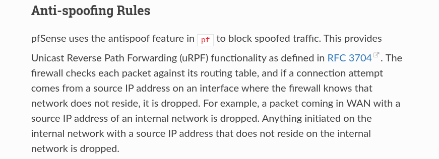
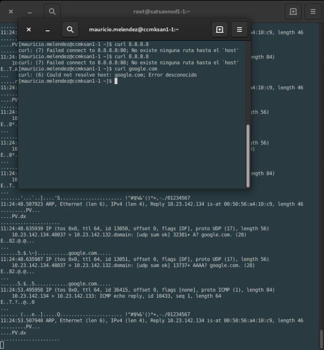
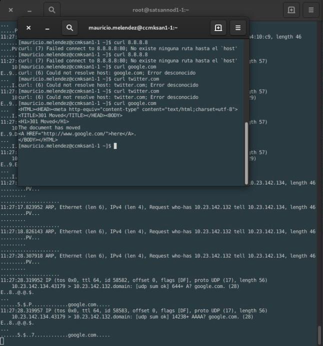

# Anti-Spoofing Pfsense

Reglas anti-spoofing en Pfsense

## Prerequisitos

* Pfsense

## Desarrollo

Típicos ataques spoofing:

1. Suplantación de ARP:

El ARP (Protocolo de resolución de direcciones) es un protocolo utilizado para traducir una dirección IP en direcciones mac (control de acceso a medios) para que se transmita correctamente. En resumen, el protocolo asigna una dirección IP a una dirección de máquina física.

Este tipo de ataque de suplantación de identidad se produce cuando un atacante malintencionado vincula la dirección mac del hacker con la dirección IP de la red de una empresa. Esto permite al atacante interceptar datos destinados a la computadora de la compañía. El ataque de falsificación de ARP puede conducir al robo y eliminación de datos, cuentas comprometidas y consecuencias maliciosas.

2. Suplantación de DNS:

El DNS (sistema de nombres de dominio) es responsable de asociar los nombres de dominio a la dirección IP correcta. Cuando un usuario escribe un nombre de dominio, el sistema DNS corresponde a una dirección IP, lo que permite al visitante conectarse al servidor correcto. Para que un ataque de falsificación de DNS sea exitoso, un atacante malintencionado redirige la traducción de DNS para que apunte a un servidor diferente que generalmente está infectado con malware y puede usarse para ayudar a propagar virus y gusanos.

3. IP Spoofing:

El ataque de suplantación más utilizado es el ataque de suplantación de IP. Este tipo de ataque de suplantación de identidad es exitoso cuando un ataque malicioso copia una dirección IP legítima para enviar paquetes IP utilizando una dirección IP confiable. La replicación de la dirección IP obliga a los sistemas a creer que la fuente es confiable, abriendo a las víctimas a diferentes tipos de ataques utilizando los paquetes IP confiables.

El tipo más popular de ataque de suplantación de IP es DOS (Denegación de servicio) que abruma y apaga los servidores de destino.

4. GPS Spoofing:

Los ataques de falsificación de GPS intentan engañar a un receptor de GPS emitiendo señales de GPS incorrectas, estructuradas para parecerse a un conjunto de señales de GPS normales o retransmitiendo señales genuinas capturadas en otro lugar o en diferentes momentos. Estas señales falsas pueden modificarse de tal manera que el receptor pueda estimar su posición en otro lugar

5. Identificación de llamadas falsas:

Las redes telefónicas públicas a menudo proporcionan información de identificación de llamadas que incluye los números de las personas que llaman y, en ocasiones, el nombre de la persona que llama con cada llamada. Sin embargo, algunas tecnologías permiten a las personas que llaman falsificar información de identificación de llamadas y presentar nombres y números falsos. Las puertas de enlace entre las redes que permiten dicha suplantación de identidad y otras redes públicas envían esa información falsa.

## Reglas Anti Spoofing en PfSense

Por defecto Pfsense integra de manera autómatica, reglas de firewall anti-spoofing, denegando la entrada de paquetes... como se explica en la documentación oficial [Reglas Firewall](https://docs.netgate.com/pfsense/en/latest/book/firewall/rule-methodology.html).



Para comprobar que dichas reglas funcionan se realizó un simulación de ARP Spoofing con el uso de la herramienta **arpfox**.

Instalación de Arpfox:

*Instalación de dependencia*
```bash
yum install -y libpcap-devel golang
```

*Descarga e instalación de Arpfox*
```bash
curl -sL 'https://raw.githubusercontent.com/malfunkt/arpfox/master/install.sh' | sudo sh
```

*Verificamos que Arpfox este instalado*
```bash
arpfox -h
```

Para esta prueba se utilizaron 3 servidores:

* Pfsense (10.23.142.132) ==> Gateway
* Servidor 1 (10.10.10.3) ==> Atacante
* Servidor 2 (10.23.142.134) ==> Victima

Para inciar el Spoofing utilizamos los siguientes comandos:

*Habilitamos el forwarding en el Servidor 1*
```bash
sysctl -w net.ipv4.ip_forward=1
```

*Iniciamos el envenenamiento de la tabla ARP (desde el Servidor 1)*
```bash
arpfox -i ens192 -t 10.23.142.134 10.23.142.132
```


En un esquema donde no existe el Pfsense no deberia mostrarse ningun cambio desde el servidor de la Victima sin embargo observamos que en este caso Pfsense se encarga de denegar la salida de los paquetes provenientes del Servidor 2, comprobando de esta manera el bloqueo por parte de las reglas Anti-Spoofing de Pfsense.

Al parar el spoofing se observa cómo de nueva cuenta el servidor dos vuelve a mandar el tráfico al gateway correcto y vuelve a recibir tráfico web.

